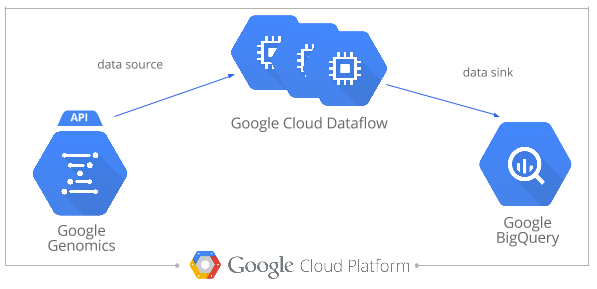

# Use Cloud Dataflow to transform data with Non-Variant Segments

In this codelab we use Cloud Dataflow to transform data with non-variant segments (such as data that was in source format Genome VCF ([gVCF](https://sites.google.com/site/gvcftools/home/about-gvcf/gvcf-conventions)) or Complete Genomics) to variant-only data with calls from non-variant-segments merged into the variants with which they overlap. 

* [Motivation](#motivation)
* [Run the Cluster Compute Job](#run-the-cluster-compute-job)
* [Results](#results)
* [Optional: Modify the Cluster Compute Job](#optional-modify-the-cluster-compute-job)
* [Appendix](#appendix)

## Motivation

Data from source files in [gVCF](https://sites.google.com/site/gvcftools/home/about-gvcf/gvcf-conventions) format or in Complete Genomics format can be challenging to work with due to the presence of non-variant segment records.

For example to use BigQuery lookup [rs9536314](http://www.ncbi.nlm.nih.gov/SNP/snp_ref.cgi?rs=rs9536314) in the Klotho gene, the `WHERE` clause
```
    WHERE
      reference_name = 'chr13'
      AND start = 33628137
```
becomes
```
    WHERE
      reference_name = 'chr13'
      AND start <= 33628137
      AND end >= 33628138
```
to capture not only that variant, but any other records that overlap that genomic position.

Suppose we want to calculate an aggregate for a particular variant, such as the number of samples with the variant on one or both alleles and of samples that match the reference?  The WHERE clause above will do the trick.  But then suppose we want to do this for all SNPs in our dataset?  There are [a few ways to do this](https://github.com/googlegenomics/bigquery-examples/tree/master/pgp/data-stories/schema-comparisons#motivation). In this codelab we will use a cluster computing job to transform data with non-variant segments to variant-only data with calls from non-variant-segments merged into the variants with which they overlap. 
* This is currently done only for SNP variants. Indels and structural variants are left as-is.  
* The resultant data is emitted to a BigQuery table.

> The result of this cluster compute job is used specifically in codelab [Quality Control using Google Genomics](../../R/PlatinumGenomes-QC).

## Run the Cluster Compute Job

_Note: This codelab assumes you have already worked with Google Genomics, Google Cloud Storage, and BigQuery and set up those necessary prerequsites._

The following example makes use of [Illumina Platinum Genomes](http://www.illumina.com/platinumgenomes/).  For more detail about how this data was loaded into the Google Genomics API, please see [Google Genomics Public Data](https://cloud.google.com/genomics/data/platinum-genomes).

This job retrieves variants from the Genomics API, transforms them and writes the result to a new BigQuery table.
* The schema contains the common fields found in all variants exported from Google Genomics, but we did not run a Google Genomics variants export --> instead this is a custom export.
* It adds the reference-matching calls to the relevant SNP variant records --> essentially adding redundant data in an effort to enable easier querying.



### Instructions

(1) Follow the Google Cloud Dataflow [getting started instructions](https://cloud.google.com/dataflow/getting-started) to set up your environment for Dataflow.

(2) Use [Apache Maven](http://maven.apache.org/download.cgi) to build the code.
```
cd codelabs/Java/PlatinumGenomes-variant-transformation
mvn clean package
```
(3) Create a BigQuery dataset in the web UI to hold the data.
* Open the [BigQuery web UI](https://bigquery.cloud.google.com/).
* Click the down arrow icon  next to your project name in the navigation
* Then click **Create new dataset**.

(4) Run the pipeline locally over BRCA1 in Platinum Genomes with the command line:
```
java -cp target/non-variant-segment-transformer-*runnable.jar \
  com.google.cloud.genomics.examples.TransformNonVariantSegmentData \
  --project=YOUR_GOOGLE_CLOUD_PLATFORM_PROJECT_ID \
  --stagingLocation=gs://YOUR_BUCKET/dataflow-staging \
  --variantSetId=3049512673186936334 \
  --references=chr17:41196311:41277499 \
  --hasNonVariantSegments \
  --outputTable=YOUR_BIGQUERY_DATASET.YOUR_BIGQUERY_DESTINATION_TABLE
```

To run this job on the entire dataset:
* Add `--runner=DataflowPipelineRunner` to run the job on Google Cloud instead of locally.
* Use `--allReferences` instead of `--references=chr17:41196311:41277499` to run over the entire genome.

To see the help text for all pipeline options:
```
java -cp target/non-variant-segment-transformer-*runnable.jar \
  com.google.cloud.genomics.examples.TransformNonVariantSegmentData \
  --help=com.google.cloud.genomics.examples.TransformNonVariantSegmentData\$Options
```

## Results

You have now created a table like [google.com:biggene:platinum_genomes.transformed_variants](https://bigquery.cloud.google.com/table/google.com:biggene:platinum_genomes.transformed_variants?pli=1)

# Appendix

### How to Run this Job Against Your Own Data

Pass `--datasetId=YOUR_GOOGLE_GENOMICS_DATASET_ID` instead of `--datasetId=3049512673186936334`.

## Optional: Modify the Cluster Compute Job

Some ideas:
* Add additional fields from the variant to the BigQuery schema.
* Note that for a large cohort with many, many more rare variants we may wish to instead modify the logic here to summarize the number of calls that match the reference for each variant instead of adding those individual calls to the record.
* merge calls in records with 1/2 genotypes with the same variant found in records with 0/1 genotypes

Reference Name | Start     | End       | Reference Bases | Alternate Bases
---------------|-----------|-----------|-----------------|-----------------
chr6           | 120458771 | 120458773 |TA               |TAA
chr6           | 120458771 | 120458773 |TA               |TAA,T
 
--------------------------------------------------------

