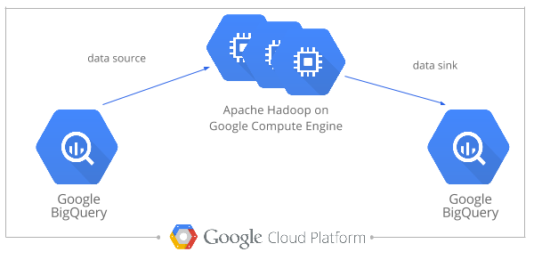

# Use Hadoop Streaming to transform data with Non-Variant Segments

In this codelab we use a Hadoop Streaming job to transform data with non-variant segments (such as data that was in source format Genome VCF ([gVCF](https://sites.google.com/site/gvcftools/home/about-gvcf/gvcf-conventions)) or Complete Genomics) to variant-only data with calls from non-variant-segments merged into the variants with which they overlap. 

* [Motivation](#motivation)
* [Run the Cluster Compute Job](#run-the-cluster-compute-job)
* [Results](#results)
* [Optional: Modify the Cluster Compute Job](#optional-modify-the-cluster-compute-job)
* [Appendix](#appendix)

## Motivation

Data from source files in [gVCF](https://sites.google.com/site/gvcftools/home/about-gvcf/gvcf-conventions) format or in Complete Genomics format can be challenging to work with due to the presence of non-variant segment records.

For example to use BigQuery lookup [rs9536314](http://www.ncbi.nlm.nih.gov/SNP/snp_ref.cgi?rs=rs9536314) in the Klotho gene, the `WHERE` clause
```
    WHERE
      reference_name = 'chr13'
      AND start = 33628137
```
becomes
```
    WHERE
      reference_name = 'chr13'
      AND start <= 33628137
      AND end >= 33628138
```
to capture not only that variant, but any other records that overlap that genomic position.

Suppose we want to calculate an aggregate for a particular variant, such as the number of samples with the variant on one or both alleles and of samples that match the reference?  The WHERE clause above will do the trick.  But then suppose we want to do this for all SNPs in our dataset?  There are [a few ways to do this](https://github.com/googlegenomics/bigquery-examples/tree/master/pgp/data-stories/schema-comparisons#motivation). In this codelab we will use a cluster computing job to transform data with non-variant segments to variant-only data with calls from non-variant-segments merged into the variants with which they overlap. 
* This is currently done only for SNP variants. Indels and structural variants are left as-is.  
* The resultant data is emitted to a BigQuery table.

> The result of this cluster compute job is used specifically in codelab [Quality Control using Google Genomics](../../R/PlatinumGenomes-QC).

## Run the Cluster Compute Job

_Note: This codelab assumes you have already worked with Google Genomics, Google Cloud Storage, and BigQuery and set up those necessary prerequsites._

The following example makes use of [Illumina Platinum Genomes](http://www.illumina.com/platinumgenomes/).  For more detail about how this data was loaded into the Google Genomics API, please see [Google Genomics Public Data](https://cloud.google.com/genomics/data/platinum-genomes).

This job creates a new BigQuery table containing data that is reshaped, but the schema is exactly the same.  It adds the reference-matching calls to the relevant SNP variant records --> essentially adding redundant data in an effort to enable easier querying. See [gvcf_expander.py](./gvcf_expander.py) for more detail including unit tests.  [Hadoop on Google Cloud Platform](https://cloud.google.com/hadoop/) supports using BigQuery as a source and/or a sink for jobs.



### Instructions

(1) Install [bdutil](https://cloud.google.com/hadoop/). Or if you already have it, ensure that it is version 1.2.0 or higher.

(2) Use bdutil to deploy a cluster with the [BigQuery Connector](https://cloud.google.com/hadoop/bigquery-connector) enabled.  For more details about using the [BigQuery Connector](https://cloud.google.com/hadoop/bigquery-connector) with Hadoop Streaming, see the [announcement](https://groups.google.com/forum/#!topic/gcp-hadoop-announce/bzji9yjj304).

```
./bdutil -e bigquery_env.sh deploy
```

(3) Copy over the code and schema to the Hadoop master:

```
gcutil push hadoop-m gvcf* platinum_genomes.variants.schema .
```

(4) ssh to the master and kick off the job:

```
export INPUT_PROJECT=genomics-public-data
export INPUT_DATASET=platinum_genomes
export INPUT_TABLE=variants
export OUTPUT_PROJECT=YOUR_GOOGLE_CLOUD_PLATFORM_PROJECT_ID
export OUTPUT_DATASET=YOUR_BIGQUERY_DATASET
export OUTPUT_TABLE=YOUR_BIGQUERY_TABLE
export SCHEMA=`cat platinum_genomes.variants.schema`

hadoop jar /home/hadoop/hadoop-install/contrib/streaming/hadoop-streaming-1.2.1.jar \
      -D mapred.bq.input.project.id=$INPUT_PROJECT\
      -D mapred.bq.input.dataset.id=$INPUT_DATASET \
      -D mapred.bq.input.table.id=$INPUT_TABLE \
      -D mapred.bq.output.project.id=$OUTPUT_PROJECT \
      -D mapred.bq.output.dataset.id=$OUTPUT_DATASET \
      -D mapred.bq.output.table.id=$OUTPUT_TABLE \
      -D mapred.bq.output.table.schema="${SCHEMA}" \
      -D mapred.task.timeout=0 \
      -D mapred.bq.output.async.write.enabled=true \
      -D mapred.output.committer.class=com.google.cloud.hadoop.io.bigquery.mapred.BigQueryMapredOutputCommitter \
      -inputformat com.google.cloud.hadoop.io.bigquery.mapred.BigQueryMapredInputFormat \
      -input requiredButUnused \
      -outputformat com.google.cloud.hadoop.io.bigquery.mapred.BigQueryMapredOutputFormat \
      -output requiredButUnused \
      -file gvcf_expander.py \
      -mapper gvcf-expand-mapper.py -file gvcf-expand-mapper.py  \
      -reducer gvcf-expand-reducer.py -file gvcf-expand-reducer.py
```

(5) Lastly, note that the BigQuery connector when used with Hadoop Streaming does not clean up its temporary files automatically.

```
export CONFIGBUCKET=YOUR_HADOOP_BUCKET
gsutil rm -r gs://$CONFIGBUCKET/hadoop/tmp/bigquery/job_*
```

## Results

You have now created a table like [google.com:biggene:platinum_genomes.expanded_variants](https://bigquery.cloud.google.com/table/google.com:biggene:platinum_genomes.expanded_variants?pli=1)

# Appendix

## How to Run this Job Against Your Own Data

(1) Get the schema for your data:
```
bq --project YOUR_GOOGLE_CLOUD_PLATFORM_PROJECT_ID show --format json \
YOUR_BIGQUERY_INPUT_DATASET.YOUR_BIGQUERY_INPUT_TABLE | python -c \
"import json,sys ; print \"%s\" % (json.dumps(json.loads(sys.stdin.readline())['schema']['fields']).replace(\"'\", \"_\"))" \
> YOUR_BIGQUERY_INPUT_DATASET.YOUR_BIGQUERY_INPUT_TABLE.schema
```

(2) Update the variables for the new input:
```
export INPUT_PROJECT=YOUR_GOOGLE_CLOUD_PLATFORM_PROJECT_ID
export INPUT_DATASET=YOUR_BIGQUERY_INPUT_DATASET
export INPUT_TABLE=YOUR_BIGQUERY_INPUT_TABLE
export SCHEMA=`cat YOUR_BIGQUERY_INPUT_DATASET.YOUR_BIGQUERY_INPUT_TABLE.schema`
```
(3) Then follow the remainder of the steps to run the job.

## Optional: Modify the Cluster Compute Job

Some ideas:
* Note that for a large cohort with many, many more rare variants we may wish to instead modify the logic here to summarize the number of calls that match the reference for each variant instead of adding those individual calls to the record.
* merge calls in records with 1/2 genotypes with the same variant found in records with 0/1 genotypes

Reference Name | Start     | End       | Reference Bases | Alternate Bases
---------------|-----------|-----------|-----------------|-----------------
chr6           | 120458771 | 120458773 |TA               |TAA
chr6           | 120458771 | 120458773 |TA               |TAA,T
 
--------------------------------------------------------

## How to get the Schema for a Table

Here's how we grabbed the schema from the source table.  Do something similar when running this job against a different table.

```
bq --project genomics-public-data show --format json platinum_genomes.variants | python -c \
"import json,sys ; print \"%s\" % (json.dumps(json.loads(sys.stdin.readline())['schema']['fields']).replace(\"'\", \"_\"))" \
> platinum_genomes.variants.schema
```

## How to use Google Cloud Storage as a source and/or sink

Note that under the covers the BigQuery connector is:
 * exporting data from BigQuery to Google Cloud Storage; this can also [be done manually](https://cloud.google.com/bigquery/bigquery-web-ui#exportdata)
  * importing the result of the job from Google Cloud Storage to BigQuery; this can also [be done manually](https://cloud.google.com/bigquery/bigquery-web-ui#createtable)
  
If you wish to run the job without the BigQuery connector:
* Edit gvcf-expand-mapper.py to set `BIG_QUERY_SOURCE = False`
* Edit gvcf-expand-reducer.py to set `BIG_QUERY_SINK = False`
* Run the job like so:
```
hadoop jar /home/hadoop/hadoop-install/contrib/streaming/hadoop-streaming-1.2.1.jar \
-file gvcf_expander.py \
-mapper gvcf-expand-mapper.py -file gvcf-expand-mapper.py \
-reducer gvcf-expand-reducer.py -file gvcf-expand-reducer.py \
-input gs://YOUR_BUCKET/YOUR_INPUT_PREFIX  \
-output gs://YOUR_BUCKET/YOUR_OUTPUT_PREFIX
```
* Finally, load the json from the Google Cloud Storage destination to BigQuery using schema [platinum_genomes.variants.schema](./platinum_genomes.variants.schema)
