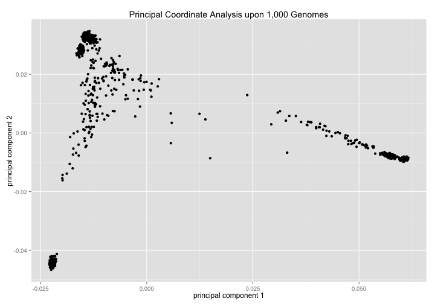
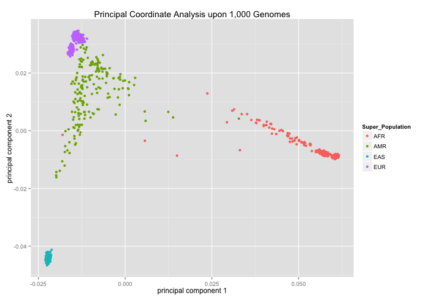
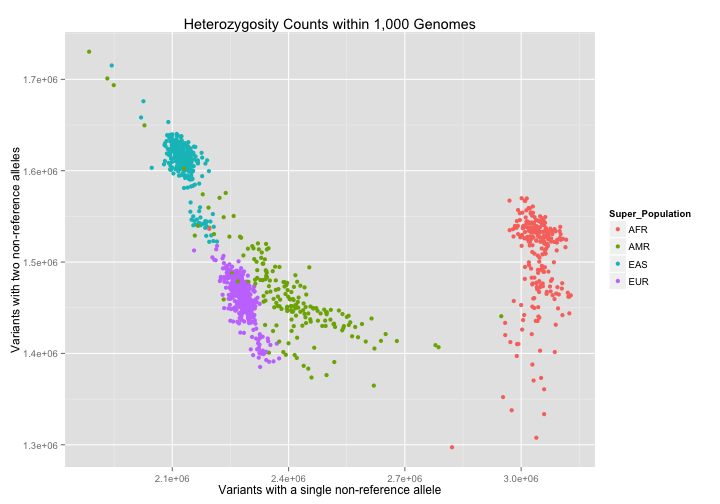
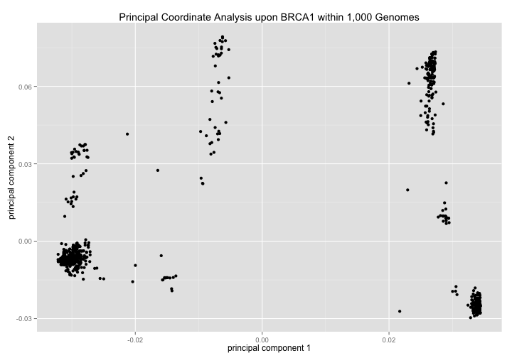
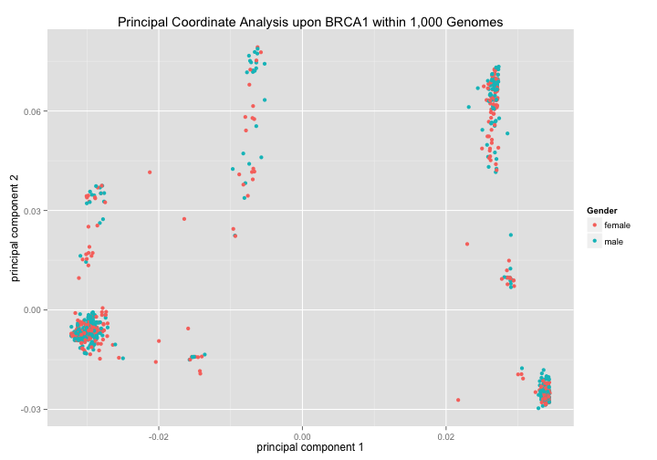
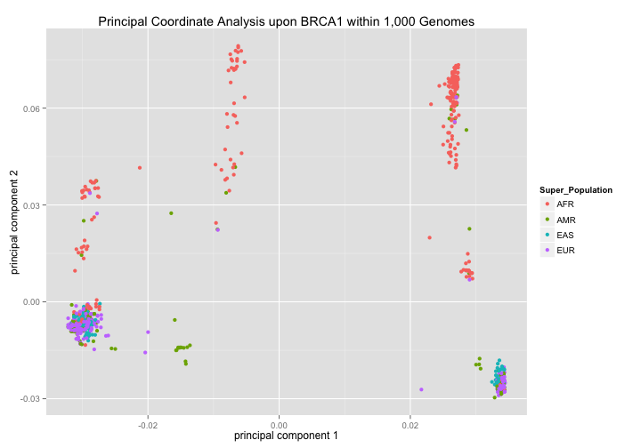
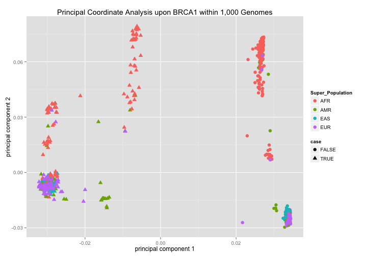
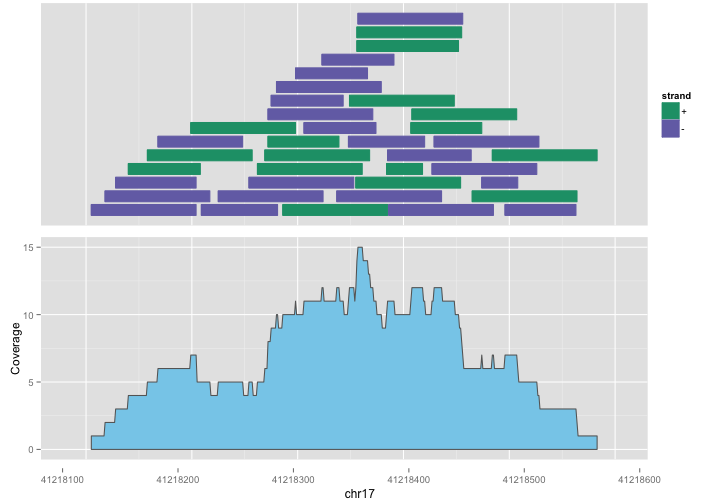

<!-- R Markdown Documentation, DO NOT EDIT THE PLAIN MARKDOWN VERSION OF THIS FILE -->

<!-- Copyright 2014 Google Inc. All rights reserved. -->

<!-- Licensed under the Apache License, Version 2.0 (the "License"); -->
<!-- you may not use this file except in compliance with the License. -->
<!-- You may obtain a copy of the License at -->

<!--     http://www.apache.org/licenses/LICENSE-2.0 -->

<!-- Unless required by applicable law or agreed to in writing, software -->
<!-- distributed under the License is distributed on an "AS IS" BASIS, -->
<!-- WITHOUT WARRANTIES OR CONDITIONS OF ANY KIND, either express or implied. -->
<!-- See the License for the specific language governing permissions and -->
<!-- limitations under the License. -->

Data Analysis using Google Genomics
===================================

The following example makes use of the [Phase 1 variants](http://ftp.1000genomes.ebi.ac.uk/vol1/ftp/release/20110521/README.phase1_integrated_release_version3_20120430) from the [1,000 Genomes Project](http://www.1000genomes.org/).  For more detail about how this data was loaded into the Google Genomics API, please see [Google Genomics Public Data](https://cloud.google.com/genomics/data/1000-genomes).

The VCFs comprising this dataset are **1.12 TB** when uncompressed and provide information about **39,706,715** variants for **1,092** individuals.

* [Working at Scale](#working-at-scale)
  * [Cluster Computing](#cluster-computing)
  * [Querying](#querying)
* [Zooming-In](#zooming-in)
  * [Simplistic GWAS](#simplistic-gwas)
  * [Annotate Variants with Bioconductor](#annotate-variants-with-bioconductor)
* [Zooming-In Even Further](#zooming-in-even-further)
  * [Visualize Reads with Bioconductor](#visualize-reads-with-bioconductor)
* [Provenance](#provenance)

Working at Scale
-------------------

### Cluster Computing

Suppose we have a new dataset.  One of the first things we might do is a basic visualization.  Let's start by projecting the relevant data into 2-dimensional space by performing a [Principal Coordinate Analysis](http://occamstypewriter.org/boboh/2012/01/17/pca_and_pcoa_explained/) based on the number of variants shared by each pair of individuals.

In this example we are reading in previously computed results, but its easy to spin up an [Apache Spark](http://spark.apache.org/) cluster on [Google Compute Engine](https://cloud.google.com/hadoop/what-is-hadoop) and run this analysis.


```r
pca_1kg <- read.table("./data/1kg-pca.tsv", col.names=c("Sample", "PC1", "PC2"))
```
This analysis performed an `O(N^2)` computation upon the relevant fields within the *terabyte* of data by running an [Apache Spark](http://spark.apache.org/) job which used the [Google Genomics Variants API](https://cloud.google.com/genomics/reference/rest/v1/variants) for its input.  See the Google Genomics [PCA cookbook entry](http://googlegenomics.readthedocs.org/en/latest/use_cases/compute_principal_coordinate_analysis/index.html) for implementation details and instructions as to how to run this job.

Visualizing the results, we see quite distinct clusters:

```r
library(scales) # for scientific_format()
library(ggplot2)
ggplot(pca_1kg) +
  geom_point(aes(x=PC1, y=PC2)) +
  xlab("principal component 1") +
  ylab("principal component 2") +
  ggtitle("Principal Coordinate Analysis upon 1,000 Genomes")
```



Let's pull in the [supplementary information](http://ftp.1000genomes.ebi.ac.uk/vol1/ftp/technical/working/20130606_sample_info/README_20130606_sample_info) we do have on these samples from [Google Cloud Storage](https://cloud.google.com/storage/):

```r
sample_info <- read.csv("http://storage.googleapis.com/genomics-public-data/1000-genomes/other/sample_info/sample_info.csv")
library(dplyr)
pca_1kg <- inner_join(pca_1kg, sample_info)
```

Applying sample ethnicity to the plot:

```r
ggplot(pca_1kg) +
  geom_point(aes(x=PC1, y=PC2, color=Super_Population)) +
  xlab("principal component 1") +
  ylab("principal component 2") +
  ggtitle("Principal Coordinate Analysis upon 1,000 Genomes")
```



we see that ethnicity appears to strongly correlate with the clusters.

### Querying

Let's also visualize a different aspect of this data by examining the variant counts for each individual of heterozygous reference variants (where one of the alleles is equal to the reference) and heterozygous alternate variants (where neither of the alleles is equal to the reference).


```r
# Setup for BigQuery access
library(bigrquery)
DisplayAndDispatchQuery <- function(queryUri, replacements=list()) {
  querySql <- readChar(queryUri, nchars=1e6)
  cat(querySql)
  for(replacement in names(replacements)) {
    querySql <- sub(replacement, replacements[[replacement]], querySql, fixed=TRUE)
  }
  query_exec(querySql, project)
}
```


```r
sample_alt_counts <- DisplayAndDispatchQuery("./sql/sample-alt-counts.sql")
```

```
# Count alternate alleles for each sample.
SELECT
  Sample,
  SUM(single) AS single,
  SUM(double) AS double,
FROM (
  SELECT
    call.call_set_name AS Sample,
    SOME(call.genotype > 0) AND NOT EVERY(call.genotype > 0) WITHIN call AS single,
    EVERY(call.genotype > 0) WITHIN call AS double,
  FROM
    [genomics-public-data:1000_genomes.variants]
  OMIT RECORD IF
    reference_name IN ("X", "Y", "MT"))
GROUP BY
  Sample
ORDER BY
  Sample
```
Number of rows returned by this query: 1092.

This analysis performed an `O(N)` computation via [Google BigQuery](https://cloud.google.com/bigquery/).  Since BigQuery is a columnar data store, it scans only the columns referenced by the query.  In this case, 1 TB of data was scanned, typically within 10 seconds.

Visualizing the results, we again see quite distinct clusters:

```r
sample_alt_counts <- inner_join(sample_alt_counts, sample_info)
ggplot(sample_alt_counts) +
  geom_point(aes(x=single, y=double, color=Super_Population)) +
  scale_x_continuous(label=scientific_format()) +
  scale_y_continuous(label=scientific_format()) +
  xlab("Variants with a single non-reference allele") +
  ylab("Variants with two non-reference alleles") +
  ggtitle("Heterozygosity Counts within 1,000 Genomes")
```



Zooming-In
------------------------

Suppose we are interested in examining variants within the BRCA1 gene.  We might run our PCoA a second time, zooming-in specifically to this region within the genome.

Again in this example we read in previously computed results, but since the amount of data over which we are computing is much less, it is feasible to run this Spark job on a local machine in just a few minutes.

```r
pca_1kg_brca1 <- read.table("./data/1kg-brca1-pca.tsv", col.names=c("Sample", "PC1", "PC2"))
```

Examining this data visually:

```r
ggplot(pca_1kg_brca1) +
  geom_point(aes(x=PC1, y=PC2)) +
  xlab("principal component 1") +
  ylab("principal component 2") +
  ggtitle("Principal Coordinate Analysis upon BRCA1 within 1,000 Genomes")
```



we see distinct clusters with a structure much different than our former result upon the entire dataset.

Let's apply the sample information we do have (just gender and ethnicity) to this visualization to see if any of it appears to explain the clustering.  First, we'll try gender:

```r
pca_1kg_brca1 <- inner_join(pca_1kg_brca1, sample_info)
ggplot(pca_1kg_brca1) +
  geom_point(aes(x=PC1, y=PC2, color=Gender)) +
  xlab("principal component 1") +
  ylab("principal component 2") +
  ggtitle("Principal Coordinate Analysis upon BRCA1 within 1,000 Genomes")
```



which has no apparent bearing on these variants.

Next, we'll try ethnicity:

```r
ggplot(pca_1kg_brca1) +
  geom_point(aes(x=PC1, y=PC2, color=Super_Population)) +
  xlab("principal component 1") +
  ylab("principal component 2") +
  ggtitle("Principal Coordinate Analysis upon BRCA1 within 1,000 Genomes")
```



which does appear to correlate to some amount of the clustering in the second principal component axis but not in the first principal component axis.

Let's split these individuals into two groups based on their position relative to the origin of the first principal component:

```r
pca_1kg_brca1 <- mutate(pca_1kg_brca1, 
                        case = 0 > PC1)
```
And visualize them again with their grouping:

```r
ggplot(pca_1kg_brca1) +
  geom_point(aes(x=PC1, y=PC2, color=Super_Population, shape=case), size=3) +
  xlab("principal component 1") +
  ylab("principal component 2") +
  ggtitle("Principal Coordinate Analysis upon BRCA1 within 1,000 Genomes")
```



### Simplistic GWAS

Next we perform a [simplistic GWAS](http://homes.cs.washington.edu/~suinlee/genome560/lecture7.pdf) on the BRCA1 variants to retrieve a ranked list of the variants that appear to differentiate these groups.

```r
case_sample_ids <- paste("'", filter(pca_1kg_brca1, case==TRUE)$Sample, "'", sep="", collapse=",")
result <- DisplayAndDispatchQuery("./sql/gwas-brca1-pattern.sql",
                                  list(CASE_SAMPLE_IDS__=case_sample_ids))
```

```
# A template for a simplistic GWAS query upon 1,000 Genomes phase 1 variants
# within BRCA1.  The template allows customization of the list of sample ids
# in the case group.  http://homes.cs.washington.edu/~suinlee/genome560/lecture7.pdf
SELECT
  reference_name,
  start,
  end,
  reference_bases,
  alternate_bases,
  vt,
  case_count,
  control_count,
  allele_count,
  ref_count,
  alt_count,
  case_ref_count,
  case_alt_count,
  control_ref_count,
  control_alt_count,
  # https://en.wikipedia.org/wiki/Yates%27s_correction_for_continuity
  ROUND(
    POW(ABS(case_ref_count - (ref_count/allele_count)*case_count) - 0.5,
      2)/((ref_count/allele_count)*case_count) +
    POW(ABS(control_ref_count - (ref_count/allele_count)*control_count) - 0.5,
      2)/((ref_count/allele_count)*control_count) +
    POW(ABS(case_alt_count - (alt_count/allele_count)*case_count) - 0.5,
      2)/((alt_count/allele_count)*case_count) +
    POW(ABS(control_alt_count - (alt_count/allele_count)*control_count) - 0.5,
      2)/((alt_count/allele_count)*control_count),
    3) AS chi_squared_score
FROM (
  SELECT
    reference_name,
    start,
    end,
    reference_bases,
    alternate_bases,
    vt,
    SUM(ref_count + alt_count) AS allele_count,
    SUM(ref_count) AS ref_count,
    SUM(alt_count) AS alt_count,
    SUM(IF(TRUE = is_case, INTEGER(ref_count + alt_count), 0)) AS case_count,
    SUM(IF(FALSE = is_case, INTEGER(ref_count + alt_count), 0)) AS control_count,
    SUM(IF(TRUE = is_case, ref_count, 0)) AS case_ref_count,
    SUM(IF(TRUE = is_case, alt_count, 0)) AS case_alt_count,
    SUM(IF(FALSE = is_case, ref_count, 0)) AS control_ref_count,
    SUM(IF(FALSE = is_case, alt_count, 0)) AS control_alt_count,
  FROM (
    SELECT
      reference_name,
      start,
      end,
      reference_bases,
      NTH(1, alternate_bases) WITHIN RECORD AS alternate_bases,
      vt,
      # 1000 genomes data is bi-allelic so there is only ever a single alt
      SUM(0 == call.genotype) WITHIN call AS ref_count,
      SUM(1 == call.genotype) WITHIN call AS alt_count,
      call.call_set_name IN (CASE_SAMPLE_IDS__) AS is_case,
    FROM
      [genomics-public-data:1000_genomes.variants]
    WHERE
      reference_name = '17'
      AND start BETWEEN 41196311 AND 41277499
    )
  GROUP BY
    reference_name,
    start,
    end,
    reference_bases,
    alternate_bases,
    vt)
WHERE
  # For chi-squared, expected counts must be at least 5 for each group
  (ref_count/allele_count)*case_count >= 5.0
  AND (ref_count/allele_count)*control_count >= 5.0
  AND (alt_count/allele_count)*case_count >= 5.0
  AND (alt_count/allele_count)*control_count >= 5.0
HAVING
  # Chi-squared critical value for df=1, p-value=5*10^-8 is 29.71679
  chi_squared_score >= 29.71679
ORDER BY
  chi_squared_score DESC,
  start
```
Number of rows returned by this query: 180.

Note that even though this query ran over a small region of the genome, with a minor change to the SQL we could have run this same GWAS query over all variants within a much larger region, over an entire chromosome, or even the full dataset; returning the ranked list of variants that differ between the two groups.

```r
head(result)
```

```
  reference_name    start      end reference_bases alternate_bases  vt
1             17 41218332 41218333               G               A SNP
2             17 41259048 41259049               C               T SNP
3             17 41261232 41261233               C               T SNP
4             17 41265775 41265776               A               G SNP
5             17 41268205 41268206               A               C SNP
6             17 41241389 41241390               C               A SNP
  case_count control_count allele_count ref_count alt_count case_ref_count
1       1158          1026         2184      1473       711            447
2       1158          1026         2184      1473       711            447
3       1158          1026         2184      1473       711            447
4       1158          1026         2184      1473       711            447
5       1158          1026         2184      1473       711            447
6       1158          1026         2184      1471       713            446
  case_alt_count control_ref_count control_alt_count chi_squared_score
1            711              1026                 0           931.230
2            711              1026                 0           931.230
3            711              1026                 0           931.230
4            711              1026                 0           931.230
5            711              1026                 0           931.230
6            712              1025                 1           929.544
```

### Annotate Variants with Bioconductor

Now let's use the [GoogleGenomics R client](https://github.com/googlegenomics/api-client-r) to retrieve the full records for the variants in which we are interested.

```r
library(GoogleGenomics)
```


```r
top_results_sorted_by_start <- arrange(head(result, 20), start)
variants <- Reduce(c, apply(top_results_sorted_by_start,
                           1,
                           function(var) {
                             getVariants(variantSetId="10473108253681171589",
                                         chromosome=as.character(var["reference_name"]),
                                         start=as.integer(var["start"]),
                                         end=as.integer(var["end"]))
                             }))
length(variants)
```

```
[1] 20
```

```r
names(variants[[1]])
```

```
 [1] "variantSetId"   "id"             "names"          "created"       
 [5] "referenceName"  "start"          "end"            "referenceBases"
 [9] "alternateBases" "quality"        "filter"         "info"          
[13] "calls"         
```

```r
length(variants[[1]]$calls)
```

```
[1] 1092
```

```r
names(variants[[1]]$calls[[1]])
```

```
[1] "callSetId"          "callSetName"        "genotype"          
[4] "phaseset"           "genotypeLikelihood" "info"              
```

```r
variants[[1]]$calls[[1]]
```

```
$callSetId
[1] "10473108253681171589-0"

$callSetName
[1] "HG00261"

$genotype
$genotype[[1]]
[1] 0

$genotype[[2]]
[1] 0


$phaseset
[1] "*"

$genotypeLikelihood
$genotypeLikelihood[[1]]
[1] 0

$genotypeLikelihood[[2]]
[1] -2.63

$genotypeLikelihood[[3]]
[1] -5


$info
$info$DS
$info$DS[[1]]
[1] "0.000"
```

We can also convert this data to [Bioconductor](http://www.bioconductor.org/) datatypes such as [GRanges data type](http://www.bioconductor.org/packages/release/bioc/vignettes/GenomicRanges/inst/doc/GenomicRangesIntroduction.pdf).

```r
granges <- variantsToGRanges(variants)
granges
```

```
GRanges object with 20 ranges and 4 metadata columns:
             seqnames               ranges strand |            REF
                <Rle>            <IRanges>  <Rle> | <DNAStringSet>
   rs4793194    chr17 [41218333, 41218333]      * |              G
   rs8176234    chr17 [41219780, 41219780]      * |              T
   rs8176233    chr17 [41219804, 41219804]      * |              T
   rs3950989    chr17 [41237953, 41237953]      * |              G
   rs8176161    chr17 [41241390, 41241390]      * |              C
         ...      ...                  ...    ... .            ...
  rs12936316    chr17 [41263044, 41263044]      * |              A
   rs8176109    chr17 [41265776, 41265776]      * |              A
   rs8176098    chr17 [41268206, 41268206]      * |              A
   rs8176092    chr17 [41270229, 41270229]      * |              T
   rs8176088    chr17 [41270463, 41270463]      * |              G
                            ALT      QUAL      FILTER
             <DNAStringSetList> <numeric> <character>
   rs4793194                  A       100        PASS
   rs8176234                  C       100        PASS
   rs8176233                  C       100        PASS
   rs3950989                  A       100        PASS
   rs8176161                  A       100        PASS
         ...                ...       ...         ...
  rs12936316                  G       100        PASS
   rs8176109                  G       100        PASS
   rs8176098                  C       100        PASS
   rs8176092                  G       100        PASS
   rs8176088                  A       100        PASS
  -------
  seqinfo: 1 sequence from an unspecified genome; no seqlengths
```

This allows us to utilize the various Bioconductor variant annotation packages:


```r
library(VariantAnnotation)
library(BSgenome.Hsapiens.UCSC.hg19)
library(TxDb.Hsapiens.UCSC.hg19.knownGene)
txdb <- TxDb.Hsapiens.UCSC.hg19.knownGene
codingVariants <- locateVariants(granges, txdb, CodingVariants())
codingVariants
```

```
GRanges object with 22 ranges and 9 metadata columns:
       seqnames               ranges strand | LOCATION  LOCSTART    LOCEND
          <Rle>            <IRanges>  <Rle> | <factor> <integer> <integer>
   [1]    chr17 [41244000, 41244000]      - |   coding      3335      3335
   [2]    chr17 [41244000, 41244000]      - |   coding      3407      3407
   [3]    chr17 [41244000, 41244000]      - |   coding      3548      3548
   [4]    chr17 [41244000, 41244000]      - |   coding      3548      3548
   [5]    chr17 [41244000, 41244000]      - |   coding      3548      3548
   ...      ...                  ...    ... .      ...       ...       ...
  [18]    chr17 [41245466, 41245466]      - |   coding      2082      2082
  [19]    chr17 [41245466, 41245466]      - |   coding      2082      2082
  [20]    chr17 [41245466, 41245466]      - |   coding      1941      1941
  [21]    chr17 [41245466, 41245466]      - |   coding      2004      2004
  [22]    chr17 [41245466, 41245466]      - |   coding      1194      1194
         QUERYID        TXID                    CDSID      GENEID
       <integer> <character>            <IntegerList> <character>
   [1]         8       63595 186231,186230,186233,...         672
   [2]         8       63598 186231,186230,186233,...         672
   [3]         8       63599 186231,186230,186233,...         672
   [4]         8       63600 186231,186230,186233,...         672
   [5]         8       63607 186231,186230,186233,...         672
   ...       ...         ...                      ...         ...
  [18]         9       63609 186231,186230,186233,...         672
  [19]         9       63610 186231,186230,186233,...         672
  [20]         9       63611 186231,186230,186233,...         672
  [21]         9       63612 186231,186230,186233,...         672
  [22]         9       63613 186231,186230,186233,...         672
             PRECEDEID        FOLLOWID
       <CharacterList> <CharacterList>
   [1]                                
   [2]                                
   [3]                                
   [4]                                
   [5]                                
   ...             ...             ...
  [18]                                
  [19]                                
  [20]                                
  [21]                                
  [22]                                
  -------
  seqinfo: 1 sequence from an unspecified genome; no seqlengths
```

```r
coding <- predictCoding(rep(granges, elementNROWS(granges$ALT)),
                        txdb,
                        seqSource=Hsapiens,
                        varAllele=unlist(granges$ALT, use.names=FALSE))
coding
```

```
GRanges object with 22 ranges and 16 metadata columns:
            seqnames               ranges strand |            REF
               <Rle>            <IRanges>  <Rle> | <DNAStringSet>
    rs16942    chr17 [41244000, 41244000]      - |              T
    rs16942    chr17 [41244000, 41244000]      - |              T
    rs16942    chr17 [41244000, 41244000]      - |              T
    rs16942    chr17 [41244000, 41244000]      - |              T
    rs16942    chr17 [41244000, 41244000]      - |              T
        ...      ...                  ...    ... .            ...
  rs1799949    chr17 [41245466, 41245466]      - |              G
  rs1799949    chr17 [41245466, 41245466]      - |              G
  rs1799949    chr17 [41245466, 41245466]      - |              G
  rs1799949    chr17 [41245466, 41245466]      - |              G
  rs1799949    chr17 [41245466, 41245466]      - |              G
                           ALT      QUAL      FILTER      varAllele
            <DNAStringSetList> <numeric> <character> <DNAStringSet>
    rs16942                  C       100        PASS              G
    rs16942                  C       100        PASS              G
    rs16942                  C       100        PASS              G
    rs16942                  C       100        PASS              G
    rs16942                  C       100        PASS              G
        ...                ...       ...         ...            ...
  rs1799949                  A       100        PASS              T
  rs1799949                  A       100        PASS              T
  rs1799949                  A       100        PASS              T
  rs1799949                  A       100        PASS              T
  rs1799949                  A       100        PASS              T
                  CDSLOC    PROTEINLOC   QUERYID        TXID
               <IRanges> <IntegerList> <integer> <character>
    rs16942 [3335, 3335]          1112         8       63595
    rs16942 [3407, 3407]          1136         8       63598
    rs16942 [3548, 3548]          1183         8       63599
    rs16942 [3548, 3548]          1183         8       63600
    rs16942 [3548, 3548]          1183         8       63607
        ...          ...           ...       ...         ...
  rs1799949 [2082, 2082]           694         9       63609
  rs1799949 [2082, 2082]           694         9       63610
  rs1799949 [1941, 1941]           647         9       63611
  rs1799949 [2004, 2004]           668         9       63612
  rs1799949 [1194, 1194]           398         9       63613
                               CDSID      GENEID   CONSEQUENCE
                       <IntegerList> <character>      <factor>
    rs16942 186231,186230,186233,...         672 nonsynonymous
    rs16942 186231,186230,186233,...         672 nonsynonymous
    rs16942 186231,186230,186233,...         672 nonsynonymous
    rs16942 186231,186230,186233,...         672 nonsynonymous
    rs16942 186231,186230,186233,...         672 nonsynonymous
        ...                      ...         ...           ...
  rs1799949 186231,186230,186233,...         672    synonymous
  rs1799949 186231,186230,186233,...         672    synonymous
  rs1799949 186231,186230,186233,...         672    synonymous
  rs1799949 186231,186230,186233,...         672    synonymous
  rs1799949 186231,186230,186233,...         672    synonymous
                  REFCODON       VARCODON         REFAA         VARAA
            <DNAStringSet> <DNAStringSet> <AAStringSet> <AAStringSet>
    rs16942            AAA            AGA             K             R
    rs16942            AAA            AGA             K             R
    rs16942            AAA            AGA             K             R
    rs16942            AAA            AGA             K             R
    rs16942            AAA            AGA             K             R
        ...            ...            ...           ...           ...
  rs1799949            AGC            AGT             S             S
  rs1799949            AGC            AGT             S             S
  rs1799949            AGC            AGT             S             S
  rs1799949            AGC            AGT             S             S
  rs1799949            AGC            AGT             S             S
  -------
  seqinfo: 1 sequence from an unspecified genome; no seqlengths
```

So a question for our users who have much experience in this domain: what should we examine next to determine potential explanations for the clustering we see?  Perhaps the relevant [ancestral haplotypes](http://hapmap.ncbi.nlm.nih.gov/originhaplotype.html)?

Zooming-in Even Further
------------------------

### Visualize Reads with Bioconductor

We can also retrieve the reads from the [Genomics Reads API](https://cloud.google.com/genomics/reference/rest/v1/readgroupsets) for a given sample and examine coverage:

```r
galignments <- getReads(readGroupSetId="CMvnhpKTFhDnk4_9zcKO3_YB", chromosome="17",
                     start=41218200, end=41218500, converter=readsToGAlignments)
galignments
```

```
GAlignments object with 38 alignments and 1 metadata column:
                     seqnames strand       cigar    qwidth     start
                        <Rle>  <Rle> <character> <integer> <integer>
  ERR251040.39294893    chr17      -        100M       100  41218105
  ERR251040.23636053    chr17      -        100M       100  41218118
  ERR016214.20846952    chr17      -       4S77M        81  41218128
   ERR251039.9112219    chr17      +      69M31S       100  41218140
   ERR251040.9517733    chr17      +        100M       100  41218158
                 ...      ...    ...         ...       ...       ...
  ERR251039.29590756    chr17      -        100M       100  41218429
    ERR251039.668959    chr17      +        100M       100  41218465
   ERR016214.4338110    chr17      -      34S35M        69  41218474
  ERR251039.41699004    chr17      +        100M       100  41218484
   ERR016213.5228009    chr17      -         68M        68  41218496
                           end     width     njunc |      flag
                     <integer> <integer> <integer> | <numeric>
  ERR251040.39294893  41218204       100         0 |        83
  ERR251040.23636053  41218217       100         0 |       147
  ERR016214.20846952  41218204        77         0 |        83
   ERR251039.9112219  41218208        69         0 |        97
   ERR251040.9517733  41218257       100         0 |       163
                 ...       ...       ...       ... .       ...
  ERR251039.29590756  41218528       100         0 |        83
    ERR251039.668959  41218564       100         0 |       163
   ERR016214.4338110  41218508        35         0 |       147
  ERR251039.41699004  41218583       100         0 |        99
   ERR016213.5228009  41218563        68         0 |       147
  -------
  seqinfo: 1 sequence from an unspecified genome; no seqlengths
```


```r
library(ggbio)
strand_plot <- autoplot(galignments, aes(color=strand, fill=strand))
coverage_plot <- ggplot(as(galignments, "GRanges")) + stat_coverage(color="gray40",
                                                      fill="skyblue")
tracks(strand_plot, coverage_plot, xlab="chr17")
```



See also [GABrowse](http://gabrowse.appspot.com/#=&location=17%3A41218331&readsetId=CMvnhpKTFhDnk4_9zcKO3_YB&backend=GOOGLE) for an interactive Reads browser.

In summary, in this demo from the R prompt we were able to exercise both large scale and small scale data analysis using cloud-based infrastructure.

Provenance
-------------------
Lastly, let us capture version information about R and loaded packages for the sake of provenance.

```r
sessionInfo()
```

```
R version 3.4.1 (2017-06-30)
Platform: x86_64-pc-linux-gnu (64-bit)
Running under: Debian GNU/Linux 9 (stretch)

Matrix products: default
BLAS/LAPACK: /usr/lib/libopenblasp-r0.2.19.so

locale:
 [1] LC_CTYPE=en_US.UTF-8       LC_NUMERIC=C              
 [3] LC_TIME=en_US.UTF-8        LC_COLLATE=en_US.UTF-8    
 [5] LC_MONETARY=en_US.UTF-8    LC_MESSAGES=C             
 [7] LC_PAPER=en_US.UTF-8       LC_NAME=C                 
 [9] LC_ADDRESS=C               LC_TELEPHONE=C            
[11] LC_MEASUREMENT=en_US.UTF-8 LC_IDENTIFICATION=C       

attached base packages:
[1] stats4    parallel  stats     graphics  grDevices utils     datasets 
[8] methods   base     

other attached packages:
 [1] ggbio_1.25.4                           
 [2] TxDb.Hsapiens.UCSC.hg19.knownGene_3.2.2
 [3] GenomicFeatures_1.29.13                
 [4] AnnotationDbi_1.39.4                   
 [5] BSgenome.Hsapiens.UCSC.hg19_1.4.0      
 [6] BSgenome_1.45.3                        
 [7] rtracklayer_1.37.3                     
 [8] GoogleGenomics_1.99.2                  
 [9] VariantAnnotation_1.23.9               
[10] GenomicAlignments_1.13.6               
[11] Rsamtools_1.29.1                       
[12] Biostrings_2.45.4                      
[13] XVector_0.17.2                         
[14] SummarizedExperiment_1.7.10            
[15] DelayedArray_0.3.21                    
[16] matrixStats_0.52.2                     
[17] Biobase_2.37.2                         
[18] GenomicRanges_1.29.15                  
[19] GenomeInfoDb_1.13.5                    
[20] IRanges_2.11.19                        
[21] S4Vectors_0.15.14                      
[22] BiocGenerics_0.23.4                    
[23] bindrcpp_0.2                           
[24] bigrquery_0.4.1                        
[25] dplyr_0.7.4                            
[26] ggplot2_2.2.1                          
[27] scales_0.5.0                           
[28] knitr_1.17                             

loaded via a namespace (and not attached):
 [1] ProtGenerics_1.9.1            bitops_1.0-6                 
 [3] bit64_0.9-7                   RColorBrewer_1.1-2           
 [5] progress_1.1.2                httr_1.3.1                   
 [7] tools_3.4.1                   backports_1.1.1              
 [9] R6_2.2.2                      rpart_4.1-11                 
[11] Hmisc_4.0-3                   DBI_0.7                      
[13] lazyeval_0.2.0                colorspace_1.3-2             
[15] nnet_7.3-12                   gridExtra_2.3                
[17] prettyunits_1.0.2             GGally_1.3.2                 
[19] bit_1.1-12                    curl_3.0                     
[21] compiler_3.4.1                graph_1.55.0                 
[23] htmlTable_1.9                 labeling_0.3                 
[25] checkmate_1.8.5               RBGL_1.53.0                  
[27] stringr_1.2.0                 digest_0.6.12                
[29] foreign_0.8-69                pkgconfig_2.0.1              
[31] base64enc_0.1-3               dichromat_2.0-0              
[33] htmltools_0.3.6               highr_0.6                    
[35] ensembldb_2.1.14              htmlwidgets_0.9              
[37] rlang_0.1.2                   RSQLite_2.0                  
[39] BiocInstaller_1.27.6          shiny_1.0.5                  
[41] bindr_0.1                     jsonlite_1.5                 
[43] BiocParallel_1.11.13          acepack_1.4.1                
[45] RCurl_1.95-4.8                magrittr_1.5                 
[47] GenomeInfoDbData_0.99.1       Formula_1.2-2                
[49] Matrix_1.2-11                 Rcpp_0.12.13                 
[51] munsell_0.4.3                 stringi_1.1.5                
[53] yaml_2.1.14                   zlibbioc_1.23.0              
[55] plyr_1.8.4                    AnnotationHub_2.9.21         
[57] grid_3.4.1                    blob_1.1.0                   
[59] lattice_0.20-35               splines_3.4.1                
[61] rjson_0.2.15                  reshape2_1.4.2               
[63] biomaRt_2.33.4                glue_1.1.1                   
[65] XML_3.98-1.9                  evaluate_0.10.1              
[67] biovizBase_1.25.1             latticeExtra_0.6-28          
[69] data.table_1.10.4-2           httpuv_1.3.5                 
[71] openssl_0.9.7                 gtable_0.2.0                 
[73] reshape_0.8.7                 assertthat_0.2.0             
[75] mime_0.5                      xtable_1.8-2                 
[77] AnnotationFilter_1.1.9        survival_2.41-3              
[79] tibble_1.3.4                  OrganismDbi_1.19.1           
[81] memoise_1.1.0                 cluster_2.0.6                
[83] interactiveDisplayBase_1.15.0
```
