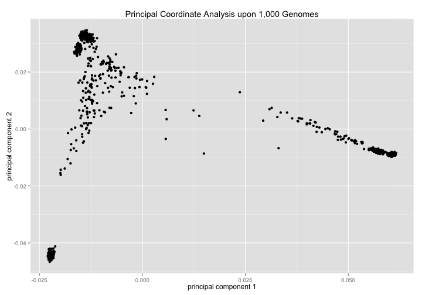
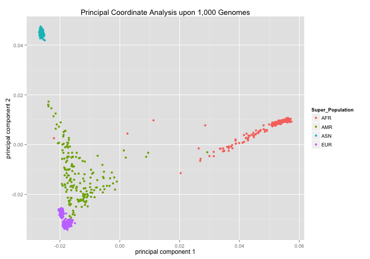
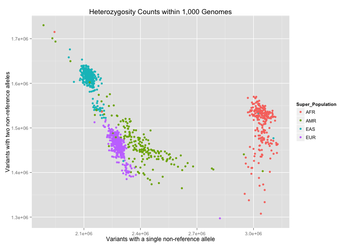
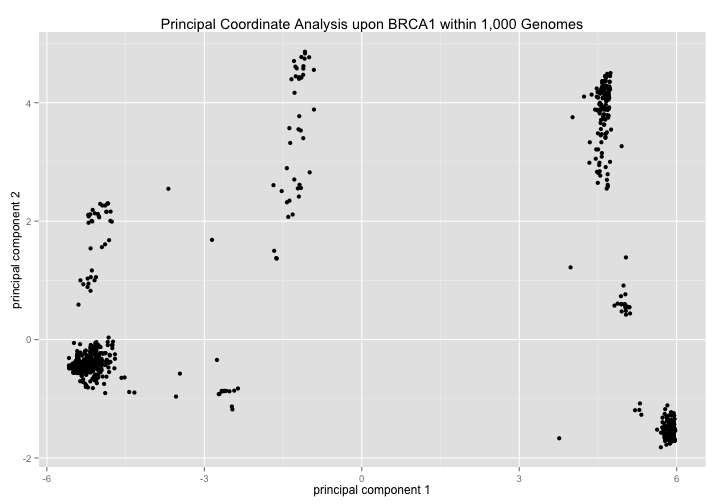
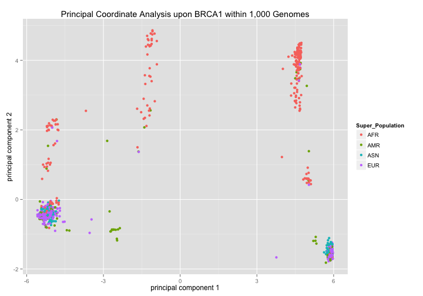
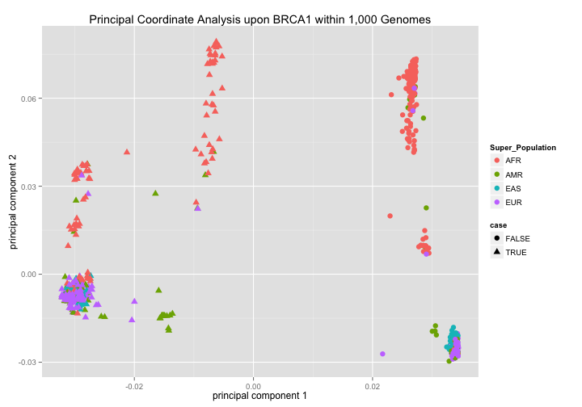
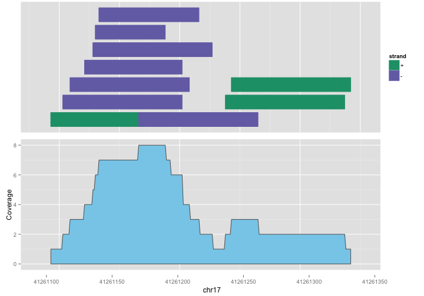

<!-- R Markdown Documentation, DO NOT EDIT THE PLAIN MARKDOWN VERSION OF THIS FILE -->

<!-- Copyright 2014 Google Inc. All rights reserved. -->

<!-- Licensed under the Apache License, Version 2.0 (the "License"); -->
<!-- you may not use this file except in compliance with the License. -->
<!-- You may obtain a copy of the License at -->

<!--     http://www.apache.org/licenses/LICENSE-2.0 -->

<!-- Unless required by applicable law or agreed to in writing, software -->
<!-- distributed under the License is distributed on an "AS IS" BASIS, -->
<!-- WITHOUT WARRANTIES OR CONDITIONS OF ANY KIND, either express or implied. -->
<!-- See the License for the specific language governing permissions and -->
<!-- limitations under the License. -->

Data Analyis using the Genomics API
===================================

The following example makes use of the [Phase 1 variants](http://ftp.1000genomes.ebi.ac.uk/vol1/ftp/release/20110521/README.phase1_integrated_release_version3_20120430) from the [1,000 Genomes Project](http://www.1000genomes.org/).  For more detail about how this data was loaded into the Google Genomics API, please see [Google Genomics Public Data](http://developers.google.com/genomics/datasets/1000-genomes-phase-1).

The VCFs comprising this dataset are **3.5 TB** when uncompressed and provide information about **39,706,715** variants for **1,092** individuals.


Working at Scale
-------------------

### Cluster Computing

Suppose we have a new dataset.  One of the first things we might do is a basic visualization.  Let's start by projecting the relevant data into 2-dimensional space by performing a [Principal Coordinate Analysis](http://occamstypewriter.org/boboh/2012/01/17/pca_and_pcoa_explained/) based on the number of variants shared by each pair of individuals.

```r
# TODO: In live demo, spin up Spark cluster on Google Compute Engine Click-to-deploy
# and kick off full PCoA job from R but then load in pre-computed results so that 
# we can proceed.
pca_1kg <- read.table("./data/1kg-pca.tsv", col.names=c("Sample", "PC1", "PC2"))
# TODO: also consider just computing the similarity matrix via Spark and use the
# appropriate R package to compute PCA
```
This analysis performed an `O(N^2)` computation upon the relevant fields within the *3.5 TB* of data by running an [Apache Spark](http://spark.apache.org/) job which used the [Genomics Variants API](https://developers.google.com/genomics/v1beta/reference/variants) for its input.  Please see the relevant [source code](https://github.com/googlegenomics/spark-examples/blob/master/src/main/scala/com/google/cloud/genomics/spark/examples/VariantsPca.scala#L37) for more detail.  When running upon X cores, this job typically takes Y minutes. 

Visualizing the results we see quite distinct clusters:

```r
ggplot(pca_1kg) +
  geom_point(aes(x=PC1, y=PC2)) +
  xlab("principal component 1") +
  ylab("principal component 2") +
  ggtitle("Principal Coordinate Analysis upon 1,000 Genomes")
```



Let's pull in the [supplementary information](http://ftp.1000genomes.ebi.ac.uk/vol1/ftp/technical/working/20130606_sample_info/README_20130606_sample_info) we do have on these samples from [Google Cloud Storage](https://developers.google.com/storage/):

```r
sample_info <- read.csv("http://storage.googleapis.com/genomics-public-data/1000-genomes/other/sample_info/sample_info.csv")
pca_1kg <- inner_join(pca_1kg, sample_info)
```

```
Joining by: "Sample"
```


Applying sample ethnicity to the plot:

```r
ggplot(pca_1kg) +
  geom_point(aes(x=PC1, y=PC2, color=Super_Population)) +
  xlab("principal component 1") +
  ylab("principal component 2") +
  ggtitle("Principal Coordinate Analysis upon 1,000 Genomes")
```



we see that ethnicity appears to be the primary explanation for the clusters.

### Querying

Let's also validate this by delving futher into counts of heterozygous reference (where one of the alleles is equal to the reference) and heterozygous 
alternate (where neither of the alleles is equal to the reference) variants.

```r
sample_alt_counts <- DisplayAndDispatchQuery("./sql/sample-alt-counts.sql")
```

```
# Count alternate alleles for each sample.
SELECT
  Sample,
  SUM(IF((first_allele > 0 AND second_allele = 0)
      OR (first_allele = 0 AND second_allele > 0),
      1, 0)) AS single,
  SUM(IF(first_allele > 0 AND second_allele > 0,
      1, 0)) AS double,
FROM
  (
  SELECT
    reference_name,
    call.call_set_name AS Sample,
    NTH(1, call.genotype) WITHIN call AS first_allele,
    NTH(2, call.genotype) WITHIN call AS second_allele
  FROM
    [genomics-public-data:1000_genomes.variants])
OMIT
  RECORD IF
  reference_name IN ("X", "Y", "MT")
GROUP BY
  Sample
ORDER BY
  Sample
```

```
Auto-refreshing stale OAuth token.
```
This analysis performed an $O(N)$ computation via [Google BigQuery](https://developers.google.com/bigquery/).  Since BigQuery is a columnar data store, it scans only the columns referenced by the query.  In this case, 1 TB of data was scanned, typically within 10 seconds.

Visualizing the results we again see quite distinct clusters:

```r
sample_alt_counts <- inner_join(sample_alt_counts, sample_info)
```

```
Joining by: "Sample"
```

```r
ggplot(sample_alt_counts) +
  geom_point(aes(x=single, y=double, color=Super_Population)) +
  scale_x_continuous(label=scientific_format()) +
  scale_y_continuous(label=scientific_format()) +
  xlab("Variants with a single non-reference allele") +
  ylab("Variants with two non-reference alleles") +
  ggtitle("Heterozygosity Counts within 1,000 Genomes")
```



Zooming-In
------------------------

Suppose we are interested in examining variants within the BRCA1 gene.  We might run our PCoA a second time, zooming-in specifically to this region within the genome.


```r
# TODO: in live demo, run Spark locally and kick off PCoA job from R.
pca_1kg_brca1 <- read.table("./data/1kg-brca1-pca.tsv", col.names=c("Sample", "PC1", "PC2"))
```
Since the amount of data over which this Spark job ran was small, it was feasible to run it locally.

Examining this data visually:

```r
ggplot(pca_1kg_brca1) +
  geom_point(aes(x=PC1, y=PC2)) +
  xlab("principal component 1") +
  ylab("principal component 2") +
  ggtitle("Principal Coordinate Analysis upon BRCA1 within 1,000 Genomes")
```



we see distinct clusters with a much different structure than our former result upon the entire dataset.  

Let's apply the sample information we have to this visualization to see if any of it explains the clustering.

```r
pca_1kg_brca1 <- inner_join(pca_1kg_brca1, sample_info)
```

```
Joining by: "Sample"
```

```r
ggplot(pca_1kg_brca1) +
  geom_point(aes(x=PC1, y=PC2, color=Gender)) +
  xlab("principal component 1") +
  ylab("principal component 2") +
  ggtitle("Principal Coordinate Analysis upon BRCA1 within 1,000 Genomes")
```


Gender has no apparent bearing on these variants.


```r
ggplot(pca_1kg_brca1) +
  geom_point(aes(x=PC1, y=PC2, color=Super_Population)) +
  xlab("principal component 1") +
  ylab("principal component 2") +
  ggtitle("Principal Coordinate Analysis upon BRCA1 within 1,000 Genomes")
```



we see that ethnicity does appear to account for some amount of the clustering in the second principal component axis but not in the first principal component axis.

Let's split these individuals into two groups based on their position relative to the origin of the first principal component and visualize them again with their grouping.

```r
pca_1kg_brca1 <- mutate(pca_1kg_brca1, 
                        case = 0 > PC1)
```

```r
ggplot(pca_1kg_brca1) +
  geom_point(aes(x=PC1, y=PC2, color=Super_Population, shape=case), size=3) +
  xlab("principal component 1") +
  ylab("principal component 2") +
  ggtitle("Principal Coordinate Analysis upon BRCA1 within 1,000 Genomes")
```



Next we perform a simplistic GWAS on the BRCA1 variants to retreive a ranked list of variants that differentiate these groups.

```r
case_sample_ids <- paste("'", filter(pca_1kg_brca1, case==TRUE)$Sample, "'", sep="", collapse=",")
significant_variants <- DisplayAndDispatchQuery("./sql/gwas-brca1-pattern.sql",
                                                list(CASE_SAMPLE_IDS__=case_sample_ids))
```

```
# A template for a simplistic GWAS query upon 1,000 Genomes phase 1 variants
# within BRCA1.  The template allows customization of the list of sample ids
# in the case group.  http://homes.cs.washington.edu/~suinlee/genome560/lecture7.pdf
SELECT
  reference_name,
  start,
  end,
  reference_bases,
  alternate_bases,
  vt,
  case_count,
  control_count,
  allele_count,
  ref_count,
  alt_count,
  case_ref_count,
  case_alt_count,
  control_ref_count,
  control_alt_count,
  ROUND(
    POW(case_ref_count - (ref_count/allele_count)*case_count,
      2)/((ref_count/allele_count)*case_count) +
    POW(control_ref_count - (ref_count/allele_count)*control_count,
      2)/((ref_count/allele_count)*control_count) +
    POW(case_alt_count - (alt_count/allele_count)*case_count,
      2)/((alt_count/allele_count)*case_count) +
    POW(control_alt_count - (alt_count/allele_count)*control_count,
      2)/((alt_count/allele_count)*control_count),
    3)
  AS chi_squared_score
FROM (
  SELECT
    reference_name,
    start,
    end,
    reference_bases,
    alternate_bases,
    vt,
    SUM(ref_count + alt_count) AS allele_count,
    SUM(ref_count) AS ref_count,
    SUM(alt_count) AS alt_count,
    SUM(IF(TRUE = is_case, INTEGER(ref_count + alt_count), 0)) AS case_count,
    SUM(IF(FALSE = is_case, INTEGER(ref_count + alt_count), 0)) AS control_count,
    SUM(IF(TRUE = is_case, ref_count, 0)) AS case_ref_count,
    SUM(IF(TRUE = is_case, alt_count, 0)) AS case_alt_count,
    SUM(IF(FALSE = is_case, ref_count, 0)) AS control_ref_count,
    SUM(IF(FALSE = is_case, alt_count, 0)) AS control_alt_count,
  FROM (
    SELECT
      reference_name,
      start,
      end,
      reference_bases,
      alternate_bases,
      vt,
      # 1000 genomes data is bi-allelic so there is only ever a single alt
      (0 = first_allele) + (0 = second_allele) AS ref_count,
      (1 = first_allele) + (1 = second_allele) AS alt_count,
      call.call_set_name IN (CASE_SAMPLE_IDS__) AS is_case,
    FROM (
        SELECT
          reference_name,
          start,
          end,
          reference_bases,
          NTH(1, alternate_bases) WITHIN RECORD AS alternate_bases,
          vt,
          call.call_set_name,
          NTH(1, call.genotype) WITHIN call AS first_allele,
          NTH(2, call.genotype) WITHIN call AS second_allele,
        FROM
          [genomics-public-data:1000_genomes.variants]
        WHERE
          reference_name = '17'
          AND start BETWEEN 41196311 AND 41277499
    ) )
  GROUP BY
    reference_name,
    start,
    end,
    reference_bases,
    alternate_bases,
    vt)
WHERE
  # For chi-squared, expected counts must be at least 5 for each group
  (ref_count/allele_count)*case_count >= 5.0
  AND (ref_count/allele_count)*control_count >= 5.0
  AND (alt_count/allele_count)*case_count >= 5.0
  AND (alt_count/allele_count)*control_count >= 5.0
HAVING
  # Chi-squared critical value for df=1, p-value=5*10^-8 is 29.71679
  chi_squared_score >= 29.71679
ORDER BY
  chi_squared_score DESC,
  start
```
Note that with a minor change to the SQL, we could have run this same GWAS query over all variants within a much larger region, over an entire chromosome, or even the full dataset; returning the ranked list of variants that differ between the two groups.

```r
head(significant_variants)
```

```
  reference_name    start      end reference_bases alternate_bases  vt
1             17 41218332 41218333               G               A SNP
2             17 41259048 41259049               C               T SNP
3             17 41261232 41261233               C               T SNP
4             17 41265775 41265776               A               G SNP
5             17 41268205 41268206               A               C SNP
6             17 41241389 41241390               C               A SNP
  case_count control_count allele_count ref_count alt_count case_ref_count
1       1158          1026         2184      1473       711            447
2       1158          1026         2184      1473       711            447
3       1158          1026         2184      1473       711            447
4       1158          1026         2184      1473       711            447
5       1158          1026         2184      1473       711            447
6       1158          1026         2184      1471       713            446
  case_alt_count control_ref_count control_alt_count chi_squared_score
1            711              1026                 0             934.0
2            711              1026                 0             934.0
3            711              1026                 0             934.0
4            711              1026                 0             934.0
5            711              1026                 0             934.0
6            712              1025                 1             932.3
```

Next we will annotate the top differenting variants using [BioConductor](http://www.bioconductor.org/).  First we will use the Genomics API R client to retrieve just the variant in which we are interested and expose it to R using the BioConductor VRanges data type.

```r
# TODO handle this vector inside the R package
variantData <-  Reduce(append, apply(head(significant_variants, 20), 1, function(sv) {
  getVariantData(datasetId="10473108253681171589", chromosome=sv["reference_name"], start=sv["start"], end=sv["end"])
}))
summary(variantData)
```

```
 Length   Class    Mode 
     20 GRanges      S4 
```


```r
require(VariantAnnotation)
require(BSgenome.Hsapiens.UCSC.hg19)
require(TxDb.Hsapiens.UCSC.hg19.knownGene)
txdb <- TxDb.Hsapiens.UCSC.hg19.knownGene
variantData <- renameSeqlevels(variantData, c("17"="chr17"))
codingVariants <- locateVariants(variantData, txdb, CodingVariants())
codingVariants
```

```
GRanges with 22 ranges and 7 metadata columns:
       seqnames               ranges strand   | LOCATION   QUERYID
          <Rle>            <IRanges>  <Rle>   | <factor> <integer>
   [1]    chr17 [41244000, 41244000]      -   |   coding        17
   [2]    chr17 [41244000, 41244000]      -   |   coding        17
   [3]    chr17 [41244000, 41244000]      -   |   coding        17
   [4]    chr17 [41244000, 41244000]      -   |   coding        17
   [5]    chr17 [41244000, 41244000]      -   |   coding        17
   ...      ...                  ...    ... ...      ...       ...
  [18]    chr17 [41245466, 41245466]      -   |   coding        18
  [19]    chr17 [41245466, 41245466]      -   |   coding        18
  [20]    chr17 [41245466, 41245466]      -   |   coding        18
  [21]    chr17 [41245466, 41245466]      -   |   coding        18
  [22]    chr17 [41245466, 41245466]      -   |   coding        18
            TXID     CDSID      GENEID       PRECEDEID        FOLLOWID
       <integer> <integer> <character> <CharacterList> <CharacterList>
   [1]     63595    186231         672                                
   [2]     63598    186231         672                                
   [3]     63599    186231         672                                
   [4]     63600    186231         672                                
   [5]     63607    186230         672                                
   ...       ...       ...         ...             ...             ...
  [18]     63609    186233         672                                
  [19]     63610    186233         672                                
  [20]     63611    186233         672                                
  [21]     63612    186233         672                                
  [22]     63613    186232         672                                
  ---
  seqlengths:
   chr17
      NA
```

```r
# TODO: next predict the effect upon the protein
#coding <- predictCoding(variantData, txdb, seqSource=Hsapiens, variantData$ALT)

# TODO: then look up clinical impact (if any) in ClinVar

# TODO: Lastly, see if the structure we see here corresponds to hapotypes 
#       http://hapmap.ncbi.nlm.nih.gov/originhaplotype.html
```

And if we want to zoom in even further, we can retrieve the reads from the [Genomics Reads API](https://developers.google.com/genomics/v1beta/reference/readsets) for a given sample and examine coverage:

```r
readData <- getReadData(readsetId="CMvnhpKTFhCxoo_umsDk4CA", chromosome="17", start=41218200, end=41218500)
```

```
Fetching read data page
Parsing read data page
```

```r
summary(readData)
```

```
     Length       Class        Mode 
         60 GAlignments          S4 
```


```r
require(ggbio)
p1 <- autoplot(readData, aes(color=strand, fill=strand))
```

```
Scale for 'colour' is already present. Adding another scale for 'colour', which will replace the existing scale.
Scale for 'fill' is already present. Adding another scale for 'fill', which will replace the existing scale.
```

```r
p2 <- ggplot(as(readData, "GRanges")) + stat_coverage(color="gray40", fill="skyblue")
tracks(p1, p2, xlab="chr17")
```



See also [GABrowse](http://gabrowse.appspot.com/#=&readsetId=CJDmkYn8ChCcnc7i4KaWqmQ&backend=GOOGLE) for an interactive Reads browser.

In summary, in this demo from the R prompt we were able to exercise both large scale and small scale data analysis using cloud-based infrastructure.

Provenance
-------------------
Lastly, let us capture version information about R and loaded packages for the sake of provenance.

```r
sessionInfo()
```

```
R version 3.1.1 (2014-07-10)
Platform: x86_64-apple-darwin13.1.0 (64-bit)

locale:
[1] en_US.UTF-8/en_US.UTF-8/en_US.UTF-8/C/en_US.UTF-8/en_US.UTF-8

attached base packages:
[1] parallel  stats     graphics  grDevices utils     datasets  methods  
[8] base     

other attached packages:
 [1] ggbio_1.12.10                           
 [2] knitr_1.6                               
 [3] TxDb.Hsapiens.UCSC.hg19.knownGene_2.14.0
 [4] GenomicFeatures_1.16.3                  
 [5] AnnotationDbi_1.26.1                    
 [6] Biobase_2.24.0                          
 [7] BSgenome.Hsapiens.UCSC.hg19_1.3.99      
 [8] BiocInstaller_1.14.2                    
 [9] GoogleGenomics_0.1.0                    
[10] devtools_1.6                            
[11] VariantAnnotation_1.10.5                
[12] GenomicAlignments_1.0.6                 
[13] BSgenome_1.32.0                         
[14] Rsamtools_1.16.1                        
[15] Biostrings_2.32.1                       
[16] XVector_0.4.0                           
[17] GenomicRanges_1.16.4                    
[18] GenomeInfoDb_1.0.2                      
[19] IRanges_1.22.10                         
[20] BiocGenerics_0.10.0                     
[21] scales_0.2.4                            
[22] testthat_0.9                            
[23] xtable_1.7-3                            
[24] dplyr_0.2                               
[25] ggplot2_1.0.0                           
[26] bigrquery_0.1                           

loaded via a namespace (and not attached):
 [1] acepack_1.3-3.3     assertthat_0.1.0.99 base64enc_0.1-2    
 [4] BatchJobs_1.4       BBmisc_1.7          BiocParallel_0.6.1 
 [7] biomaRt_2.20.0      biovizBase_1.12.3   bitops_1.0-6       
[10] brew_1.0-6          checkmate_1.4       cluster_1.15.3     
[13] codetools_0.2-9     colorspace_1.2-4    DBI_0.3.1          
[16] dichromat_2.0-0     digest_0.6.4        evaluate_0.5.5     
[19] fail_1.2            foreach_1.4.2       foreign_0.8-61     
[22] formatR_1.0         Formula_1.1-2       grid_3.1.1         
[25] gridExtra_0.9.1     gtable_0.1.2        Hmisc_3.14-5       
[28] htmltools_0.2.6     httr_0.5            iterators_1.0.7    
[31] jsonlite_0.9.12     labeling_0.3        lattice_0.20-29    
[34] latticeExtra_0.6-26 MASS_7.3-35         munsell_0.4.2      
[37] nnet_7.3-8          plyr_1.8.1          proto_0.3-10       
[40] RColorBrewer_1.0-5  Rcpp_0.11.3         RCurl_1.95-4.3     
[43] reshape2_1.4        rjson_0.2.14        rmarkdown_0.3.3    
[46] rpart_4.1-8         RSQLite_0.11.4      rtracklayer_1.24.2 
[49] sendmailR_1.2-1     splines_3.1.1       stats4_3.1.1       
[52] stringr_0.6.2       survival_2.37-7     tools_3.1.1        
[55] XML_3.98-1.1        zlibbioc_1.10.0    
```


