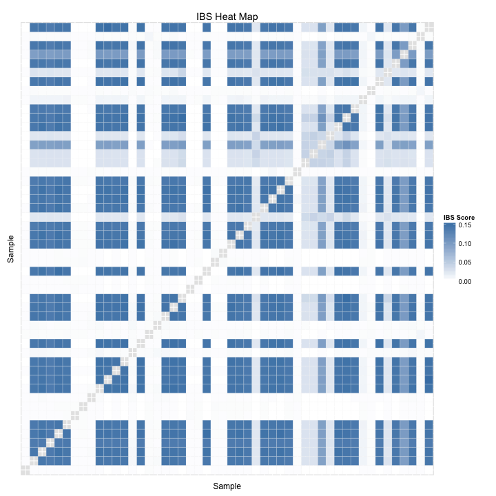

# Identity By State (IBS) for 1000 Genomes BRAC1


The input IBS matrix is an $N\times N$ matrix, where $N$ is the size of the
population. First, transform this matrix into a $N^2 \times 3$ matrix, where
each row represents the IBS score for a pair of individuals.


```r
library(reshape2)
ibs_data <- read.table("./1000genomes_phase1_brca1.ibs", header=TRUE,
                       row.names=1, stringsAsFactors=FALSE)
ibs_matrix <- data.matrix(ibs_data)
ibs_pairs <- melt(ibs_matrix)
colnames(ibs_pairs) <- c("sample1", "sample2", "ibs_score")
write.table(ibs_pairs, file="1000genomes_phase1_brca1_melted.ibs")
```

Extract the IBS matrix for a random sample of individuals.


```r
individuals <- unique(ibs_pairs$sample1)
sample_size <- 50
sample <- sample(individuals, sample_size)
ibs_pairs <- subset(ibs_pairs, ibs_pairs$sample1 %in% sample)
ibs_pairs <- subset(ibs_pairs, ibs_pairs$sample2 %in% sample)
```
Then, draw a heat map based on the IBS scores.


```r
require(ggplot2)
p <- ggplot(data=ibs_pairs, aes(x=sample1, y=sample2)) +
     theme(axis.ticks=element_blank(), axis.text=element_blank()) +
     geom_tile(aes(fill=ibs_score), colour="white") +
     scale_fill_gradient(low="white", high="steelblue",
                         guide=guide_colourbar(title="IBS Score")) +
     labs(list(title="IBS Heat Map", x="Sample", y="Sample"))
p
```



