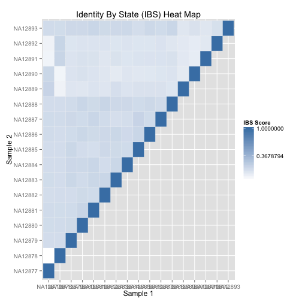

<!-- R Markdown Documentation, DO NOT EDIT THE PLAIN MARKDOWN VERSION OF THIS FILE -->

<!-- Copyright 2015 Google Inc. All rights reserved. -->

<!-- Licensed under the Apache License, Version 2.0 (the "License"); -->
<!-- you may not use this file except in compliance with the License. -->
<!-- You may obtain a copy of the License at -->

<!--     http://www.apache.org/licenses/LICENSE-2.0 -->

<!-- Unless required by applicable law or agreed to in writing, software -->
<!-- distributed under the License is distributed on an "AS IS" BASIS, -->
<!-- WITHOUT WARRANTIES OR CONDITIONS OF ANY KIND, either express or implied. -->
<!-- See the License for the specific language governing permissions and -->
<!-- limitations under the License. -->

# Sample-Level QC

* Singleton Rate
* Missingness Rate
* Heterozygosity Rate and Inbreeding Coefficient
* Sex Inference
* Ethnicity Inference
* Genome Similarity


## Singleton Rate

```r
result <- DisplayAndDispatchQuery("./sql/private-variants.sql",
                                  project=project,
                                  replacements=table_replacement)
```

```
# Compute private variants counts for each sample.
SELECT
  INDV,
  COUNT(INDV) AS private_variant_count,
FROM (
  SELECT
    reference_name AS CHROM,
    start AS POS,
    GROUP_CONCAT(CASE WHEN cnt = 1 THEN 'S'
      WHEN cnt = 2 THEN 'D'
      ELSE STRING(cnt) END) AS SINGLETON_DOUBLETON,
    reference_bases AS REF,
    alternate_bases AS ALT,
    GROUP_CONCAT(call.call_set_name) AS INDV,
    GROUP_CONCAT(genotype) AS genotype,
    SUM(num_samples_with_variant) AS num_samples_with_variant
  FROM (
    SELECT
      reference_name,
      start,
      reference_bases,
      alternate_bases,
      alt_num,
      call.call_set_name,
      GROUP_CONCAT(STRING(call.genotype)) WITHIN call AS genotype,
      SUM(call.genotype == alt_num) WITHIN call AS cnt,
      COUNT(call.call_set_name) WITHIN RECORD AS num_samples_with_variant
    FROM (
        FLATTEN((
          SELECT
            reference_name,
            start,
            reference_bases,
            alternate_bases,
            POSITION(alternate_bases) AS alt_num,
            call.call_set_name,
            call.genotype,
          FROM
            [genomics-public-data:platinum_genomes.variants]
          # Optionally add a clause here to limit the query to a particular
          # region of the genome.
          #_WHERE_
          OMIT call IF EVERY(call.genotype = -1)
        ), alternate_bases)
        )
    OMIT
      RECORD IF alternate_bases IS NULL
    HAVING
      cnt > 0
      )
    GROUP EACH BY
    chrom,
    pos,
    ref,
    alt
  HAVING
    num_samples_with_variant = 1
    )
GROUP BY
  INDV
ORDER BY
  private_variant_count DESC
```
Number of rows returned by this query: 17.

<!-- html table generated in R 3.1.1 by xtable 1.7-4 package -->
<!-- Tue Feb  3 11:58:22 2015 -->
<table border=1>
<tr> <th> INDV </th> <th> private_variant_count </th>  </tr>
  <tr> <td> NA12890 </td> <td align="right"> 418760 </td> </tr>
  <tr> <td> NA12892 </td> <td align="right"> 415630 </td> </tr>
  <tr> <td> NA12889 </td> <td align="right"> 415513 </td> </tr>
  <tr> <td> NA12891 </td> <td align="right"> 394767 </td> </tr>
  <tr> <td> NA12881 </td> <td align="right"> 86565 </td> </tr>
  <tr> <td> NA12878 </td> <td align="right"> 82767 </td> </tr>
  <tr> <td> NA12884 </td> <td align="right"> 82571 </td> </tr>
  <tr> <td> NA12877 </td> <td align="right"> 81159 </td> </tr>
  <tr> <td> NA12883 </td> <td align="right"> 78648 </td> </tr>
  <tr> <td> NA12880 </td> <td align="right"> 78461 </td> </tr>
  <tr> <td> NA12887 </td> <td align="right"> 76395 </td> </tr>
  <tr> <td> NA12893 </td> <td align="right"> 75042 </td> </tr>
  <tr> <td> NA12879 </td> <td align="right"> 74672 </td> </tr>
  <tr> <td> NA12888 </td> <td align="right"> 73311 </td> </tr>
  <tr> <td> NA12886 </td> <td align="right"> 72490 </td> </tr>
  <tr> <td> NA12885 </td> <td align="right"> 72283 </td> </tr>
  <tr> <td> NA12882 </td> <td align="right"> 62161 </td> </tr>
   </table>

## Missingness Rate

```r
result <- DisplayAndDispatchQuery("./sql/sample-level-missingness.sql",
                                  project=project,
                                  replacements=table_replacement)
```

```
# Compute the ratio of positions corresponding to no-calls versus all positions
# called (reference, variant, and no-calls).
SELECT
  sample_id,
  no_calls,
  all_calls,
  (no_calls/all_calls) AS missingness_rate
FROM (
  SELECT
    sample_id,
    SUM(IF(has_no_calls, delta, 0)) AS no_calls,
    SUM(delta) AS all_calls
  FROM (
    SELECT
      END - start AS delta,
      call.call_set_name AS sample_id,
      SOME(call.genotype == -1) WITHIN call AS has_no_calls,
    FROM
      [genomics-public-data:platinum_genomes.variants]
    # Optionally add clause here to limit the query to a particular
    # region of the genome.
    #_WHERE_
    )
  GROUP BY
    sample_id)
ORDER BY
  sample_id
```
Number of rows returned by this query: 17.

<!-- html table generated in R 3.1.1 by xtable 1.7-4 package -->
<!-- Tue Feb  3 11:58:24 2015 -->
<table border=1>
<tr> <th> sample_id </th> <th> no_calls </th> <th> all_calls </th> <th> missingness_rate </th>  </tr>
  <tr> <td> NA12877 </td> <td align="right"> 41927032 </td> <td align="right"> 2147483647 </td> <td align="right"> 0.01 </td> </tr>
  <tr> <td> NA12878 </td> <td align="right"> 58122228 </td> <td align="right"> 2147483647 </td> <td align="right"> 0.02 </td> </tr>
  <tr> <td> NA12879 </td> <td align="right"> 59224162 </td> <td align="right"> 2147483647 </td> <td align="right"> 0.02 </td> </tr>
  <tr> <td> NA12880 </td> <td align="right"> 58539440 </td> <td align="right"> 2147483647 </td> <td align="right"> 0.02 </td> </tr>
  <tr> <td> NA12881 </td> <td align="right"> 58261455 </td> <td align="right"> 2147483647 </td> <td align="right"> 0.02 </td> </tr>
  <tr> <td> NA12882 </td> <td align="right"> 42249595 </td> <td align="right"> 2147483647 </td> <td align="right"> 0.01 </td> </tr>
  <tr> <td> NA12883 </td> <td align="right"> 42898398 </td> <td align="right"> 2147483647 </td> <td align="right"> 0.01 </td> </tr>
  <tr> <td> NA12884 </td> <td align="right"> 43068456 </td> <td align="right"> 2147483647 </td> <td align="right"> 0.02 </td> </tr>
  <tr> <td> NA12885 </td> <td align="right"> 59611219 </td> <td align="right"> 2147483647 </td> <td align="right"> 0.02 </td> </tr>
  <tr> <td> NA12886 </td> <td align="right"> 42030311 </td> <td align="right"> 2147483647 </td> <td align="right"> 0.01 </td> </tr>
  <tr> <td> NA12887 </td> <td align="right"> 58855381 </td> <td align="right"> 2147483647 </td> <td align="right"> 0.02 </td> </tr>
  <tr> <td> NA12888 </td> <td align="right"> 43427753 </td> <td align="right"> 2147483647 </td> <td align="right"> 0.02 </td> </tr>
  <tr> <td> NA12889 </td> <td align="right"> 42357008 </td> <td align="right"> 2147483647 </td> <td align="right"> 0.01 </td> </tr>
  <tr> <td> NA12890 </td> <td align="right"> 59109599 </td> <td align="right"> 2147483647 </td> <td align="right"> 0.02 </td> </tr>
  <tr> <td> NA12891 </td> <td align="right"> 44879167 </td> <td align="right"> 2147483647 </td> <td align="right"> 0.02 </td> </tr>
  <tr> <td> NA12892 </td> <td align="right"> 58520385 </td> <td align="right"> 2147483647 </td> <td align="right"> 0.02 </td> </tr>
  <tr> <td> NA12893 </td> <td align="right"> 42705227 </td> <td align="right"> 2147483647 </td> <td align="right"> 0.01 </td> </tr>
   </table>

## Homozygosity Rate and Inbreeding Coefficient


```r
result <- DisplayAndDispatchQuery("./sql/homozygous-variants.sql",
                                  project=project,
                                  replacements=table_replacement)
```

```
# Compute the expected and observed homozygosity rate for each individual.
SELECT
  INDV,
  O_HOM,
  ROUND(E_HOM, 2) as E_HOM,
  N_SITES,
  ROUND((O_HOM - E_HOM) / (N_SITES - E_HOM), 5) AS F
FROM (
  SELECT
    call.call_set_name AS INDV,
    SUM(first_allele = second_allele) AS O_HOM,
    SUM(1.0 - (2.0 * freq * (1.0 - freq) * (called_allele_count / (called_allele_count - 1.0)))) AS E_HOM,
    COUNT(call.call_set_name) AS N_SITES,
  FROM (
    SELECT
      reference_name,
      start,
      reference_bases,
      GROUP_CONCAT(alternate_bases) WITHIN RECORD AS alternate_bases,
      call.call_set_name,
      NTH(1, call.genotype) WITHIN call AS first_allele,
      NTH(2, call.genotype) WITHIN call AS second_allele,
      COUNT(alternate_bases) WITHIN RECORD AS num_alts,
      SUM(call.genotype >= 0) WITHIN RECORD AS called_allele_count,
      IF((SUM(1 = call.genotype) > 0),
        SUM(call.genotype = 1)/SUM(call.genotype >= 0),
        -1)  WITHIN RECORD AS freq
    FROM
      [google.com:biggene:platinum_genomes.expanded_variants]
    # Optionally add a clause here to limit the query to a particular
    # region of the genome.
    #_WHERE_
    # Skip no calls and haploid sites
    OMIT call IF SOME(call.genotype < 0) OR (2 > COUNT(call.genotype))
    HAVING
      # Skip 1/2 genotypes _and non-SNP variants
      num_alts = 1
      AND reference_bases IN ('A','C','G','T')
      AND alternate_bases IN ('A','C','G','T')
      )
  GROUP BY
    INDV
    )
ORDER BY
  INDV
```
Number of rows returned by this query: 17.

<!-- html table generated in R 3.1.1 by xtable 1.7-4 package -->
<!-- Tue Feb  3 11:58:28 2015 -->
<table border=1>
<tr> <th> INDV </th> <th> O_HOM </th> <th> E_HOM </th> <th> N_SITES </th> <th> F </th>  </tr>
  <tr> <td> NA12877 </td> <td align="right"> 6794394 </td> <td align="right"> 7988474.22 </td> <td align="right"> 10204968 </td> <td align="right"> -0.54 </td> </tr>
  <tr> <td> NA12878 </td> <td align="right"> 6700705 </td> <td align="right"> 7955077.42 </td> <td align="right"> 10171953 </td> <td align="right"> -0.57 </td> </tr>
  <tr> <td> NA12879 </td> <td align="right"> 6620470 </td> <td align="right"> 7933125.29 </td> <td align="right"> 10147411 </td> <td align="right"> -0.59 </td> </tr>
  <tr> <td> NA12880 </td> <td align="right"> 6590387 </td> <td align="right"> 7929608.34 </td> <td align="right"> 10150696 </td> <td align="right"> -0.60 </td> </tr>
  <tr> <td> NA12881 </td> <td align="right"> 6567127 </td> <td align="right"> 7935804.42 </td> <td align="right"> 10153820 </td> <td align="right"> -0.62 </td> </tr>
  <tr> <td> NA12882 </td> <td align="right"> 6805829 </td> <td align="right"> 7965142.57 </td> <td align="right"> 10202639 </td> <td align="right"> -0.52 </td> </tr>
  <tr> <td> NA12883 </td> <td align="right"> 6711035 </td> <td align="right"> 7960645.88 </td> <td align="right"> 10196517 </td> <td align="right"> -0.56 </td> </tr>
  <tr> <td> NA12884 </td> <td align="right"> 6724829 </td> <td align="right"> 7968575.28 </td> <td align="right"> 10194307 </td> <td align="right"> -0.56 </td> </tr>
  <tr> <td> NA12885 </td> <td align="right"> 6646687 </td> <td align="right"> 7915953.64 </td> <td align="right"> 10143362 </td> <td align="right"> -0.57 </td> </tr>
  <tr> <td> NA12886 </td> <td align="right"> 6711907 </td> <td align="right"> 7958039.74 </td> <td align="right"> 10198639 </td> <td align="right"> -0.56 </td> </tr>
  <tr> <td> NA12887 </td> <td align="right"> 6596235 </td> <td align="right"> 7922772.49 </td> <td align="right"> 10145655 </td> <td align="right"> -0.60 </td> </tr>
  <tr> <td> NA12888 </td> <td align="right"> 6689570 </td> <td align="right"> 7948212.37 </td> <td align="right"> 10168686 </td> <td align="right"> -0.57 </td> </tr>
  <tr> <td> NA12889 </td> <td align="right"> 6754839 </td> <td align="right"> 8227918.79 </td> <td align="right"> 10229176 </td> <td align="right"> -0.74 </td> </tr>
  <tr> <td> NA12890 </td> <td align="right"> 6732772 </td> <td align="right"> 8148035.81 </td> <td align="right"> 10189031 </td> <td align="right"> -0.69 </td> </tr>
  <tr> <td> NA12891 </td> <td align="right"> 6717266 </td> <td align="right"> 8155071.16 </td> <td align="right"> 10184943 </td> <td align="right"> -0.71 </td> </tr>
  <tr> <td> NA12892 </td> <td align="right"> 6656245 </td> <td align="right"> 8140185.61 </td> <td align="right"> 10181667 </td> <td align="right"> -0.73 </td> </tr>
  <tr> <td> NA12893 </td> <td align="right"> 6694329 </td> <td align="right"> 7952465.33 </td> <td align="right"> 10172280 </td> <td align="right"> -0.57 </td> </tr>
   </table>

## Sex Inference


```r
result <- DisplayAndDispatchQuery("./sql/gender-check.sql",
                                  project=project,
                                  replacements=table_replacement)
```

```
# Compute the the homozygous and heterozygous variant counts for each individual
# within chromosome X to help determine whether the gender phenotype value is
# correct for each individual.
SELECT
  sample_id,
  (hom_AA_count + het_RA_count + hom_RR_count) AS all_callable_sites,
  hom_AA_count,
  het_RA_count,
  hom_RR_count,
  (hom_AA_count + het_RA_count) AS all_snvs,
  ROUND((het_RA_count/(hom_AA_count + het_RA_count))*1000)/1000 AS perct_het_alt_in_snvs,
  ROUND((hom_AA_count/(hom_AA_count + het_RA_count))*1000)/1000 AS perct_hom_alt_in_snvs
FROM
  (
  SELECT
    sample_id,
    SUM(0 = first_allele
      AND 0 = second_allele) AS hom_RR_count,
    SUM(first_allele = second_allele AND first_allele > 0) AS hom_AA_count,
    SUM((first_allele != second_allele OR second_allele IS NULL)
      AND (first_allele > 0 OR second_allele > 0)) AS het_RA_count
  FROM (
    SELECT
      reference_bases,
      GROUP_CONCAT(alternate_bases) WITHIN RECORD AS alternate_bases,
      COUNT(alternate_bases) WITHIN RECORD AS num_alts,
      call.call_set_name AS sample_id,
      NTH(1, call.genotype) WITHIN call AS first_allele,
      NTH(2, call.genotype) WITHIN call AS second_allele,
    FROM
      [google.com:biggene:platinum_genomes.expanded_variants]
    WHERE
      reference_name = 'chrX'
      AND start NOT BETWEEN 59999 AND 2699519
      AND start NOT BETWEEN 154931042 AND 155260559
    HAVING
      # Skip 1/2 genotypes _and non-SNP variants
      num_alts = 1
      AND reference_bases IN ('A','C','G','T')
      AND alternate_bases IN ('A','C','G','T')
      )
  GROUP BY
    sample_id)
ORDER BY
  sample_id
```
Number of rows returned by this query: 17.

<!-- html table generated in R 3.1.1 by xtable 1.7-4 package -->
<!-- Tue Feb  3 11:58:31 2015 -->
<table border=1>
<tr> <th> sample_id </th> <th> all_callable_sites </th> <th> hom_AA_count </th> <th> het_RA_count </th> <th> hom_RR_count </th> <th> all_snvs </th> <th> perct_het_alt_in_snvs </th> <th> perct_hom_alt_in_snvs </th>  </tr>
  <tr> <td> NA12877 </td> <td align="right"> 329461 </td> <td align="right"> 79721 </td> <td align="right"> 37317 </td> <td align="right"> 212423 </td> <td align="right"> 117038 </td> <td align="right"> 0.32 </td> <td align="right"> 0.68 </td> </tr>
  <tr> <td> NA12878 </td> <td align="right"> 326950 </td> <td align="right"> 43626 </td> <td align="right"> 106398 </td> <td align="right"> 176926 </td> <td align="right"> 150024 </td> <td align="right"> 0.71 </td> <td align="right"> 0.29 </td> </tr>
  <tr> <td> NA12879 </td> <td align="right"> 326052 </td> <td align="right"> 45636 </td> <td align="right"> 105711 </td> <td align="right"> 174705 </td> <td align="right"> 151347 </td> <td align="right"> 0.70 </td> <td align="right"> 0.30 </td> </tr>
  <tr> <td> NA12880 </td> <td align="right"> 325288 </td> <td align="right"> 47237 </td> <td align="right"> 105768 </td> <td align="right"> 172283 </td> <td align="right"> 153005 </td> <td align="right"> 0.69 </td> <td align="right"> 0.31 </td> </tr>
  <tr> <td> NA12881 </td> <td align="right"> 325437 </td> <td align="right"> 47424 </td> <td align="right"> 105386 </td> <td align="right"> 172627 </td> <td align="right"> 152810 </td> <td align="right"> 0.69 </td> <td align="right"> 0.31 </td> </tr>
  <tr> <td> NA12882 </td> <td align="right"> 328200 </td> <td align="right"> 78797 </td> <td align="right"> 34911 </td> <td align="right"> 214492 </td> <td align="right"> 113708 </td> <td align="right"> 0.31 </td> <td align="right"> 0.69 </td> </tr>
  <tr> <td> NA12883 </td> <td align="right"> 329159 </td> <td align="right"> 76907 </td> <td align="right"> 38032 </td> <td align="right"> 214220 </td> <td align="right"> 114939 </td> <td align="right"> 0.33 </td> <td align="right"> 0.67 </td> </tr>
  <tr> <td> NA12884 </td> <td align="right"> 327724 </td> <td align="right"> 78601 </td> <td align="right"> 38645 </td> <td align="right"> 210478 </td> <td align="right"> 117246 </td> <td align="right"> 0.33 </td> <td align="right"> 0.67 </td> </tr>
  <tr> <td> NA12885 </td> <td align="right"> 325591 </td> <td align="right"> 46838 </td> <td align="right"> 102998 </td> <td align="right"> 175755 </td> <td align="right"> 149836 </td> <td align="right"> 0.69 </td> <td align="right"> 0.31 </td> </tr>
  <tr> <td> NA12886 </td> <td align="right"> 327948 </td> <td align="right"> 78590 </td> <td align="right"> 39225 </td> <td align="right"> 210133 </td> <td align="right"> 117815 </td> <td align="right"> 0.33 </td> <td align="right"> 0.67 </td> </tr>
  <tr> <td> NA12887 </td> <td align="right"> 325777 </td> <td align="right"> 45117 </td> <td align="right"> 107107 </td> <td align="right"> 173553 </td> <td align="right"> 152224 </td> <td align="right"> 0.70 </td> <td align="right"> 0.30 </td> </tr>
  <tr> <td> NA12888 </td> <td align="right"> 324782 </td> <td align="right"> 78392 </td> <td align="right"> 37682 </td> <td align="right"> 208708 </td> <td align="right"> 116074 </td> <td align="right"> 0.33 </td> <td align="right"> 0.68 </td> </tr>
  <tr> <td> NA12889 </td> <td align="right"> 328313 </td> <td align="right"> 77435 </td> <td align="right"> 37636 </td> <td align="right"> 213242 </td> <td align="right"> 115071 </td> <td align="right"> 0.33 </td> <td align="right"> 0.67 </td> </tr>
  <tr> <td> NA12890 </td> <td align="right"> 328233 </td> <td align="right"> 44075 </td> <td align="right"> 104357 </td> <td align="right"> 179801 </td> <td align="right"> 148432 </td> <td align="right"> 0.70 </td> <td align="right"> 0.30 </td> </tr>
  <tr> <td> NA12891 </td> <td align="right"> 323041 </td> <td align="right"> 78885 </td> <td align="right"> 37234 </td> <td align="right"> 206922 </td> <td align="right"> 116119 </td> <td align="right"> 0.32 </td> <td align="right"> 0.68 </td> </tr>
  <tr> <td> NA12892 </td> <td align="right"> 326992 </td> <td align="right"> 43570 </td> <td align="right"> 105552 </td> <td align="right"> 177870 </td> <td align="right"> 149122 </td> <td align="right"> 0.71 </td> <td align="right"> 0.29 </td> </tr>
  <tr> <td> NA12893 </td> <td align="right"> 325037 </td> <td align="right"> 79020 </td> <td align="right"> 36655 </td> <td align="right"> 209362 </td> <td align="right"> 115675 </td> <td align="right"> 0.32 </td> <td align="right"> 0.68 </td> </tr>
   </table>

## Ethnicity Inference

For this check, we:
* use the intersection of common variants found in both 1,000 Genomes phase 1 variants and Platinum Genomes
* compute PCA on those variants in common between the two data
* examine whether the individuals in Platinum Genomes cluster with other samples of the same ethnicity

This is a work-in-progress.  See https://github.com/elmer-garduno/spark-examples/tree/multiple_dataset_pca for the current state.

## Genome Similarity

### Results


```r
ibs <- read.table("./data/platinum-genomes-ibs.tsv",
                  col.names=c("sample1", "sample2", "ibsScore", "similar", "observed"))
ggplot(data=ibs, aes(x=sample1, y=sample2)) +
       geom_tile(aes(fill=ibsScore), colour="white") +
       scale_fill_gradient(low="white", high="steelblue", na.value="black", trans="log",
                           guide=guide_colourbar(title= "IBS Score")) +
       labs(list(title="Identity By State (IBS) Heat Map",
                 x="Sample 1", y="Sample 2"))
```

 

### To Run the Job

If you wish to run the Dataflow job, see the [dataflow-java README](https://github.com/googlegenomics/dataflow-java) for instructions to compile and run the job.
```
java -cp target/google-genomics-dataflow-v1beta2-0.2-SNAPSHOT.jar \
com.google.cloud.genomics.dataflow.pipelines.IdentityByState \
--project=YOUR-PROJECT \
--stagingLocation=gs://YOUR-BUCKET/staging \
--output=gs://YOUR-BUCKET/output/platinum-genomes-ibs.tsv \
--genomicsSecretsFile=/PATH/TO/YOUR/client_secrets.json \
--runner=DataflowPipelineRunner \
--numWorkers=40 \
--basesPerShard=1000000 \
--datasetId=3049512673186936334 \
--gvcf \
--allContigs
```

Note that there are several IBS calculators from which to choose.  Use the `--callSimilarityCalculatorFactory` to switch between them.

To gather the results into a single file:
```
gsutil cat gs://YOUR-BUCKET/output/platinum-genomes-ibs.tsv* | sort > platinum-genomes-ibs.tsv
```
