<!-- R Markdown Documentation, DO NOT EDIT THE PLAIN MARKDOWN VERSION OF THIS FILE -->

<!-- Copyright 2015 Google Inc. All rights reserved. -->

<!-- Licensed under the Apache License, Version 2.0 (the "License"); -->
<!-- you may not use this file except in compliance with the License. -->
<!-- You may obtain a copy of the License at -->

<!--     http://www.apache.org/licenses/LICENSE-2.0 -->

<!-- Unless required by applicable law or agreed to in writing, software -->
<!-- distributed under the License is distributed on an "AS IS" BASIS, -->
<!-- WITHOUT WARRANTIES OR CONDITIONS OF ANY KIND, either express or implied. -->
<!-- See the License for the specific language governing permissions and -->
<!-- limitations under the License. -->

# Part 3: Sample-Level QC


In Part 3 of the codelab, we perform some quality control analyses that could help to identify any problematic genomes that should be removed from the cohort before proceeding with further analysis.  The appropriate cut off thresholds will depend upon the input dataset and/or other factors.

* [Missingness Rate](#missingness-rate)
* [Singleton Rate](#singleton-rate)
* [Heterozygosity Rate and Inbreeding Coefficient](#homozygosity-rate-and-inbreeding-coefficient)
* [Sex Inference](#sex-inference)
* [Ethnicity Inference](#ethnicity-inference)
* [Genome Similarity](#genome-similarity)

By default this codelab runs upon the Illumina Platinum Genomes Variants. Update the table and change the source of sample information here if you wish to run the queries against a different dataset.

```r
queryReplacements <- list("_THE_TABLE_"="genomics-public-data:platinum_genomes.variants",
                          "_THE_EXPANDED_TABLE_"="google.com:biggene:platinum_genomes.expanded_variants")

sampleData <- read.csv("http://storage.googleapis.com/genomics-public-data/platinum-genomes/other/platinum_genomes_sample_info.csv")
sampleInfo <- dplyr::select(sampleData, call_call_set_name=Catalog.ID, gender=Gender)

ibs <- read.table("./data/platinum-genomes-ibs.tsv",
                  col.names=c("sample1", "sample2", "ibsScore", "similar", "observed"))

# To run this against other public data, source in one of the dataset helpers.  For example:
# source("./rHelpers/pgpCGIOnlyDataset.R")
```

## Missingness Rate

For each genome, determine the percentage of sites explicitly called as a no-call.  If this percentage is too high, the genome may be problematic.


```r
result <- DisplayAndDispatchQuery("./sql/sample-level-missingness.sql",
                                  project=project,
                                  replacements=queryReplacements)
```

```
# Compute the ratio of positions corresponding to no-calls versus all positions
# called (reference, variant, and no-calls).
SELECT
  call.call_set_name,
  no_calls,
  all_calls,
  (no_calls/all_calls) AS missingness_rate
FROM (
  SELECT
    call.call_set_name,
    SUM(IF(has_no_calls, delta, 0)) AS no_calls,
    SUM(delta) AS all_calls
  FROM (
    SELECT
      END - start AS delta,
      call.call_set_name,
      SOME(call.genotype == -1) WITHIN call AS has_no_calls,
    FROM
      [genomics-public-data:platinum_genomes.variants]
    # Optionally add clause here to limit the query to a particular
    # region of the genome.
    #_WHERE_
    )
  GROUP BY
    call.call_set_name)
ORDER BY
  call.call_set_name
```
Number of rows returned by this query: **17**.

Displaying the first few rows of the dataframe of results:
<!-- html table generated in R 3.2.0 by xtable 1.7-4 package -->
<!-- Tue Jun  2 18:39:05 2015 -->
<table border=1>
<tr> <th> call_call_set_name </th> <th> no_calls </th> <th> all_calls </th> <th> missingness_rate </th>  </tr>
  <tr> <td> NA12877 </td> <td align="right"> 41927032 </td> <td align="right"> 2147483647 </td> <td align="right"> 0.01 </td> </tr>
  <tr> <td> NA12878 </td> <td align="right"> 58122228 </td> <td align="right"> 2147483647 </td> <td align="right"> 0.02 </td> </tr>
  <tr> <td> NA12879 </td> <td align="right"> 59224162 </td> <td align="right"> 2147483647 </td> <td align="right"> 0.02 </td> </tr>
  <tr> <td> NA12880 </td> <td align="right"> 58539440 </td> <td align="right"> 2147483647 </td> <td align="right"> 0.02 </td> </tr>
  <tr> <td> NA12881 </td> <td align="right"> 58261455 </td> <td align="right"> 2147483647 </td> <td align="right"> 0.02 </td> </tr>
  <tr> <td> NA12882 </td> <td align="right"> 42249595 </td> <td align="right"> 2147483647 </td> <td align="right"> 0.01 </td> </tr>
   </table>

And visualizing the results:

```r
ggplot(result, aes(x=missingness_rate)) +
  geom_histogram(color="black", fill="#FF6666") +
  scale_x_continuous(limits=c(0, NA), labels=percent_format()) +
  xlab("Missingness Rate") +
  ylab("Sample Count") +
  ggtitle("Histogram: Genome-Specific Missingness")
```

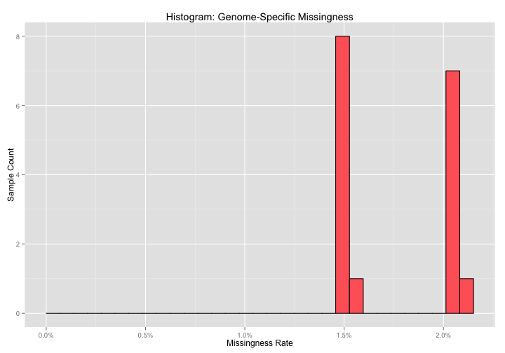


```r
p <- ggplot(result) +
  geom_point(aes(x=call_call_set_name, y=missingness_rate)) +
  scale_x_discrete(expand=c(0.05, 1)) +
  scale_y_continuous(limits=c(0, NA), labels=percent_format()) +
  xlab("Sample") +
  ylab("Missingness Rate") +
  ggtitle("Scatter Plot: Genome-Specific Missingness")
if(nrow(result) <= 20) {
  p + theme(axis.text.x=element_text(angle=50, hjust=1))
} else {
  p + theme(axis.text.x=element_blank(), axis.ticks.x=element_blank(), panel.grid.major.x=element_blank())
}
```

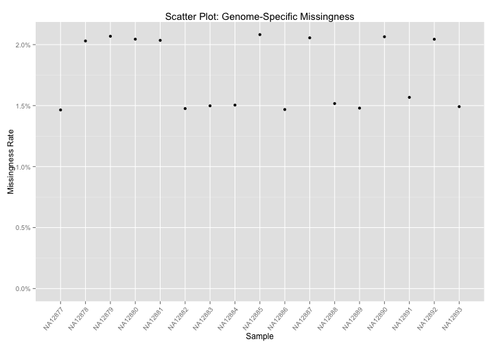

Let's accumulate our sample-specific results for later use.

```r
allResults <- result
```

## Singleton Rate

For each genome, count the number of variants shared by no other member of the cohort.  Too many private calls for a particular individual may indicate a problem.


```r
result <- DisplayAndDispatchQuery("./sql/private-variants.sql",
                                  project=project,
                                  replacements=queryReplacements)
```

```
# Compute private variants counts for each sample.
SELECT
  call.call_set_name,
  COUNT(call.call_set_name) AS private_variant_count,
FROM (
  SELECT
    reference_name,
    start,
    GROUP_CONCAT(CASE WHEN cnt = 1 THEN 'S'
      WHEN cnt = 2 THEN 'D'
      ELSE STRING(cnt) END) AS SINGLETON_DOUBLETON,
    reference_bases,
    alternate_bases,
    GROUP_CONCAT(call.call_set_name) AS call.call_set_name,
    GROUP_CONCAT(genotype) AS genotype,
    COUNT(call.call_set_name) AS num_samples_with_variant
  FROM (
    SELECT
      reference_name,
      start,
      reference_bases,
      alternate_bases,
      alt_num,
      call.call_set_name,
      GROUP_CONCAT(STRING(call.genotype)) WITHIN call AS genotype,
      SUM(call.genotype == alt_num) WITHIN call AS cnt,
    FROM (
        FLATTEN((
          SELECT
            reference_name,
            start,
            reference_bases,
            alternate_bases,
            POSITION(alternate_bases) AS alt_num,
            call.call_set_name,
            call.genotype,
          FROM
            [genomics-public-data:platinum_genomes.variants]
          # Optionally add a clause here to limit the query to a particular
          # region of the genome.
          #_WHERE_
          OMIT call IF EVERY(call.genotype = -1)
        ), alternate_bases)
        )
    OMIT RECORD IF alternate_bases IS NULL
    HAVING
      cnt > 0
      )
    GROUP EACH BY
      reference_name,
      start,
      reference_bases,
      alternate_bases
  HAVING
    num_samples_with_variant = 1
    )
GROUP BY
  call.call_set_name
ORDER BY
  private_variant_count DESC
```
Number of rows returned by this query: **17**.

Displaying the first few rows of the dataframe of results:
<!-- html table generated in R 3.2.0 by xtable 1.7-4 package -->
<!-- Tue Jun  2 18:39:08 2015 -->
<table border=1>
<tr> <th> call_call_set_name </th> <th> private_variant_count </th>  </tr>
  <tr> <td> NA12890 </td> <td align="right"> 418760 </td> </tr>
  <tr> <td> NA12892 </td> <td align="right"> 415630 </td> </tr>
  <tr> <td> NA12889 </td> <td align="right"> 415513 </td> </tr>
  <tr> <td> NA12891 </td> <td align="right"> 394767 </td> </tr>
  <tr> <td> NA12881 </td> <td align="right"> 86565 </td> </tr>
  <tr> <td> NA12878 </td> <td align="right"> 82767 </td> </tr>
   </table>

And visualizing the results:

```r
ggplot(result, aes(x=private_variant_count)) +
  geom_histogram(color="black", fill="#FF6666") +
  scale_x_continuous(labels=comma) +
  xlab("Number of Singletons") +
  xlab("Sample Count") +
  ggtitle("Histogram: Count of Singletons Per Genome")
```

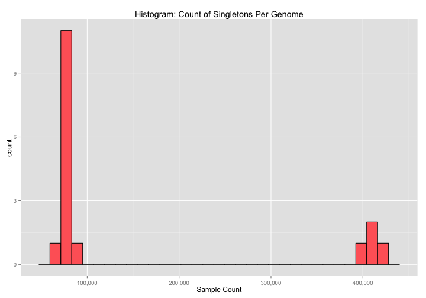


```r
p <- ggplot(result) +
  geom_point(aes(x=call_call_set_name, y=private_variant_count)) +
  scale_x_discrete(expand=c(0.05, 1)) +
  scale_y_continuous(labels=comma) +
  xlab("Sample") +
  ylab("Number of Singletons") +
  ggtitle("Scatter Plot: Count of Singletons Per Genome")
if(nrow(result) <= 20) {
  p + theme(axis.text.x=element_text(angle=50, hjust=1))
} else {
  p + theme(axis.text.x=element_blank(), axis.ticks.x=element_blank(), panel.grid.major.x=element_blank())
}
```

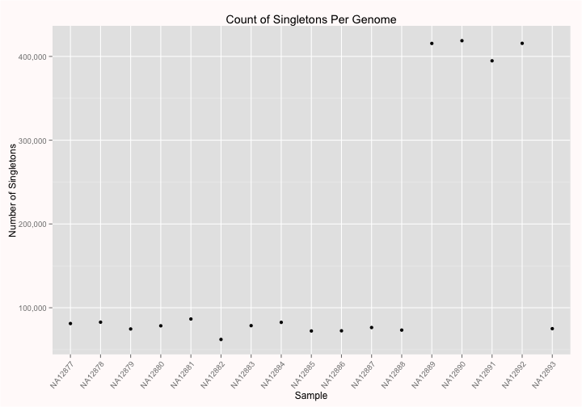

Let's accumulate our sample-specific results for later use.

```r
allResults <- full_join(allResults, result)
```

```
## Joining by: "call_call_set_name"
```

## Homozygosity Rate and Inbreeding Coefficient

For each genome, compare the expected and observed rates of homozygosity.


```r
result <- DisplayAndDispatchQuery("./sql/homozygous-variants.sql",
                                  project=project,
                                  replacements=queryReplacements)
```

```
# Compute the expected and observed homozygosity rate for each individual.
SELECT
  call.call_set_name,
  O_HOM,
  ROUND(E_HOM, 2) as E_HOM,
  N_SITES,
  ROUND((O_HOM - E_HOM) / (N_SITES - E_HOM), 5) AS F
FROM (
  SELECT
    call.call_set_name,
    SUM(first_allele = second_allele) AS O_HOM,
    SUM(1.0 - (2.0 * freq * (1.0 - freq) * (called_allele_count / (called_allele_count - 1.0)))) AS E_HOM,
    COUNT(call.call_set_name) AS N_SITES,
  FROM (
    SELECT
      reference_name,
      start,
      reference_bases,
      GROUP_CONCAT(alternate_bases) WITHIN RECORD AS alternate_bases,
      call.call_set_name,
      NTH(1, call.genotype) WITHIN call AS first_allele,
      NTH(2, call.genotype) WITHIN call AS second_allele,
      COUNT(alternate_bases) WITHIN RECORD AS num_alts,
      SUM(call.genotype >= 0) WITHIN RECORD AS called_allele_count,
      IF((SUM(1 = call.genotype) > 0),
        SUM(call.genotype = 1)/SUM(call.genotype >= 0),
        -1)  WITHIN RECORD AS freq
    FROM
      [google.com:biggene:platinum_genomes.expanded_variants]
    # Optionally add a clause here to limit the query to a particular
    # region of the genome.
    #_WHERE_
    # Skip no calls and haploid sites
    OMIT call IF SOME(call.genotype < 0) OR (2 > COUNT(call.genotype))
    HAVING
      # Skip 1/2 genotypes _and non-SNP variants
      num_alts = 1
      AND reference_bases IN ('A','C','G','T')
      AND alternate_bases IN ('A','C','G','T')
      )
  GROUP BY
    call.call_set_name
    )
ORDER BY
  call.call_set_name
```
Number of rows returned by this query: **17**.

Displaying the first few rows of the dataframe of results:
<!-- html table generated in R 3.2.0 by xtable 1.7-4 package -->
<!-- Tue Jun  2 18:39:11 2015 -->
<table border=1>
<tr> <th> call_call_set_name </th> <th> O_HOM </th> <th> E_HOM </th> <th> N_SITES </th> <th> F </th>  </tr>
  <tr> <td> NA12877 </td> <td align="right"> 6794394 </td> <td align="right"> 7988474.22 </td> <td align="right"> 10204968 </td> <td align="right"> -0.54 </td> </tr>
  <tr> <td> NA12878 </td> <td align="right"> 6700705 </td> <td align="right"> 7955077.42 </td> <td align="right"> 10171953 </td> <td align="right"> -0.57 </td> </tr>
  <tr> <td> NA12879 </td> <td align="right"> 6620470 </td> <td align="right"> 7933125.29 </td> <td align="right"> 10147411 </td> <td align="right"> -0.59 </td> </tr>
  <tr> <td> NA12880 </td> <td align="right"> 6590387 </td> <td align="right"> 7929608.34 </td> <td align="right"> 10150696 </td> <td align="right"> -0.60 </td> </tr>
  <tr> <td> NA12881 </td> <td align="right"> 6567127 </td> <td align="right"> 7935804.42 </td> <td align="right"> 10153820 </td> <td align="right"> -0.62 </td> </tr>
  <tr> <td> NA12882 </td> <td align="right"> 6805829 </td> <td align="right"> 7965142.57 </td> <td align="right"> 10202639 </td> <td align="right"> -0.52 </td> </tr>
   </table>

And visualizing the results:

```r
limits <- c(min(result$O_HOM, result$E_HOM),
            max(result$O_HOM, result$E_HOM))
ggplot(result) +
  geom_point(aes(x=O_HOM, y=E_HOM, label=call_call_set_name), alpha=1/1.5) +
  geom_abline(color="darkslateblue") +
  scale_x_continuous(limits=limits, labels=comma) +
  scale_y_continuous(limits=limits, labels=comma) +
  xlab("Observed Homozygous Variants") +
  ylab("Expected Homozygous Variants") +
  ggtitle("Homozygosity")
```

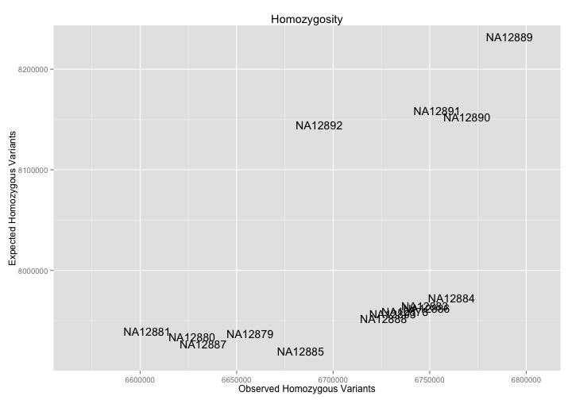

And with labels:

```r
ggplot(result) +
  geom_text(aes(x=O_HOM, y=E_HOM, label=call_call_set_name), alpha=1/1.5) +
  geom_abline(color="darkslateblue") +
  scale_x_continuous(limits=limits, labels=comma, expand=c(0.05, 5)) +
  scale_y_continuous(limits=limits, labels=comma) +
  xlab("Observed Homozygous Variants") +
  ylab("Expected Homozygous Variants") +
  ggtitle("Homozygosity")
```

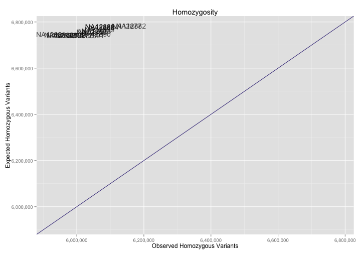

Let's accumulate our sample-specific results for later use.

```r
allResults <- full_join(allResults, result)
```

```
## Joining by: "call_call_set_name"
```

## Sex Inference

For each genome, compare the gender from the sample information to the heterozygosity rate on the chromosome X calls.

```r
result <- DisplayAndDispatchQuery("./sql/gender-check.sql",
                                  project=project,
                                  replacements=queryReplacements)
```

```
# Compute the the homozygous and heterozygous variant counts for each individual
# within chromosome X to help determine whether the gender phenotype value is
# correct for each individual.
SELECT
  call.call_set_name,
  ROUND(SUM(het_RA)/(SUM(hom_AA) + SUM(het_RA)), 3) AS perct_het_alt_in_snvs,
  ROUND(SUM(hom_AA)/(SUM(hom_AA) + SUM(het_RA)), 3) AS perct_hom_alt_in_snvs,
  SUM(hom_AA) AS hom_AA_count,
  SUM(het_RA) AS het_RA_count,
  SUM(hom_RR) AS hom_RR_count,
FROM (
  SELECT
    reference_bases,
    GROUP_CONCAT(alternate_bases) WITHIN RECORD AS alternate_bases,
    COUNT(alternate_bases) WITHIN RECORD AS num_alts,
    call.call_set_name,
    SOME(call.genotype = 0) AND NOT SOME(call.genotype > 0) WITHIN call AS hom_RR,
    SOME(call.genotype > 0) AND NOT SOME(call.genotype = 0) WITHIN call AS hom_AA,
    SOME(call.genotype > 0) AND SOME(call.genotype = 0) WITHIN call AS het_RA
  FROM
    [google.com:biggene:platinum_genomes.expanded_variants]
  WHERE
    reference_name = 'chrX'
    AND start NOT BETWEEN 59999 AND 2699519
    AND start NOT BETWEEN 154931042 AND 155260559
  HAVING
    # Skip 1/2 genotypes _and non-SNP variants
    num_alts = 1
    AND reference_bases IN ('A','C','G','T')
    AND alternate_bases IN ('A','C','G','T')
  )
GROUP BY
  call.call_set_name
ORDER BY
  call.call_set_name
```
Number of rows returned by this query: **17**.

Displaying the first few rows of the dataframe of results:
<!-- html table generated in R 3.2.0 by xtable 1.7-4 package -->
<!-- Tue Jun  2 18:39:14 2015 -->
<table border=1>
<tr> <th> call_call_set_name </th> <th> perct_het_alt_in_snvs </th> <th> perct_hom_alt_in_snvs </th> <th> hom_AA_count </th> <th> het_RA_count </th> <th> hom_RR_count </th>  </tr>
  <tr> <td> NA12877 </td> <td align="right"> 0.32 </td> <td align="right"> 0.68 </td> <td align="right"> 79739 </td> <td align="right"> 37299 </td> <td align="right"> 212773 </td> </tr>
  <tr> <td> NA12878 </td> <td align="right"> 0.71 </td> <td align="right"> 0.29 </td> <td align="right"> 43666 </td> <td align="right"> 106358 </td> <td align="right"> 183525 </td> </tr>
  <tr> <td> NA12879 </td> <td align="right"> 0.70 </td> <td align="right"> 0.30 </td> <td align="right"> 45655 </td> <td align="right"> 105692 </td> <td align="right"> 180162 </td> </tr>
  <tr> <td> NA12880 </td> <td align="right"> 0.69 </td> <td align="right"> 0.31 </td> <td align="right"> 47261 </td> <td align="right"> 105744 </td> <td align="right"> 178206 </td> </tr>
  <tr> <td> NA12881 </td> <td align="right"> 0.69 </td> <td align="right"> 0.31 </td> <td align="right"> 47446 </td> <td align="right"> 105364 </td> <td align="right"> 178591 </td> </tr>
  <tr> <td> NA12882 </td> <td align="right"> 0.31 </td> <td align="right"> 0.69 </td> <td align="right"> 78815 </td> <td align="right"> 34893 </td> <td align="right"> 214852 </td> </tr>
   </table>

Let's join this with the sample information:

```r
joinedResult <- inner_join(result, sampleInfo)
```

And visualize the results:

```r
ggplot(joinedResult) +
  geom_boxplot(aes(x=gender, y=perct_het_alt_in_snvs, fill=gender)) +
  scale_y_continuous(labels = percent_format()) +
  xlab("Gender") +
  ylab("Heterozygosity Rate ") +
  ggtitle("Box Plot: Heterozygosity Rate on the X Chromosome")
```

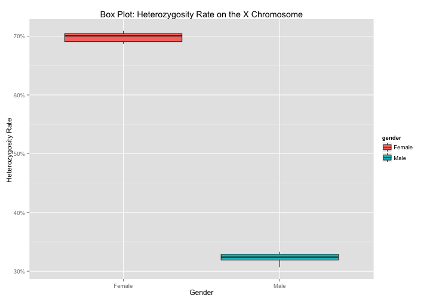


```r
p <- ggplot(joinedResult) +
  geom_point(aes(x=call_call_set_name, y=perct_het_alt_in_snvs, color=gender)) +
  scale_x_discrete(expand=c(0.05, 1)) +
  scale_y_continuous(labels = percent_format()) +
  xlab("Sample") +
  ylab("Heterozygosity Rate ") +
  ggtitle("Scatter Plot: Heterozygosity Rate on the X Chromosome")
if(nrow(result) <= 20) {
  p + theme(axis.text.x=element_text(angle=50, hjust=1))
} else {
  p + theme(axis.text.x=element_blank(), axis.ticks.x=element_blank(), panel.grid.major.x=element_blank())
}
```

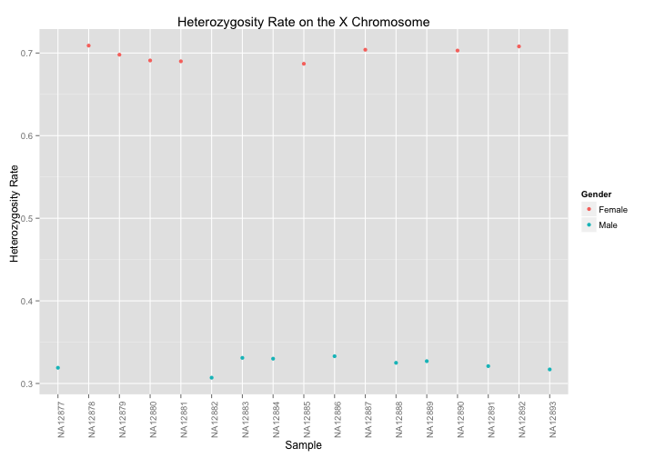

Let's accumulate our sample-specific results for later use.

```r
allResults <- full_join(allResults, result)
```

## Ethnicity Inference

For each genome, compare the ethncity from the sample information to the clustering in this analysis.

For this check, we:
* use the intersection of common variants found in both 1,000 Genomes phase 1 variants and Platinum Genomes
* compute PCA on those variants in common between the two data
* examine whether the individuals in Platinum Genomes cluster with other samples of the same ethnicity

See the Google Genomics [2-way PCA cookbook entry](http://googlegenomics.readthedocs.org/en/latest/use_cases/compute_principal_coordinate_analysis/2-way-pca.html) for the details as to how to run this pipeline.

Note that this `n^2` analysis is a cluster compute job instead of a BigQuery query.

### Results


```r
# Read in the results of the 2-way PCA over BRCA1.
pca <- read.table("./data/platinum-genomes-X-1kg-brca1-pca.tsv", col.names=c("call_call_set_name", "PC1", "PC2", "count"))

# Read in the demographic information for 1,000 Genomes.
sampleData1kg <- read.csv("http://storage.googleapis.com/genomics-public-data/1000-genomes/other/sample_info/sample_info.csv")
sampleInfo1kg <- dplyr::select(sampleData1kg, call_call_set_name=Sample, gender=Gender, ethnicity=Super_Population)

# Update our sample information for Platinum Genomes as "Unknown" since this is what we are trying to check.
sampleInfoToCheck <- mutate(sampleInfo, ethnicity="Unknown")

# Note that 5 samples are in both datasets, so those will be plotted twice with different symbols.
pcaPlatinumX1kg <- inner_join(pca, rbind(sampleInfoToCheck, sampleInfo1kg))
pcaPlatinumX1kg <- mutate(pcaPlatinumX1kg, unknown=(ethnicity == "Unknown"))
```


```r
ggplot(pcaPlatinumX1kg) +
  geom_point(aes(x=PC1, y=PC2,
                 color=ethnicity,
                 shape=ethnicity,
                 size=unknown)) +
  xlab("principal component 1") +
  ylab("principal component 2") +
  scale_shape_manual(values=c(3, 3, 3, 3, 19)) +
  scale_size_manual(values=c(2,4)) +
  ggtitle("2-way Principal Coordinate Analysis upon Platinum Genomes and 1,000 Genomes")
```

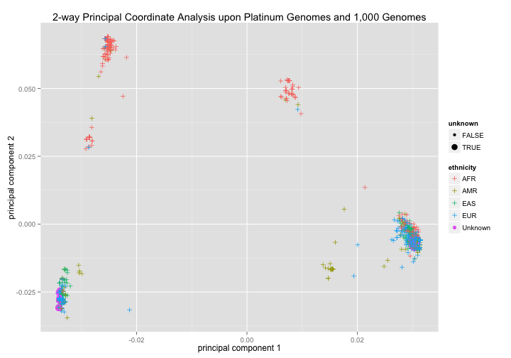

## Genome Similarity

Perform a simplistic similarity check on each pair of genomes to identify any mislabled or cross-contaminated samples.  See the Google Genomics [Identity-By-State cookbook entry](http://googlegenomics.readthedocs.org/en/latest/use_cases/compute_identity_by_state/index.html) for the details as to how to run this pipeline.

Note that this `n^2` analysis is a cluster compute job instead of a BigQuery query.

### Results


```r
ggplot(ibs) +
  geom_tile(aes(x=sample1, y=sample2, fill=ibsScore), colour="white") +
  scale_fill_gradient(low="white", high="steelblue",
                      na.value="black", trans="log",
                      guide=guide_colourbar(title= "IBS Score")) +
  theme(axis.text.x=element_text(angle=50, hjust=1)) +
  xlab("Sample 1") +
  ylab("Sample 2") +
  ggtitle("Identity By State (IBS) Heat Map")
```

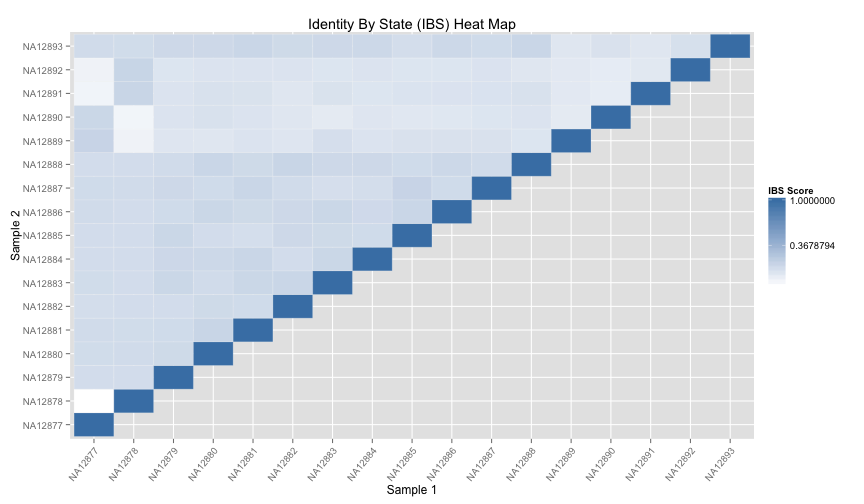

# Removing Genomes from the Cohort

To only remove a genome from BigQuery only:
* Re-export the table to BigQuery using the `--call_set_id` flag on the `exportvariants` command in [api-client-java](http://github.com/googlegenomics/api-client-java) to list which callsets to _include_ in the export.

To exclude a genome from data returned by the Genomics API:
* See the `callSetIds` property on the [variants search](https://cloud.google.com/genomics/v1beta2/reference/variants/search) method.

To entirely remove a genome from a variant set in the Genomics API:
* See the [callsets delete](https://cloud.google.com/genomics/v1beta2/reference/callsets/delete) method.
* To delete a callset using a command line tool, see the the `deletecallset` command in [api-client-java](http://github.com/googlegenomics/api-client-java).
* *Note:* deletion cannot be undone.

# Summary

Let's wrap up with a quick comparison using all the variables we've collected for each sample:

```r
plot(dplyr::select(allResults, -call_call_set_name))
```

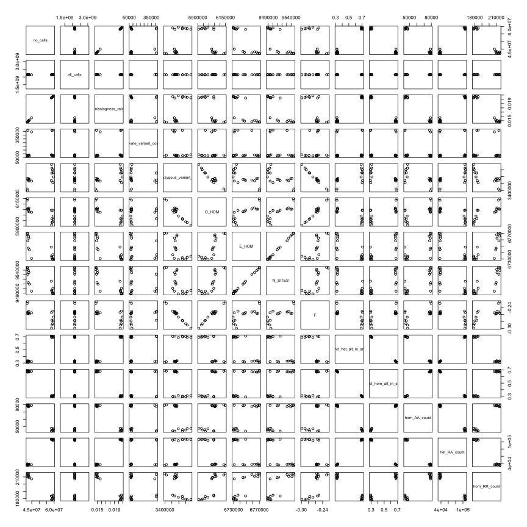

If we see any relationships that we do not expect, it may be worth a closer look.

--------------------------------------------------------
_Next_: [Part 4: Variant-Level QC](./Variant-Level-QC.md)
