<!-- R Markdown Documentation, DO NOT EDIT THE PLAIN MARKDOWN VERSION OF THIS FILE -->

<!-- Copyright 2015 Google Inc. All rights reserved. -->

<!-- Licensed under the Apache License, Version 2.0 (the "License"); -->
<!-- you may not use this file except in compliance with the License. -->
<!-- You may obtain a copy of the License at -->

<!--     http://www.apache.org/licenses/LICENSE-2.0 -->

<!-- Unless required by applicable law or agreed to in writing, software -->
<!-- distributed under the License is distributed on an "AS IS" BASIS, -->
<!-- WITHOUT WARRANTIES OR CONDITIONS OF ANY KIND, either express or implied. -->
<!-- See the License for the specific language governing permissions and -->
<!-- limitations under the License. -->

# Part 3: Sample-Level QC


In Part 3 of the codelab, we perform some quality control analyses that could help to identify any problematic genomes that should be removed from the cohort before proceeding with further analysis.  The appropriate cut off thresholds will depend upon the input dataset and/or other factors.

* [Genome Variant Call Rate](#genome-variant-call-rate)
* [Missingness Rate](#missingness-rate)
* [Singleton Rate](#singleton-rate)
* [Heterozygosity Rate](#heterozygosity-rate)
* [Homozygosity Rate](#homozygosity-rate)
* [Inbreeding Coefficient](#inbreeding-coefficient)
* [Ti/Tv Ratio per Chromosome](#titv-ratio-per-chromosome)
* [Sex Inference](#sex-inference)
* [Ethnicity Inference](#ethnicity-inference)
* [Genome Similarity](#genome-similarity)

By default this codelab runs upon the Illumina Platinum Genomes Variants. Update the table and change the source of sample information here if you wish to run the queries against a different dataset.

```r
source("./rHelpers/platinumGenomesDataset.R")

# To run this against other public data, source in one of the dataset helpers.  For example:
# source("./rHelpers/pgpDataset.R")
```

## Genome Variant Call Rate

For each genome, count the number of variant calls.  Any genomes whose count is far away from the mean may indicate a problem such as sample quality or identical data loaded multiple times.


```r
result <- DisplayAndDispatchQuery("./sql/genome-variant-calls.sql",
                                  project=project,
                                  replacements=queryReplacements)
```

```
#standardSQL
--
-- Count the number of variant calls per genome.
--
SELECT
  call.call_set_name,
  COUNT(call.call_set_name) AS number_of_calls
FROM
  `genomics-public-data.platinum_genomes.variants` v, v.call call
WHERE
  # Skip homozygous reference calls, no-calls, and non-passing variants.
  EXISTS (SELECT gt FROM UNNEST(call.genotype) gt WHERE gt > 0)
  AND NOT EXISTS (SELECT gt FROM UNNEST(call.genotype) gt WHERE gt < 0)
  AND NOT EXISTS (SELECT ft FROM UNNEST(call.FILTER) ft WHERE ft NOT IN ('PASS', '.'))
GROUP BY
  call_set_name
ORDER BY
  call_set_name
```
Number of rows returned by this query: **6**.

Displaying the first few rows of the dataframe of results:

|call_set_name | number_of_calls|
|:-------------|---------------:|
|NA12877       |         3859838|
|NA12878       |         3874126|
|NA12889       |         3825240|
|NA12890       |         3900336|
|NA12891       |         3825507|
|NA12892       |         3901539|

Let's join this with the sample information and visualize the results:

```r
joinedResult <- inner_join(result, sampleInfo)
```


```r
ggplot(joinedResult, aes(y=number_of_calls, x=ethnicity, fill=ethnicity)) +
  geom_boxplot() +
  scale_y_continuous(expand = c(0.3, 0)) +
  stat_summary(fun.data=get_boxplot_fun_data, geom="text", position=position_dodge(width=0.9), vjust=-0.5) +
  ylab("Number of Variant Calls") +
  xlab("Ethnicity") +
  ggtitle("Box plot: Count of variant calls per genome by ethnicity") +
  theme(axis.text.x=element_text(angle=50, hjust=1))
```


```r
p <- ggplot(joinedResult) +
  geom_point(aes(x=call_set_name, y=number_of_calls, color=sex)) +
  scale_x_discrete(expand=c(0.05, 1)) +
  scale_y_continuous(labels=comma) +
  xlab("Sample") +
  ylab("Number of Calls") +
  ggtitle("Scatter Plot: Count of Calls Per Genome")
if(nrow(result) <= 20) {
  p + theme(axis.text.x=element_text(angle=50, hjust=1))
} else {
  p + theme(axis.text.x=element_blank(), axis.ticks.x=element_blank(), panel.grid.major.x=element_blank())
}
```

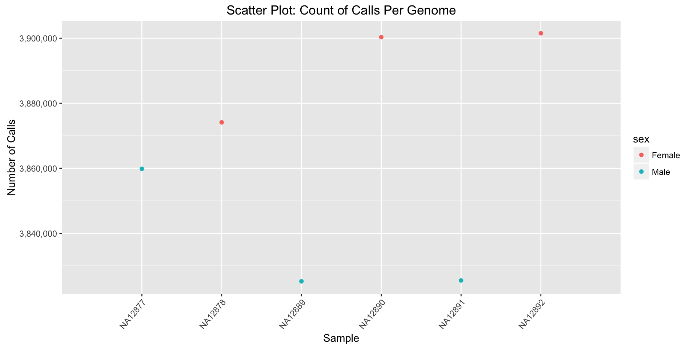

Let's accumulate our sample-specific results for later use.

```r
sampleResults <- result
```

## Missingness Rate

For each genome, determine the percentage of sites explicitly called as a no-call.  If this percentage is too high, the genome may be problematic.


```r
result <- DisplayAndDispatchQuery("./sql/sample-level-missingness.sql",
                                  project=project,
                                  replacements=queryReplacements)
```

```
#standardSQL
--
-- Compute the ratio of positions corresponding to no-calls versus all positions
-- called (reference, variant, and no-calls).
--
WITH deltas AS (
  SELECT
    `end` - start AS delta,
    call.call_set_name,
    EXISTS (SELECT gt FROM UNNEST(call.genotype) gt WHERE gt < 0)
      OR
      EXISTS (SELECT ft FROM UNNEST(call.FILTER) ft WHERE ft NOT IN ('PASS', '.')) AS has_no_calls
  FROM
    `genomics-public-data.platinum_genomes.variants` v, v.call call
),

positions_called AS (
  SELECT
    call_set_name,
    SUM(IF(has_no_calls, delta, 0)) AS no_calls,
    SUM(delta) AS all_calls
  FROM deltas
  GROUP BY
    call_set_name
)

SELECT
  call_set_name,
  no_calls,
  all_calls,
  (no_calls/all_calls) AS missingness_rate
FROM positions_called
ORDER BY
  call_set_name
```
Number of rows returned by this query: **6**.

Displaying the first few rows of the dataframe of results:

|call_set_name |  no_calls| all_calls| missingness_rate|
|:-------------|---------:|---------:|----------------:|
|NA12877       |  85025808|        NA|        0.0296975|
|NA12878       | 100372181|        NA|        0.0350581|
|NA12889       |  86633619|        NA|        0.0302603|
|NA12890       | 101036492|        NA|        0.0352902|
|NA12891       |  88847153|        NA|        0.0310334|
|NA12892       | 100898127|        NA|        0.0352419|

Note that for some datasets, we see message "NAs introduced by coercion to integer range" when [bigrquery](https://github.com/rstats-db/bigrquery) converts 64-bit integer results from BigQuery to 32-bit R integers in the dataframe. For this query, the particular column with the issue is not used in our downstream analysis in R, so we can omit it.

```r
.Machine$integer.max
```

```
## [1] 2147483647
```

```r
result <- dplyr::select(result, -all_calls)
```

Let's join this with the sample information and visualize the results:

```r
joinedResult <- inner_join(result, sampleInfo)
```


```r
ggplot(joinedResult, aes(y=missingness_rate, x=ethnicity)) +
  geom_boxplot() +
  stat_summary(fun.data=get_boxplot_fun_data, geom="text", position=position_dodge(width=0.9), vjust=-0.5) +
  scale_y_continuous(limits=c(0, NA), labels=percent_format()) +
  ylab("Missingness Rate") +
  xlab("Sequencing Platform") +
  ggtitle("Genome-Specific Missingness") +
  theme(axis.text.x=element_text(angle=50, hjust=1))
```

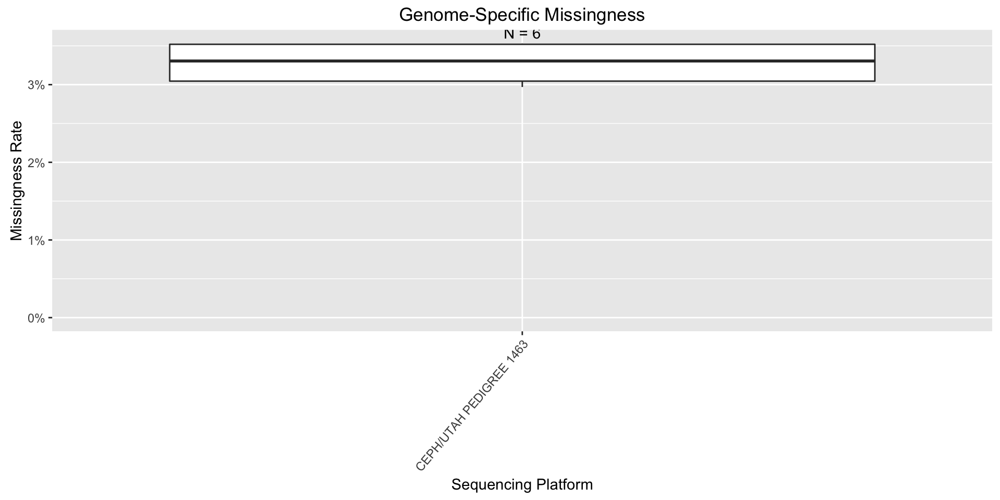


```r
p <- ggplot(joinedResult) +
  geom_point(aes(x=call_set_name, y=missingness_rate, color=sex)) +
  scale_x_discrete(expand=c(0.05, 1)) +
  scale_y_continuous(limits=c(0, NA), labels=percent_format()) +
  xlab("Sample") +
  ylab("Missingness Rate") +
  ggtitle("Scatter Plot: Genome-Specific Missingness")
if(nrow(result) <= 20) {
  p + theme(axis.text.x=element_text(angle=50, hjust=1))
} else {
  p + theme(axis.text.x=element_blank(), axis.ticks.x=element_blank(), panel.grid.major.x=element_blank())
}
```

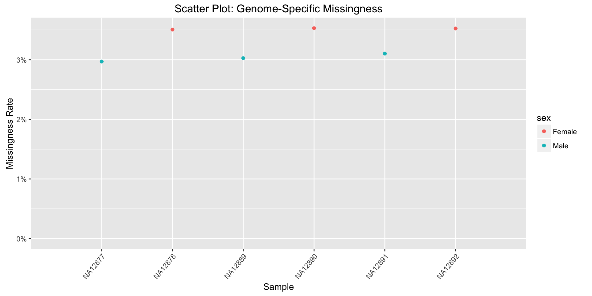

Let's accumulate our sample-specific results for later use.

```r
sampleResults <- full_join(sampleResults, result)
```

## Singleton Rate

For each genome, count the number of variants shared by no other member of the cohort.  Too many private calls for a particular individual may indicate a problem.


```r
result <- DisplayAndDispatchQuery("./sql/private-variants.sql",
                                  project=project,
                                  replacements=queryReplacements)
```

```
#standardSQL
--
-- Compute private variants counts for each sample.
--
WITH filtered_called_alleles AS (
  SELECT
    reference_name,
    start,
    reference_bases AS ref,
    alt,
    call.call_set_name,
    (SELECT COUNT(CAST(gt = alt_offset+1 AS INT64)) FROM call.genotype gt) AS allele_cnt
  FROM
    `genomics-public-data.platinum_genomes.variants` v, v.call call, v.alternate_bases alt WITH OFFSET alt_offset
  WHERE
    # Skip homozygous reference calls, no-calls, and non-passing variants.
    EXISTS (SELECT gt FROM UNNEST(call.genotype) gt WHERE gt > 0)
    AND NOT EXISTS (SELECT gt FROM UNNEST(call.genotype) gt WHERE gt < 0)
    AND NOT EXISTS (SELECT ft FROM UNNEST(call.FILTER) ft WHERE ft NOT IN ('PASS', '.'))
),

grouped_alleles AS (
  SELECT
    reference_name,
    start,
    ref,
    alt,
    STRING_AGG(call_set_name) AS call_set_name,
    COUNT(call_set_name) AS num_samples_with_variant
  FROM filtered_called_alleles
  GROUP BY
    reference_name,
    start,
    ref,
    alt
)

SELECT
  call_set_name,
  COUNT(call_set_name) AS private_variant_count
FROM grouped_alleles
WHERE
  num_samples_with_variant = 1
GROUP BY
  call_set_name
ORDER BY
  private_variant_count DESC
```
Number of rows returned by this query: **6**.

Displaying the first few rows of the dataframe of results:

|call_set_name | private_variant_count|
|:-------------|---------------------:|
|NA12892       |                348480|
|NA12890       |                334270|
|NA12889       |                318492|
|NA12891       |                312855|
|NA12877       |                 82411|
|NA12878       |                 78934|

Let's join this with the sample information and visualize the results:

```r
joinedResult <- inner_join(result, sampleInfo)
```


```r
ggplot(joinedResult, aes(y=private_variant_count, x=ethnicity, fill=ethnicity)) +
  geom_boxplot() +
  stat_summary(fun.data=get_boxplot_fun_data, geom="text", position=position_dodge(width=0.9), vjust=-0.5) +
  scale_y_continuous(labels=comma, expand = c(0.3, 0)) +
  ylab("Number of Singletons") +
  xlab("Ethnicity") +
  ggtitle("Box plot: Count of singletons per genome by ethnicity") +
  theme(axis.text.x=element_text(angle=50, hjust=1))
```

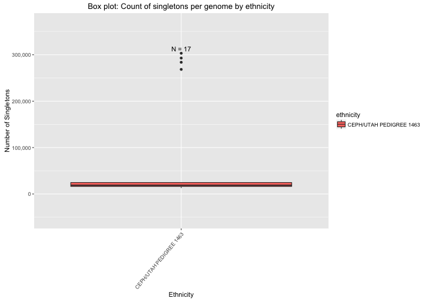


```r
p <- ggplot(joinedResult) +
  geom_point(aes(x=call_set_name, y=private_variant_count, color=sex)) +
  scale_x_discrete(expand=c(0.05, 1)) +
  scale_y_continuous(labels=comma) +
  xlab("Sample") +
  ylab("Number of Singletons") +
  ggtitle("Scatter Plot: Count of Singletons Per Genome")
if(nrow(result) <= 20) {
  p + theme(axis.text.x=element_text(angle=50, hjust=1))
} else {
  p + theme(axis.text.x=element_blank(), axis.ticks.x=element_blank(), panel.grid.major.x=element_blank())
}
```

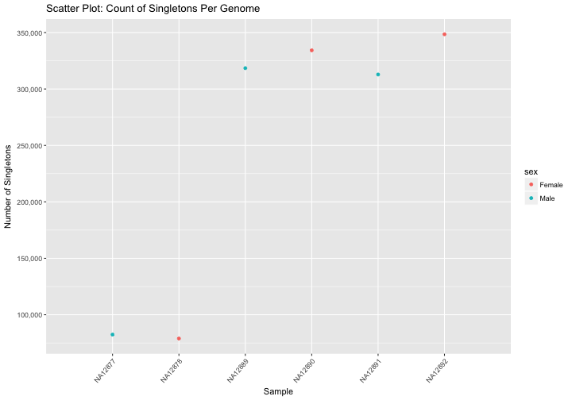

Let's accumulate our sample-specific results for later use.

```r
sampleResults <- full_join(sampleResults, result)
```

## Heterozygosity Rate

For each genome, determine the number of heterozygous variants.


```r
result <- DisplayAndDispatchQuery("./sql/heterozygous-calls-by-sample.sql",
                                  project=project,
                                  replacements=queryReplacements)
```

```
#standardSQL
--
-- Count the number of heterozygous variants per sample.
--
WITH filtered_snp_calls AS (
  SELECT
    call.call_set_name,
    call.genotype[ORDINAL(1)] AS first_allele,
    call.genotype[ORDINAL(2)] AS second_allele
  FROM
    `genomics-public-data.platinum_genomes.variants` v, v.call call
  WHERE
    # Only include biallelic snps.
    reference_bases IN ('A','C','G','T')
    AND ARRAY_LENGTH(alternate_bases) = 1
    AND alternate_bases[ORDINAL(1)] IN ('A','C','G','T')
    # Skip homozygous reference calls, no-calls, non-passing variants, and non-diploid calls.
    AND EXISTS (SELECT gt FROM UNNEST(call.genotype) gt WHERE gt > 0)
    AND NOT EXISTS (SELECT gt FROM UNNEST(call.genotype) gt WHERE gt < 0)
    AND NOT EXISTS (SELECT ft FROM UNNEST(call.FILTER) ft WHERE ft NOT IN ('PASS', '.'))
    AND ARRAY_LENGTH(call.genotype) = 2
)

SELECT
  call_set_name,
  SUM(CAST((first_allele != second_allele) AS INT64)) AS heterozygous_variant_count
FROM filtered_snp_calls
GROUP BY
  call_set_name
ORDER BY
  call_set_name
```
Number of rows returned by this query: **6**.

Displaying the first few rows of the dataframe of results:

|call_set_name | heterozygous_variant_count|
|:-------------|--------------------------:|
|NA12877       |                    1916100|
|NA12878       |                    1961370|
|NA12889       |                    1928251|
|NA12890       |                    1980057|
|NA12891       |                    1885606|
|NA12892       |                    2016053|

Let's join this with the sample information and visualize the results:

```r
joinedResult <- inner_join(result, sampleInfo)
```


```r
ggplot(joinedResult, aes(y=heterozygous_variant_count, x=ethnicity, fill=ethnicity)) +
  geom_boxplot() +
  stat_summary(fun.data=get_boxplot_fun_data, geom="text", position=position_dodge(width=0.9), vjust=-0.5) +
  scale_y_continuous(labels=comma, expand = c(0.3, 0)) +
  ylab("Number of Heterozyous Variants") +
  xlab("Ethnicity") +
  ggtitle("Box plot: Count of heterozygous variants per genome by ethnicity") +
  theme(axis.text.x=element_text(angle=50, hjust=1))
```

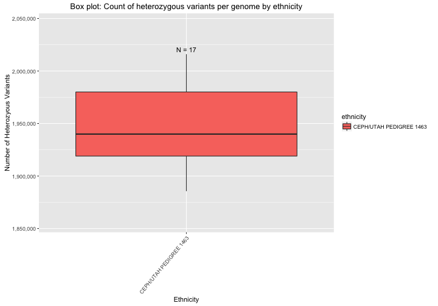


```r
p <- ggplot(joinedResult) +
  geom_point(aes(x=call_set_name, y=heterozygous_variant_count, color=sex)) +
  scale_x_discrete(expand=c(0.05, 1)) +
  scale_y_continuous(labels=comma) +
  xlab("Sample") +
  ylab("Number of Heterozygous Variants") +
  ggtitle("Scatter Plot: Count of Heterozygous Variants Per Genome")
if(nrow(result) <= 20) {
  p + theme(axis.text.x=element_text(angle=50, hjust=1))
} else {
  p + theme(axis.text.x=element_blank(), axis.ticks.x=element_blank(), panel.grid.major.x=element_blank())
}
```

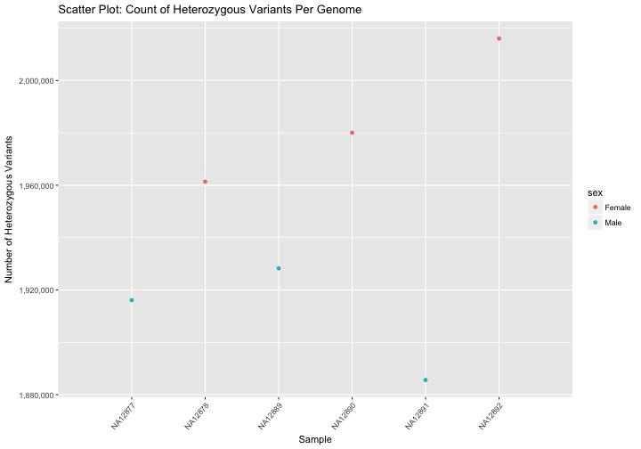

Let's accumulate our sample-specific results for later use.

```r
sampleResults <- full_join(sampleResults, result)
```

## Homozygosity Rate

For each genome, calculate the fraction of homozygous positions per chromosome.  This is useful to identify uniparental disomy (UPD) or large stretches of homozygosity.


```r
result <- DisplayAndDispatchQuery("./sql/homozygous-variant-rate-by-sample-and-reference.sql",
                                  project=project,
                                  replacements=queryReplacements,
                                  max_pages=Inf)
```

```
#standardSQL
--
-- Compute the ratio of homozygous vs. heterozygous variant calls for each individual.
--
WITH filtered_snp_calls AS (
  SELECT
    reference_name,
    reference_bases AS ref,
    ARRAY_TO_STRING(v.alternate_bases, ',') AS alt_concat,
    call.call_set_name,
    call.genotype[ORDINAL(1)] AS first_allele,
    call.genotype[ORDINAL(2)] AS second_allele
  FROM
    `genomics-public-data.platinum_genomes.variants` v, v.call call
  WHERE
    # Only include biallelic snps.
    reference_bases IN ('A','C','G','T')
    AND ARRAY_LENGTH(alternate_bases) = 1
    AND alternate_bases[ORDINAL(1)] IN ('A','C','G','T')
    # Skip homozygous reference calls, no-calls, non-passing variants, and non-diploid calls.
    AND EXISTS (SELECT gt FROM UNNEST(call.genotype) gt WHERE gt > 0)
    AND NOT EXISTS (SELECT gt FROM UNNEST(call.genotype) gt WHERE gt < 0)
    AND NOT EXISTS (SELECT ft FROM UNNEST(call.FILTER) ft WHERE ft NOT IN ('PASS', '.'))
    AND ARRAY_LENGTH(call.genotype) = 2
),

variant_counts AS (
  SELECT
    call_set_name,
    reference_name,
    SUM(CAST(first_allele = 1 AND second_allele = 1 AS INT64)) AS HOM_ALT,
    SUM(CAST(first_allele = 1 OR second_allele = 1 AS INT64))  AS HAS_ALT,
    COUNT(call_set_name) AS N_SITES
  FROM filtered_snp_calls
  GROUP BY
    call_set_name,
    reference_name
)

SELECT
  call_set_name,
  reference_name,
  HOM_ALT,
  HAS_ALT,
  N_SITES,
  ROUND((HOM_ALT) / (HAS_ALT), 5) AS F
FROM variant_counts
ORDER BY
  call_set_name,
  reference_name
```
Number of rows returned by this query: **144**.

Displaying the first few rows of the dataframe of results:

|call_set_name |reference_name | HOM_ALT| HAS_ALT| N_SITES|       F|
|:-------------|:--------------|-------:|-------:|-------:|-------:|
|NA12877       |chr1           |  103349|  247958|  247958| 0.41680|
|NA12877       |chr10          |   66163|  161993|  161993| 0.40843|
|NA12877       |chr11          |   67922|  164243|  164243| 0.41355|
|NA12877       |chr12          |   60750|  154954|  154954| 0.39205|
|NA12877       |chr13          |   55000|  126927|  126927| 0.43332|
|NA12877       |chr14          |   40460|  101858|  101858| 0.39722|

Let's join this with the sample information and visualize the results:

```r
joinedResult <- inner_join(result, sampleInfo)
```


```r
  ggplot(joinedResult, aes(y=F, x=reference_name, color=sex)) +
  geom_boxplot() +
  facet_grid(sex ~ .) +
  scale_y_continuous(labels=comma) +
  ylab("Fraction of Homozygous Variants") +
  xlab("Reference Name") +
  ggtitle("Fraction of Homozygous Variants Per Genome") +
  theme(axis.text.x=element_text(angle=50, hjust=1))
```

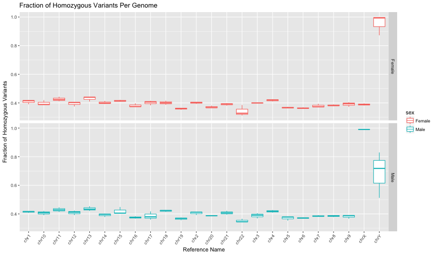


```r
sampleReferenceResults <- result
```

## Inbreeding Coefficient

For each genome, compare the expected and observed rates of homozygosity.


```r
if (kMultiSampleTableSchemaIsOptimized) {
  query = "./sql/homozygosity-coefficient-optimized-schema.sql"
} else {
  query = "./sql/homozygosity-coefficient.sql"
}
result <- DisplayAndDispatchQuery(query,
                                  project=project,
                                  replacements=queryReplacements)
```

```
#standardSQL
--
-- Compute the expected and observed homozygosity rate for each individual.
--
WITH variant_calls AS (
  SELECT
    call.call_set_name,
    call.genotype[ORDINAL(1)] = call.genotype[ORDINAL(2)] AS O_HOM,
    (SELECT SUM((SELECT COUNT(gt) FROM UNNEST(call.genotype) gt WHERE gt >= 0)) FROM v.call) AS AN,
    (SELECT SUM((SELECT COUNT(gt) FROM UNNEST(call.genotype) gt WHERE gt = 1)) FROM v.call) AS AC
  FROM
    `google.com:biggene.platinum_genomes.multisample_variants_dense_schema` v, v.call call
  WHERE
    # Only include biallelic snps within autosomes. (Concise but inexact regexp used for brevity.)
    REGEXP_CONTAINS(reference_name, r'^(chr)?([1-2])?[0-9]$')
    AND reference_bases IN ('A','C','G','T')
    AND ARRAY_LENGTH(v.alternate_bases) = 1
    AND v.alternate_bases[ORDINAL(1)] IN ('A','C','G','T')
    # Skip no-calls, non-passing variants, and non-diploid calls.
    AND NOT EXISTS (SELECT gt FROM UNNEST(call.genotype) gt WHERE gt < 0)
    AND NOT EXISTS (SELECT ft FROM UNNEST(call.FILTER) ft WHERE ft NOT IN ('PASS', '.'))
    AND ARRAY_LENGTH(call.genotype) = 2
),

grouped_values AS (
  SELECT
    call_set_name,
    SUM(CAST(O_HOM AS INT64)) AS O_HOM,
    SUM(1.0 - (2.0 * (AC/AN) * (1.0 - (AC/AN)) * (AN / (AN - 1.0)))) AS E_HOM,
    COUNT(call_set_name) AS N_SITES
  FROM variant_calls
  WHERE
    # Ensure allelic frequency is in the range (0, 1).
    AN > 0 AND AC < AN
  GROUP BY
    call_set_name
)

SELECT
  call_set_name,
  O_HOM,
  ROUND(E_HOM, 2) AS E_HOM,
  N_SITES,
  ROUND((O_HOM - E_HOM) / (N_SITES - E_HOM), 5) AS F
FROM grouped_values
ORDER BY
  call_set_name
```
Number of rows returned by this query: **6**.

Displaying the first few rows of the dataframe of results:

|call_set_name |   O_HOM|   E_HOM| N_SITES|        F|
|:-------------|-------:|-------:|-------:|--------:|
|NA12877       | 2974569| 3073568| 4889939| -0.05450|
|NA12878       | 2990194| 3075965| 4895182| -0.04715|
|NA12889       | 2982768| 3084585| 4910114| -0.05577|
|NA12890       | 2985723| 3084037| 4909733| -0.05385|
|NA12891       | 3010803| 3075165| 4895617| -0.03535|
|NA12892       | 2965224| 3090686| 4924716| -0.06841|

Let's join this with the sample information and visualize the results:

```r
joinedResult <- inner_join(result, sampleInfo)
```


```r
limits <- c(min(result$O_HOM, result$E_HOM),
            max(result$O_HOM, result$E_HOM))
ggplot(result) +
  geom_point(aes(x=O_HOM, y=E_HOM, label=call_set_name), alpha=1/1.5) +
  geom_abline(color="darkslateblue") +
  scale_x_continuous(limits=limits, labels=comma) +
  scale_y_continuous(limits=limits, labels=comma) +
  xlab("Observed Homozygous Variants") +
  ylab("Expected Homozygous Variants") +
  ggtitle("Homozygosity")
```

```
Warning: Ignoring unknown aesthetics: label
```

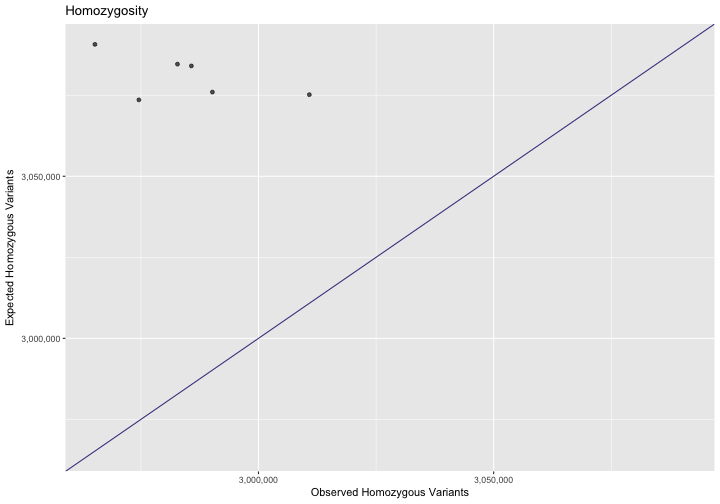

And with labels:

```r
ggplot(result) +
  geom_text(aes(x=O_HOM, y=E_HOM, label=call_set_name), alpha=1/1.5) +
  geom_abline(color="darkslateblue") +
  scale_x_continuous(limits=limits, labels=comma, expand=c(0.05, 5)) +
  scale_y_continuous(limits=limits, labels=comma) +
  xlab("Observed Homozygous Variants") +
  ylab("Expected Homozygous Variants") +
  ggtitle("Homozygosity")
```

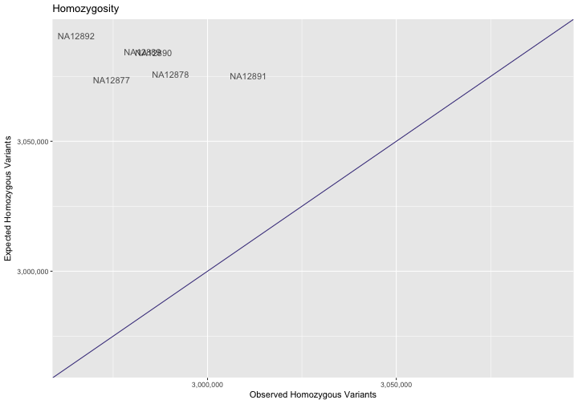

Let's accumulate our sample-specific results for later use.

```r
sampleResults <- full_join(sampleResults, result)
```

## Ti/Tv Ratio per Chromosome

For each genome, determine the Ti/Tv ratio per chromosome.

```r
result <- DisplayAndDispatchQuery("./sql/ti-tv-by-sample-and-reference.sql",
                                  project=project,
                                  replacements=queryReplacements,
                                  max_pages=Inf)
```

```
#standardSQL
--
-- Compute the transition/transversion ratio per sample and reference name.
--
WITH filtered_snp_calls AS (
  SELECT
    reference_name,
    call.call_set_name,
    CONCAT(reference_bases, '->', alternate_bases[ORDINAL(1)]) AS mutation
  FROM
    `genomics-public-data.platinum_genomes.variants` v, v.call call
  WHERE
    # Only include biallelic snps.
    reference_bases IN ('A','C','G','T')
    AND ARRAY_LENGTH(alternate_bases) = 1
    AND alternate_bases[ORDINAL(1)] IN ('A','C','G','T')
    # Skip homozygous reference calls, no-calls, and non-passing variants.
    AND EXISTS (SELECT gt FROM UNNEST(call.genotype) gt WHERE gt > 0)
    AND NOT EXISTS (SELECT gt FROM UNNEST(call.genotype) gt WHERE gt < 0)
    AND NOT EXISTS (SELECT ft FROM UNNEST(call.FILTER) ft WHERE ft NOT IN ('PASS', '.'))
),

mutation_type_counts AS (
  SELECT
    reference_name,
    call_set_name,
    SUM(CAST(mutation IN ('A->G', 'G->A', 'C->T', 'T->C') AS INT64)) AS transitions,
    SUM(CAST(mutation IN ('A->C', 'C->A', 'G->T', 'T->G',
                          'A->T', 'T->A', 'C->G', 'G->C') AS INT64)) AS transversions
  FROM filtered_snp_calls
  GROUP BY
    reference_name,
    call_set_name
)

SELECT
  reference_name,
  call_set_name,
  transitions,
  transversions,
  transitions/transversions AS titv
FROM mutation_type_counts
WHERE
  transversions > 0
ORDER BY
  titv DESC,
  call_set_name
```
Number of rows returned by this query: **144**.

Displaying the first few rows of the dataframe of results:

|reference_name |call_set_name | transitions| transversions|     titv|
|:--------------|:-------------|-----------:|-------------:|--------:|
|chr22          |NA12892       |       30420|         12616| 2.411224|
|chr22          |NA12889       |       29342|         12183| 2.408438|
|chr22          |NA12878       |       28418|         11829| 2.402401|
|chr22          |NA12877       |       29591|         12385| 2.389261|
|chr17          |NA12877       |       61396|         25702| 2.388764|
|chr17          |NA12890       |       58786|         24688| 2.381157|

Let's join this with the sample information and visualize the results:

```r
joinedResult <- inner_join(result, sampleInfo)
```


```r
ggplot(joinedResult, aes(y=titv, x=reference_name, color=sex)) +
  geom_boxplot() +
  facet_wrap(~ ethnicity) +
  scale_y_continuous(labels=comma) +
  ylab("Ti/Tv ratio") +
  xlab("Chromosome") +
  ggtitle("Ti/Tv ratio per genome") +
  theme(axis.text.x=element_text(angle=50, hjust=1))
```

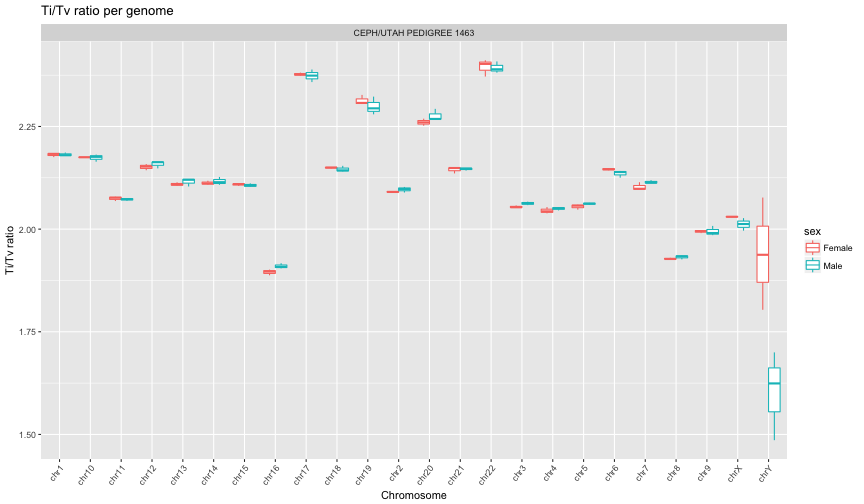


```r
sampleReferenceResults <- full_join(sampleReferenceResults, result)
```

## Sex Inference

For each genome, compare the sex from the sample information to the heterozygosity rate on the chromosome X calls.

In the query that follows we specifically examine the percentage of SNP variants that are heterozygous but note that the Inbreeding Coefficient query above can also be used as a sex check when run upon only chromosome X omitting the pseudoautosomal regions.  For more detail, see the [comparison](./comparison/QC-Comparison.md) against results from other tools.


```r
result <- DisplayAndDispatchQuery("./sql/check-sex.sql",
                                  project=project,
                                  replacements=queryReplacements)
```

```
#standardSQL
--
-- Compute the homozygous and heterozygous variant counts for each individual
-- within chromosome X to help determine whether the sex phenotype value is
-- correct for each individual.
--
WITH filtered_snp_calls AS (
  SELECT
    call.call_set_name,
    CAST((SELECT LOGICAL_AND(gt > 0) FROM UNNEST(call.genotype) gt) AS INT64) AS hom_AA,
    CAST(EXISTS (SELECT gt FROM UNNEST(call.genotype) gt WHERE gt > 0)
      AND EXISTS (SELECT gt FROM UNNEST(call.genotype) gt WHERE gt = 0) AS INT64) AS het_RA
  FROM
    `genomics-public-data.platinum_genomes.variants` v, v.call call
  WHERE
    reference_name IN ('chrX', 'X')
    # Locations of PAR1 and PAR2 on GRCh37.
    AND start NOT BETWEEN 59999 AND 2699519
    AND start NOT BETWEEN 154931042 AND 155260559
    # Only include biallelic snps.
    AND reference_bases IN ('A','C','G','T')
    AND ARRAY_LENGTH(alternate_bases) = 1
    AND alternate_bases[ORDINAL(1)] IN ('A','C','G','T')
    # Skip non-passing calls.
    AND NOT EXISTS (SELECT ft FROM UNNEST(call.FILTER) ft WHERE ft NOT IN ('PASS', '.'))
)

SELECT
  call_set_name,
  ROUND(SUM(het_RA)/(SUM(hom_AA) + SUM(het_RA)), 3) AS perct_het_alt_in_snvs,
  ROUND(SUM(hom_AA)/(SUM(hom_AA) + SUM(het_RA)), 3) AS perct_hom_alt_in_snvs,
  SUM(hom_AA) AS hom_AA_count,
  SUM(het_RA) AS het_RA_count
FROM filtered_snp_calls
GROUP BY
  call_set_name
ORDER BY
  call_set_name
```
Number of rows returned by this query: **6**.

Displaying the first few rows of the dataframe of results:

|call_set_name | perct_het_alt_in_snvs| perct_hom_alt_in_snvs| hom_AA_count| het_RA_count|
|:-------------|---------------------:|---------------------:|------------:|------------:|
|NA12877       |                 0.010|                 0.990|        65922|          655|
|NA12878       |                 0.612|                 0.388|        35769|        56382|
|NA12889       |                 0.011|                 0.989|        64397|          704|
|NA12890       |                 0.604|                 0.396|        36763|        56046|
|NA12891       |                 0.008|                 0.992|        66349|          556|
|NA12892       |                 0.618|                 0.382|        34943|        56543|

Let's join this with the sample information and visualize the results:

```r
joinedResult <- inner_join(result, sampleInfo)
```


```r
ggplot(joinedResult) +
  geom_boxplot(aes(x=sex, y=perct_het_alt_in_snvs, fill=sex)) +
  scale_y_continuous(labels = percent_format()) +
  xlab("Sex") +
  ylab("Heterozygosity Rate ") +
  ggtitle("Box Plot: Heterozygosity Rate on the X Chromosome")
```

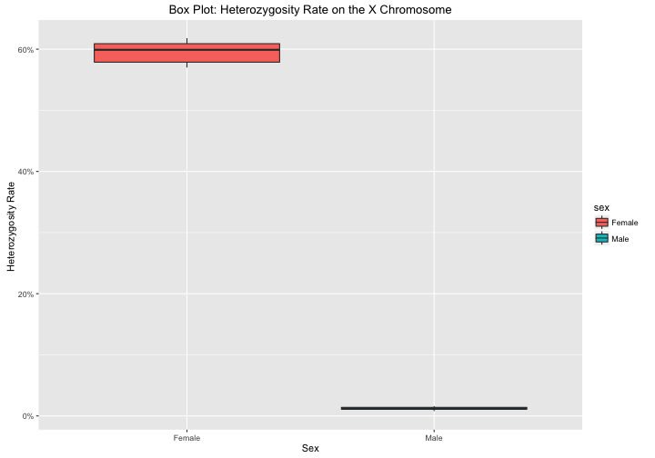


```r
p <- ggplot(joinedResult) +
  geom_point(aes(x=call_set_name, y=perct_het_alt_in_snvs, color=sex)) +
  scale_x_discrete(expand=c(0.05, 1)) +
  scale_y_continuous(labels = percent_format()) +
  xlab("Sample") +
  ylab("Heterozygosity Rate ") +
  ggtitle("Scatter Plot: Heterozygosity Rate on the X Chromosome")
if(nrow(result) <= 20) {
  p + theme(axis.text.x=element_text(angle=50, hjust=1))
} else {
  p + theme(axis.text.x=element_blank(), axis.ticks.x=element_blank(), panel.grid.major.x=element_blank())
}
```

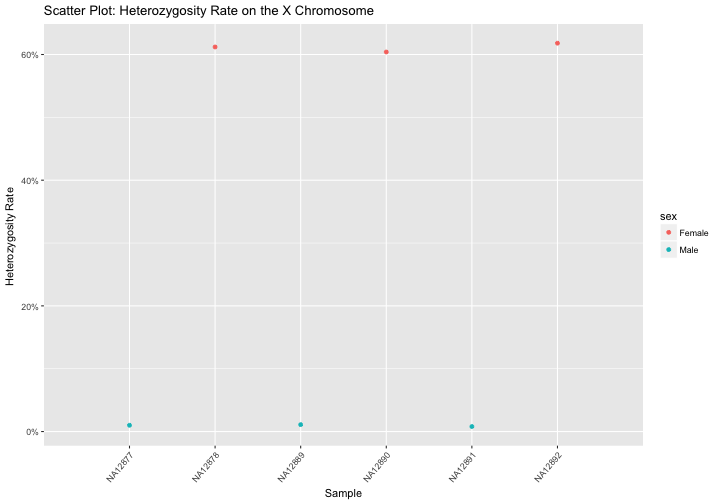

Let's accumulate our sample-specific results for later use.

```r
sampleResults <- full_join(sampleResults, result)
```

## Ethnicity Inference

For each genome, compare the ethncity from the sample information to the clustering in this analysis.

For this check, we:

* use the intersection of common variants found in both 1,000 Genomes phase 1 variants and Platinum Genomes
* compute PCA on those variants in common between the two data
* examine whether the individuals in Platinum Genomes cluster with other samples of the same ethnicity

See the Google Genomics [2-way PCA cookbook entry](http://googlegenomics.readthedocs.org/en/latest/use_cases/compute_principal_coordinate_analysis/2-way-pca.html) for the details as to how to run this pipeline.

Note that this `n^2` analysis is a cluster compute job instead of a BigQuery query.

### Results


```r
# Read in the demographic information for 1,000 Genomes.
sampleData1kg <- read.csv("http://storage.googleapis.com/genomics-public-data/1000-genomes/other/sample_info/sample_info.csv")
sampleInfo1kg <- dplyr::select(sampleData1kg, call_set_name=Sample, sex=Gender, ethnicity=Super_Population)

# Update our sample information for Platinum Genomes as "Unknown" since this is what we are trying to check.
sampleInfoToCheck <- mutate(sampleInfo, ethnicity="Unknown")

# Note that 5 samples are in both datasets, so those will be plotted twice with different symbols.
pcaPlatinumX1kg <- inner_join(pca, rbind(sampleInfoToCheck, sampleInfo1kg), by=c("call_call_set_name" = "call_set_name"))
pcaPlatinumX1kg <- mutate(pcaPlatinumX1kg, unknown=(ethnicity == "Unknown"))
```


```r
ggplot(pcaPlatinumX1kg) +
  geom_point(aes(x=PC1, y=PC2,
                 color=ethnicity,
                 shape=ethnicity,
                 size=unknown)) +
  xlab("principal component 1") +
  ylab("principal component 2") +
  scale_shape_manual(values=c(3, 3, 3, 3, 19)) +
  scale_size_manual(values=c(2,4)) +
  ggtitle("2-way Principal Coordinate Analysis upon Platinum Genomes and 1,000 Genomes")
```

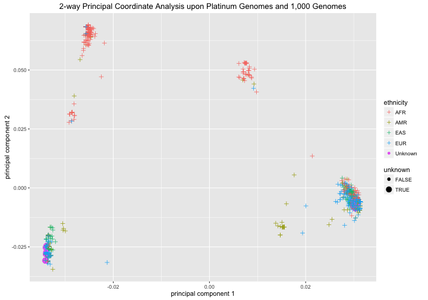

## Genome Similarity

Perform a simplistic similarity check on each pair of genomes to identify any mislabled or cross-contaminated samples.  See the Google Genomics [Identity-By-State cookbook entry](http://googlegenomics.readthedocs.org/en/latest/use_cases/compute_identity_by_state/index.html) for the details as to how to run this pipeline.

Note that this `n^2` analysis is a cluster compute job instead of a BigQuery query.

### Results


```r
ggplot(ibs) +
  geom_tile(aes(x=sample1, y=sample2, fill=ibsScore), colour="white") +
  scale_fill_gradient(low="white", high="steelblue",
                      na.value="black", trans="log",
                      guide=guide_colourbar(title= "IBS Score")) +
  theme(axis.text.x=element_text(angle=50, hjust=1)) +
  xlab("Sample 1") +
  ylab("Sample 2") +
  ggtitle("Identity By State (IBS) Heat Map")
```

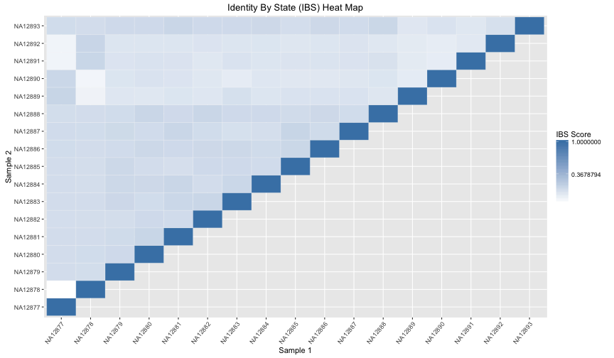

# Removing Genomes from the Cohort

To remove a genome from BigQuery only:

* Re-export the table to BigQuery using the `--call-set-ids` flag on the `gcloud alpha genomics variantsets export` command.

To exclude a genome from data returned by the Genomics API:

* See the `callSetIds` property on the [variants search](https://cloud.google.com/genomics/reference/rest/v1/variants/search) method.

To entirely remove a genome from a variant set in the Genomics API:

* See the [callsets delete](https://cloud.google.com/genomics/reference/rest/v1/callsets/delete) method.
* To delete a callset using a command line tool, see the `gcloud alpha genomics callsets delete` command.
* *Note:* deletion cannot be undone.

# Summary

Accumulated results for per sample analyses:

```r
dim(sampleResults)
```

```
[1]  6 14
```

```r
summary(sampleResults)
```

```
 call_set_name      number_of_calls      no_calls        
 Length:6           Min.   :3825240   Min.   : 85025808  
 Class :character   1st Qu.:3834090   1st Qu.: 87187002  
 Mode  :character   Median :3866982   Median : 94609667  
                    Mean   :3864431   Mean   : 93802230  
                    3rd Qu.:3893784   3rd Qu.:100766640  
                    Max.   :3901539   Max.   :101036492  
 missingness_rate  private_variant_count heterozygous_variant_count
 Min.   :0.02970   Min.   : 78934        Min.   :1885606           
 1st Qu.:0.03045   1st Qu.:140022        1st Qu.:1919138           
 Median :0.03305   Median :315674        Median :1944810           
 Mean   :0.03276   Mean   :245907        Mean   :1947906           
 3rd Qu.:0.03520   3rd Qu.:330326        3rd Qu.:1975385           
 Max.   :0.03529   Max.   :348480        Max.   :2016053           
     O_HOM             E_HOM            N_SITES              F           
 Min.   :2965224   Min.   :3073568   Min.   :4889939   Min.   :-0.06841  
 1st Qu.:2976619   1st Qu.:3075365   1st Qu.:4895291   1st Qu.:-0.05545  
 Median :2984246   Median :3080001   Median :4902675   Median :-0.05418  
 Mean   :2984880   Mean   :3080668   Mean   :4904217   Mean   :-0.05251  
 3rd Qu.:2989076   3rd Qu.:3084448   3rd Qu.:4910019   3rd Qu.:-0.04883  
 Max.   :3010803   Max.   :3090686   Max.   :4924716   Max.   :-0.03535  
 perct_het_alt_in_snvs perct_hom_alt_in_snvs  hom_AA_count  
 Min.   :0.00800       Min.   :0.3820        Min.   :34943  
 1st Qu.:0.01025       1st Qu.:0.3900        1st Qu.:36018  
 Median :0.30750       Median :0.6925        Median :50580  
 Mean   :0.31050       Mean   :0.6895        Mean   :50690  
 3rd Qu.:0.61000       3rd Qu.:0.9898        3rd Qu.:65541  
 Max.   :0.61800       Max.   :0.9920        Max.   :66349  
  het_RA_count    
 Min.   :  556.0  
 1st Qu.:  667.2  
 Median :28375.0  
 Mean   :28481.0  
 3rd Qu.:56298.0  
 Max.   :56543.0  
```

```r
write.csv(sampleResults, file=file.path(kResultsDir, "sampleResults.csv"))
```

Accumulated results for per sample, reference analyses:

```r
dim(sampleReferenceResults)
```

```
[1] 144   9
```

```r
summary(sampleReferenceResults)
```

```
 call_set_name      reference_name        HOM_ALT          HAS_ALT      
 Length:144         Length:144         Min.   :   123   Min.   :   141  
 Class :character   Class :character   1st Qu.: 34826   1st Qu.: 84019  
 Mode  :character   Mode  :character   Median : 55396   Median :131487  
                                       Mean   : 54636   Mean   :135799  
                                       3rd Qu.: 72390   3rd Qu.:187405  
                                       Max.   :108452   Max.   :269962  
    N_SITES             F           transitions     transversions  
 Min.   :   141   Min.   :0.3122   Min.   :    93   Min.   :   48  
 1st Qu.: 84019   1st Qu.:0.3785   1st Qu.: 59132   1st Qu.:24888  
 Median :131487   Median :0.3947   Median : 88440   Median :42931  
 Mean   :135799   Mean   :0.4240   Mean   : 92018   Mean   :43784  
 3rd Qu.:187405   3rd Qu.:0.4146   3rd Qu.:126712   3rd Qu.:61680  
 Max.   :269962   Max.   :1.0000   Max.   :182576   Max.   :87391  
      titv      
 Min.   :1.486  
 1st Qu.:2.053  
 Median :2.111  
 Mean   :2.112  
 3rd Qu.:2.163  
 Max.   :2.411  
```

```r
write.csv(sampleReferenceResults, file=file.path(kResultsDir, "sampleReferenceResults.csv"))
```


```r
sessionInfo()
```

```
## R version 3.4.0 (2017-04-21)
## Platform: x86_64-apple-darwin15.6.0 (64-bit)
## Running under: macOS Sierra 10.12.5
## 
## Matrix products: default
## BLAS: /System/Library/Frameworks/Accelerate.framework/Versions/A/Frameworks/vecLib.framework/Versions/A/libBLAS.dylib
## LAPACK: /Library/Frameworks/R.framework/Versions/3.4/Resources/lib/libRlapack.dylib
## 
## locale:
## [1] en_US.UTF-8/en_US.UTF-8/en_US.UTF-8/C/en_US.UTF-8/en_US.UTF-8
## 
## attached base packages:
## [1] stats     graphics  grDevices utils     datasets  methods   base     
## 
## other attached packages:
## [1] ggplot2_2.2.1        bigrquery_0.3.0.9000 scales_0.4.1        
## [4] dplyr_0.5.0          RCurl_1.95-4.8       bitops_1.0-6        
## [7] knitr_1.16          
## 
## loaded via a namespace (and not attached):
##  [1] Rcpp_0.12.11      magrittr_1.5      progress_1.1.2   
##  [4] munsell_0.4.3     colorspace_1.3-2  R6_2.2.1         
##  [7] rlang_0.1.1       highr_0.6         stringr_1.2.0    
## [10] httr_1.2.1        plyr_1.8.4        tools_3.4.0      
## [13] grid_3.4.0        gtable_0.2.0      DBI_0.6-1        
## [16] htmltools_0.3.6   rprojroot_1.2     digest_0.6.12    
## [19] openssl_0.9.6     lazyeval_0.2.0    assertthat_0.2.0 
## [22] tibble_1.3.3      reshape2_1.4.2    curl_2.6         
## [25] evaluate_0.10     rmarkdown_1.5     labeling_0.3     
## [28] stringi_1.1.5     compiler_3.4.0    backports_1.1.0  
## [31] prettyunits_1.0.2 jsonlite_1.5
```
--------------------------------------------------------
_Next_: [Part 4: Variant-Level QC](./Variant-Level-QC.md)
