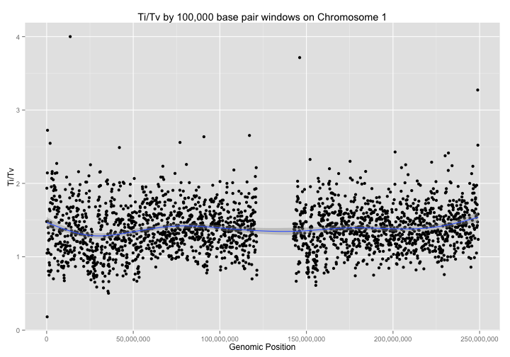
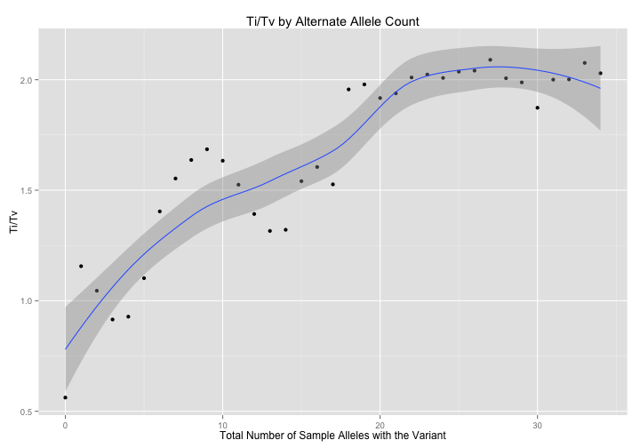

<!-- R Markdown Documentation, DO NOT EDIT THE PLAIN MARKDOWN VERSION OF THIS FILE -->

<!-- Copyright 2015 Google Inc. All rights reserved. -->

<!-- Licensed under the Apache License, Version 2.0 (the "License"); -->
<!-- you may not use this file except in compliance with the License. -->
<!-- You may obtain a copy of the License at -->

<!--     http://www.apache.org/licenses/LICENSE-2.0 -->

<!-- Unless required by applicable law or agreed to in writing, software -->
<!-- distributed under the License is distributed on an "AS IS" BASIS, -->
<!-- WITHOUT WARRANTIES OR CONDITIONS OF ANY KIND, either express or implied. -->
<!-- See the License for the specific language governing permissions and -->
<!-- limitations under the License. -->

# Variant-Level QC

* [Missingness Rate](#missingness-rate)
* [Hardy-Weinberg Equilibrium](#hardy-weinberg-equilibrium)
* [Ti/Tv by Depth](#titv-by-depth)
* [Ti/Tv by Alternate Allele Counts](#titv-by-alternate-allele-counts)
* [Heterozygous Haploitype](#heterozygous-haploitype)


## Missingness Rate

## Hardy-Weinberg Equilibrium

```r
result <- DisplayAndDispatchQuery("./sql/hardy-weinberg-brca1-expanded.sql",
                                  project=project,
                                  replacements=c(table_replacement,
                                                 "#_ORDER_BY_"=
                                                   paste("ORDER BY",
                                                         "ChiSq DESC, CHR, POS, ref, alt",
                                                         "LIMIT 1000")))
```

```
# The following query computes the Hardy-Weinberg equilibrium for BRCA1 variants.
SELECT
  CHR,
  POS,
  ref,
  alt,
  OBS_HOM1,
  OBS_HET,
  OBS_HOM2,
  E_HOM1,
  E_HET,
  E_HOM2,

  # Chi Squared Calculation
  # SUM(((Observed - Expected)^2) / Expected )
  ROUND((POW(OBS_HOM1 - E_HOM1, 2) / E_HOM1)
  + (POW(OBS_HET - E_HET, 2) / E_HET)
  + (POW(OBS_HOM2 - E_HOM2, 2) / E_HOM2), 6)
  AS ChiSq,

  # Determine if Chi Sq value is significant
  IF((POW(OBS_HOM1 - E_HOM1, 2) / E_HOM1)
  + (POW(OBS_HET - E_HET, 2) / E_HET)
  + (POW(OBS_HOM2 - E_HOM2, 2) / E_HOM2)
  > 5.991, "TRUE", "FALSE") AS PVALUE_SIG

FROM (
    SELECT
      CHR,
      POS,
      ref,
      alt,
      OBS_HOM1,
      OBS_HET,
      OBS_HOM2,

      # Expected AA
      # p^2
      # ((COUNT(AA) + (COUNT(Aa)/2) /
      #  SAMPLE_COUNT) ^ 2) * SAMPLE_COUNT
      ROUND(POW((OBS_HOM1 + (OBS_HET/2)) /
        SAMPLE_COUNT, 2) * SAMPLE_COUNT, 2)
        AS E_HOM1,

      # Expected Aa
      # 2pq
      # 2 * (COUNT(AA) + (COUNT(Aa)/2) / SAMPLE_COUNT) *
      # (COUNT(aa) + (COUNT(Aa)/2) / SAMPLE_COUNT)
      # * SAMPLE_COUNT
      ROUND(2 * ((OBS_HOM1 + (OBS_HET/2)) / SAMPLE_COUNT) *
        ((OBS_HOM2 + (OBS_HET/2)) / SAMPLE_COUNT)
        * SAMPLE_COUNT, 2)
        AS E_HET,

      # Expected aa
      # q^2
      # (COUNT(aa) + (COUNT(Aa)/2) /
      #  SAMPLE_COUNT) ^ 2 * SAMPLE_COUNT
      ROUND(POW((OBS_HOM2 + (OBS_HET/2)) /
        SAMPLE_COUNT, 2) * SAMPLE_COUNT, 2)
        AS E_HOM2,

  FROM (
    SELECT
      reference_name AS CHR,
      start AS POS,
      reference_bases AS ref,
      alternate_bases AS alt,
      HOM_REF AS OBS_HOM1,
      HET AS OBS_HET,
      HOM_ALT AS OBS_HOM2,
      HOM_REF + HET + HOM_ALT AS SAMPLE_COUNT,
    FROM (
      SELECT
        reference_name,
        start,
        END,
        reference_bases,
        GROUP_CONCAT(alternate_bases) WITHIN RECORD AS alternate_bases,
        COUNT(alternate_bases) WITHIN RECORD AS num_alts,
        SUM(EVERY(0 = call.genotype)) WITHIN call AS HOM_REF,
        SUM(EVERY(1 = call.genotype)) WITHIN call AS HOM_ALT,
        SUM(SOME(0 = call.genotype)
          AND SOME(1 = call.genotype)) WITHIN call AS HET,
      FROM
        [google.com:biggene:platinum_genomes.expanded_variants]
      # Optionally add a clause here to limit the query to a particular
      # region of the genome.
      #_WHERE_
      HAVING
        # Skip 1/2 genotypes
        num_alts = 1
        )))
# Optionally add a clause here sort and limit the results.
ORDER BY ChiSq DESC, CHR, POS, ref, alt LIMIT 1000
```
Number of rows returned by this query: 1000.

Displaying the first few results:
<!-- html table generated in R 3.1.1 by xtable 1.7-4 package -->
<!-- Wed Feb  4 15:33:32 2015 -->
<table border=1>
<tr> <th> CHR </th> <th> POS </th> <th> ref </th> <th> alt </th> <th> OBS_HOM1 </th> <th> OBS_HET </th> <th> OBS_HOM2 </th> <th> E_HOM1 </th> <th> E_HET </th> <th> E_HOM2 </th> <th> ChiSq </th> <th> PVALUE_SIG </th>  </tr>
  <tr> <td> chr1 </td> <td align="right"> 4125498 </td> <td> T </td> <td> C </td> <td align="right">   9 </td> <td align="right">   0 </td> <td align="right">   8 </td> <td align="right"> 4.76 </td> <td align="right"> 8.47 </td> <td align="right"> 3.76 </td> <td align="right"> 17.03 </td> <td> TRUE </td> </tr>
  <tr> <td> chr1 </td> <td align="right"> 64839482 </td> <td> G </td> <td> A </td> <td align="right">   9 </td> <td align="right">   0 </td> <td align="right">   8 </td> <td align="right"> 4.76 </td> <td align="right"> 8.47 </td> <td align="right"> 3.76 </td> <td align="right"> 17.03 </td> <td> TRUE </td> </tr>
  <tr> <td> chr1 </td> <td align="right"> 80603209 </td> <td> T </td> <td> C </td> <td align="right">   9 </td> <td align="right">   0 </td> <td align="right">   8 </td> <td align="right"> 4.76 </td> <td align="right"> 8.47 </td> <td align="right"> 3.76 </td> <td align="right"> 17.03 </td> <td> TRUE </td> </tr>
  <tr> <td> chr1 </td> <td align="right"> 83650074 </td> <td> A </td> <td> C </td> <td align="right">   9 </td> <td align="right">   0 </td> <td align="right">   8 </td> <td align="right"> 4.76 </td> <td align="right"> 8.47 </td> <td align="right"> 3.76 </td> <td align="right"> 17.03 </td> <td> TRUE </td> </tr>
  <tr> <td> chr1 </td> <td align="right"> 102019360 </td> <td> A </td> <td> G </td> <td align="right">   8 </td> <td align="right">   0 </td> <td align="right">   9 </td> <td align="right"> 3.76 </td> <td align="right"> 8.47 </td> <td align="right"> 4.76 </td> <td align="right"> 17.03 </td> <td> TRUE </td> </tr>
  <tr> <td> chr1 </td> <td align="right"> 110191193 </td> <td> T </td> <td> C </td> <td align="right">   9 </td> <td align="right">   0 </td> <td align="right">   8 </td> <td align="right"> 4.76 </td> <td align="right"> 8.47 </td> <td align="right"> 3.76 </td> <td align="right"> 17.03 </td> <td> TRUE </td> </tr>
   </table>

## Ti/Tv by Depth

TODO: this is actually by genomic window, not depth

```r
result <- DisplayAndDispatchQuery("./sql/ti-tv-ratio.sql",
                                  project=project,
                                  replacements=c(table_replacement,
                                                 "#_WHERE_"="WHERE reference_name='chr1'",
                                                 "_WINDOW_SIZE_"="100000"))
```

```
# Compute the Ti/Tv ratio for variants within genomic region windows.
SELECT
  reference_name,
  window * 100000 AS window_start,
  transitions,
  transversions,
  transitions/transversions AS titv,
  num_variants_in_window,
FROM (
  SELECT
    reference_name,
    window,
    SUM(mutation IN ('A->G', 'G->A', 'C->T', 'T->C')) AS transitions,
    SUM(mutation IN ('A->C', 'C->A', 'G->T', 'T->G',
                     'A->T', 'T->A', 'C->G', 'G->C')) AS transversions,
    COUNT(mutation) AS num_variants_in_window
  FROM (
    SELECT
      reference_name,
      INTEGER(FLOOR(start / 100000)) AS window,
      CONCAT(reference_bases, CONCAT(STRING('->'), alternate_bases)) AS mutation,
      COUNT(alternate_bases) WITHIN RECORD AS num_alts,
    FROM
      [genomics-public-data:platinum_genomes.variants]
    # Optionally add clause here to limit the query to a particular
    # region of the genome.
    WHERE reference_name='chr1'
    HAVING
      # Skip 1/2 genotypes _and non-SNP variants
      num_alts = 1
      AND reference_bases IN ('A','C','G','T')
      AND alternate_bases IN ('A','C','G','T'))
  GROUP BY
    reference_name,
    window)
ORDER BY
  window_start
```

Visualizing the results:

```r
ggplot(result) +
  geom_point(aes(x=window_start, y=titv)) +
  xlab("Genomic Position") +
  ylab("Ti/Tv") +
  ggtitle("Ti/Tv by 100,000 base pair windows on Chromosome 1")
```



## Ti/Tv by Alternate Allele Counts


```r
result <- DisplayAndDispatchQuery("./sql/ti-tv-by-alternate-allele-count.sql",
                                  project=project,
                                  replacements=c(table_replacement))
```

```
# Compute the Ti/Tv ratio for variants binned by alternate allele count.
SELECT
  transitions,
  transversions,
  transitions/transversions AS titv,
  alternate_allele_count
FROM (
  SELECT
    SUM(mutation IN ('A->G', 'G->A', 'C->T', 'T->C')) AS transitions,
    SUM(mutation IN ('A->C', 'C->A', 'G->T', 'T->G',
                     'A->T', 'T->A', 'C->G', 'G->C')) AS transversions,
    alternate_allele_count
  FROM (
    SELECT
      CONCAT(reference_bases, CONCAT(STRING('->'), alternate_bases)) AS mutation,
      COUNT(alternate_bases) WITHIN RECORD AS num_alts,
      SUM(call.genotype = 1) WITHIN RECORD AS alternate_allele_count,
    FROM
      [genomics-public-data:platinum_genomes.variants]
    # Optionally add clause here to limit the query to a particular
    # region of the genome.
    #_WHERE_
    HAVING
      # Skip 1/2 genotypes _and non-SNP variants
      num_alts = 1
      AND reference_bases IN ('A','C','G','T')
      AND alternate_bases IN ('A','C','G','T'))
  GROUP BY
    alternate_allele_count)
ORDER BY
  alternate_allele_count DESC
```

Visualizing the results:

```r
ggplot(result) +
  geom_point(aes(x=alternate_allele_count, y=titv)) +
  xlab("Alternate Allele Count") +
  ylab("Ti/Tv") +
  ggtitle("Ti/Tv by Alternate Allele Count")
```



## Heterozygous Haploitype
