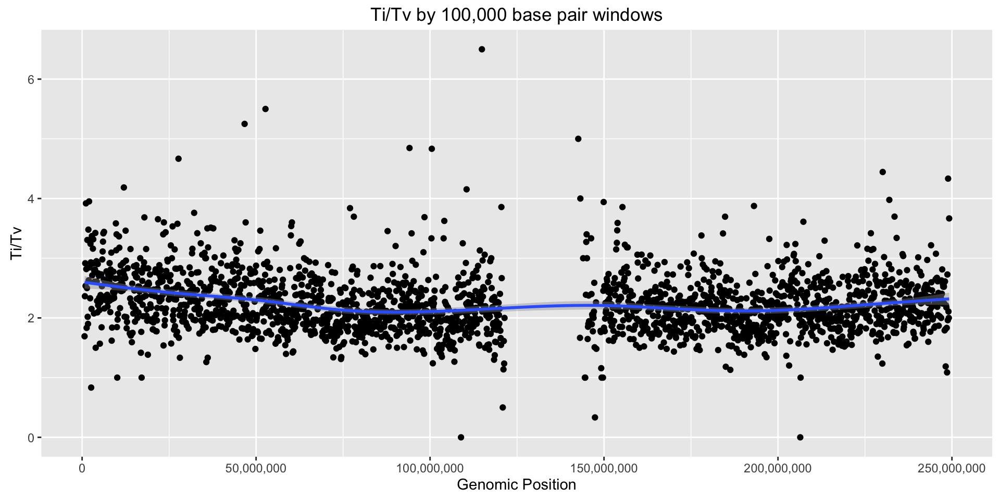
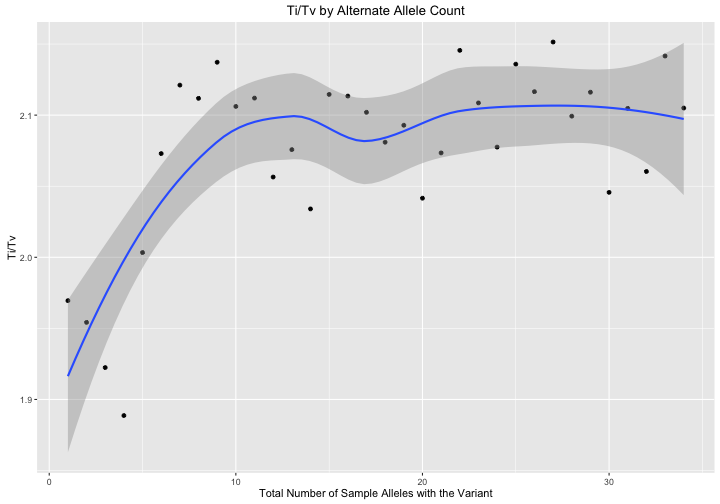
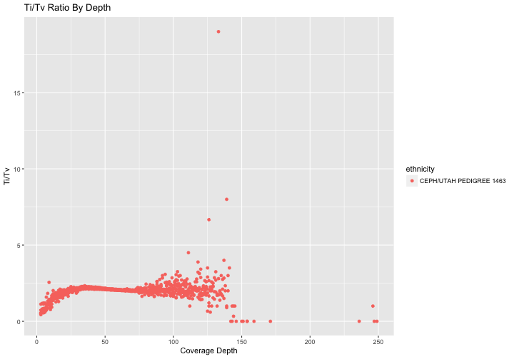

<!-- R Markdown Documentation, DO NOT EDIT THE PLAIN MARKDOWN VERSION OF THIS FILE -->

<!-- Copyright 2015 Google Inc. All rights reserved. -->

<!-- Licensed under the Apache License, Version 2.0 (the "License"); -->
<!-- you may not use this file except in compliance with the License. -->
<!-- You may obtain a copy of the License at -->

<!--     http://www.apache.org/licenses/LICENSE-2.0 -->

<!-- Unless required by applicable law or agreed to in writing, software -->
<!-- distributed under the License is distributed on an "AS IS" BASIS, -->
<!-- WITHOUT WARRANTIES OR CONDITIONS OF ANY KIND, either express or implied. -->
<!-- See the License for the specific language governing permissions and -->
<!-- limitations under the License. -->

# Part 4: Variant-Level QC


In Part 4 of the codelab, we perform some quality control analyses that could help to identify any problematic variants which should be excluded from further analysis.  The appropriate cut off thresholds will depend upon the input dataset and/or other factors.

* [Ti/Tv by Genomic Window](#titv-by-genomic-window)
* [Ti/Tv by Alternate Allele Counts](#titv-by-alternate-allele-counts)
* [Ti/Tv by Depth](#titv-by-depth)
* [Missingness Rate](#missingness-rate)
* [Hardy-Weinberg Equilibrium](#hardy-weinberg-equilibrium)
* [Heterozygous Haplotype](#heterozygous-haplotype)

By default this codelab runs upon the Illumina Platinum Genomes Variants. Update the table and change the source of sample information here if you wish to run the queries against a different dataset.

```r
source("./rHelpers/platinumGenomesDataset.R")

# To run this against other public data, source in one of the dataset helpers.  For example:
# source("./rHelpers/pgpDataset.R")
```

## Ti/Tv by Genomic Window

Check whether the ratio of transitions vs. transversions in SNPs appears to be reasonable in each window of genomic positions.  This query may help identify problematic regions.


```r
result <- DisplayAndDispatchQuery("./sql/ti-tv-by-genomic-window.sql",
                                  project=project,
                                  replacements=c("@WINDOW_SIZE"="100000",
                                                 queryReplacements))
```

```
#standardSQL
--
-- Compute the Ti/Tv ratio for variants within genomic windows.
--
WITH filtered_snp_calls AS (
  SELECT
    reference_name,
    CAST(FLOOR(start / 100000) AS INT64) AS genomic_window,
    CONCAT(reference_bases, '->', alternate_bases[ORDINAL(1)]) AS mutation
  FROM
    `genomics-public-data.platinum_genomes.variants` v
  WHERE
    # Only include biallelic snps with at least one passing variant call.
    reference_bases IN ('A','C','G','T')
    AND ARRAY_LENGTH(alternate_bases) = 1
    AND alternate_bases[ORDINAL(1)] IN ('A','C','G','T')
    AND EXISTS (SELECT gt FROM UNNEST(v.call) AS call, UNNEST(call.genotype) AS gt WHERE gt > 0
      AND EXISTS (SELECT ft FROM UNNEST(call.FILTER) ft WHERE ft IN ('PASS', '.')))
),

mutation_type_counts AS (
  SELECT
    reference_name,
    genomic_window,
    SUM(CAST(mutation IN ('A->G', 'G->A', 'C->T', 'T->C') AS INT64)) AS transitions,
    SUM(CAST(mutation IN ('A->C', 'C->A', 'G->T', 'T->G',
                          'A->T', 'T->A', 'C->G', 'G->C') AS INT64)) AS transversions,
    COUNT(mutation) AS num_variants_in_group
  FROM filtered_snp_calls
  GROUP BY
    reference_name,
    genomic_window
)

SELECT
  reference_name,
  genomic_window * 100000 AS window_start,
  transitions,
  transversions,
  transitions/transversions AS titv,
  num_variants_in_group
FROM mutation_type_counts
WHERE
  transversions > 0
ORDER BY
  reference_name,
  window_start
```
Number of rows returned by this query: **28319**.

Displaying the first few rows of the dataframe of results:

|reference_name | window_start| transitions| transversions|     titv| num_variants_in_group|
|:--------------|------------:|-----------:|-------------:|--------:|---------------------:|
|chr1           |       700000|          44|            26| 1.692308|                    70|
|chr1           |       800000|         156|            66| 2.363636|                   222|
|chr1           |       900000|         207|            71| 2.915493|                   278|
|chr1           |      1000000|         104|            41| 2.536585|                   145|
|chr1           |      1100000|         145|            37| 3.918919|                   182|
|chr1           |      1200000|          93|            33| 2.818182|                   126|

Visualizing the results:

```r
ggplot(filter(result, reference_name %in% c("1", "chr1")), aes(x=window_start, y=titv)) +
  geom_point() +
  stat_smooth() +
  scale_x_continuous(labels=comma) +
  xlab("Genomic Position") +
  ylab("Ti/Tv") +
  ggtitle("Ti/Tv by 100,000 base pair windows")
```



## Ti/Tv by Alternate Allele Counts

Check whether the ratio of transitions vs. transversions in SNPs appears to be resonable across the range of rare variants to common variants.  This query may help to identify problems with rare or common variants.


```r
result <- DisplayAndDispatchQuery("./sql/ti-tv-by-alternate-allele-count.sql",
                                  project=project,
                                  replacements=queryReplacements)
```

```
#standardSQL
--
-- Compute the Ti/Tv ratio for variants binned by alternate allele count.
--
WITH filtered_snp_calls AS (
  SELECT
    ( -- Compute the allele count for this site of variation.
      SELECT COUNTIF(gt = 1)
      FROM UNNEST(v.call) AS call, UNNEST(call.genotype) AS gt
      WHERE
        # Skip homozygous reference calls, no-calls, and non-passing variants.
        EXISTS (SELECT gt FROM UNNEST(call.genotype) gt WHERE gt > 0)
        AND NOT EXISTS (SELECT gt FROM UNNEST(call.genotype) gt WHERE gt < 0)
        AND NOT EXISTS (SELECT ft FROM UNNEST(call.FILTER) ft WHERE ft NOT IN ('PASS', '.'))
    ) AS AC,
    CONCAT(reference_bases, '->', alternate_bases[ORDINAL(1)]) AS mutation
  FROM
    `genomics-public-data.platinum_genomes.variants` v
  WHERE
    # Only include biallelic snps.
    reference_bases IN ('A','C','G','T')
    AND ARRAY_LENGTH(alternate_bases) = 1
    AND alternate_bases[ORDINAL(1)] IN ('A','C','G','T')
),

mutation_type_counts AS (
  SELECT
    AC,
    SUM(CAST(mutation IN ('A->G', 'G->A', 'C->T', 'T->C') AS INT64)) AS transitions,
    SUM(CAST(mutation IN ('A->C', 'C->A', 'G->T', 'T->G',
                          'A->T', 'T->A', 'C->G', 'G->C') AS INT64)) AS transversions,
    COUNT(mutation) AS num_variants_in_group
  FROM filtered_snp_calls
  GROUP BY
    AC
)

SELECT
  AC,
  transitions,
  transversions,
  transitions/transversions AS titv,
  num_variants_in_group
FROM mutation_type_counts
WHERE
  transversions > 0 AND AC > 0
ORDER BY
  AC DESC
```
Number of rows returned by this query: **12**.

Displaying the first few rows of the dataframe of results:

| AC| transitions| transversions|     titv| num_variants_in_group|
|--:|-----------:|-------------:|--------:|---------------------:|
| 12|      305770|        145657| 2.099247|                451427|
| 11|       98223|         45962| 2.137048|                144185|
| 10|      159649|         75857| 2.104605|                235506|
|  9|      161852|         76643| 2.111765|                238495|
|  8|      193681|         91602| 2.114375|                285283|
|  7|      212197|        101342| 2.093870|                313539|

Visualizing the results:

```r
ggplot(result, aes(x=AC, y=titv)) +
  geom_point() +
  stat_smooth() +
  scale_x_continuous(labels=comma) +
  xlab("Total Number of Sample Alleles with the Variant") +
  ylab("Ti/Tv") +
  ggtitle("Ti/Tv by Alternate Allele Count")
```



## Ti/Tv by Depth

Visualize the ratio of transitions vs. transversions by depth of coverage.


```r
result <- DisplayAndDispatchQuery("./sql/ti-tv-by-depth.sql",
                                  project=project,
                                  replacements=queryReplacements)
```

```
#standardSQL
--
-- Transition/Transversion Ratio by Depth of Coverage.
--
WITH filtered_snp_calls AS (
  SELECT
    call.call_set_name,
    call.DP,
    CONCAT(reference_bases, '->', alternate_bases[ORDINAL(1)]) AS mutation
  FROM
    `genomics-public-data.platinum_genomes.variants` v, v.call call
  WHERE
    # Only include biallelic snps.
    reference_bases IN ('A','C','G','T')
    AND ARRAY_LENGTH(alternate_bases) = 1
    AND alternate_bases[ORDINAL(1)] IN ('A','C','G','T')
    # Skip homozygous reference calls, no-calls, and non-passing variants.
    AND EXISTS (SELECT gt FROM UNNEST(call.genotype) gt WHERE gt > 0)
    AND NOT EXISTS (SELECT gt FROM UNNEST(call.genotype) gt WHERE gt < 0)
    AND NOT EXISTS (SELECT ft FROM UNNEST(call.FILTER) ft WHERE ft NOT IN ('PASS', '.'))
),

mutation_type_counts AS (
  SELECT
    call_set_name,
    DP,
    SUM(CAST(mutation IN ('A->G', 'G->A', 'C->T', 'T->C') AS INT64)) AS transitions,
    SUM(CAST(mutation IN ('A->C', 'C->A', 'G->T', 'T->G',
                          'A->T', 'T->A', 'C->G', 'G->C') AS INT64)) AS transversions,
    COUNT(mutation) AS num_variants_in_group
  FROM filtered_snp_calls
  WHERE
    DP IS NOT NULL
  GROUP BY
    call_set_name,
    DP
)

SELECT
  call_set_name,
  DP AS average_depth,
  transitions,
  transversions,
  transitions/transversions AS titv,
  num_variants_in_group
FROM mutation_type_counts
WHERE
  transversions > 0
ORDER BY
  call_set_name,
  average_depth
```


|call_set_name | average_depth| transitions| transversions|      titv| num_variants_in_group|
|:-------------|-------------:|-----------:|-------------:|---------:|---------------------:|
|NA12877       |             3|           4|             8| 0.5000000|                    12|
|NA12877       |             4|           7|            10| 0.7000000|                    17|
|NA12877       |             5|          12|            10| 1.2000000|                    22|
|NA12877       |             6|           8|            11| 0.7272727|                    19|
|NA12877       |             7|           8|            11| 0.7272727|                    19|
|NA12877       |             8|          11|             6| 1.8333333|                    17|

Let's join this with the sample information and visualize the results:

```r
joinedResult <- inner_join(result, sampleInfo)
```


```r
ggplot(joinedResult, aes(x=average_depth, y=titv, color=ethnicity)) + 
  geom_point() +
  ggtitle("Ti/Tv Ratio By Depth") +
  xlab("Coverage Depth") + 
  ylab("Ti/Tv")
```



## Missingness Rate

For each variant, compute the missingness rate.  This query can be used to identify variants with a poor call rate.


```r
if (kMultiSampleTableSchemaIsOptimized) {
  query = "./sql/variant-level-missingness-optimized-schema.sql"
} else {
  query = "./sql/variant-level-missingness.sql"
}
sortAndLimit <- "ORDER BY missingness_rate DESC, reference_name, start, reference_bases, alt_concat LIMIT 1000"
result <- DisplayAndDispatchQuery(query,
                                  project=project,
                                  replacements=c(
                                    "-- Optionally add a clause here to constrain the results."=sortAndLimit,
                                                 queryReplacements))
```

```
#standardSQL
--
-- Compute the ratio of no-calls for each variant.
--
WITH variant_missingness AS (
  SELECT
    reference_name,
    start,
    `end`,
    reference_bases,
    ARRAY_TO_STRING(v.alternate_bases, ',') AS alt_concat,
    (SELECT SUM((SELECT COUNT(gt) FROM UNNEST(call.genotype) gt)) FROM v.call) AS all_calls,
    (SELECT SUM((SELECT COUNT(gt) FROM UNNEST(call.genotype) gt WHERE gt < 0)) FROM v.call) AS no_calls
  FROM
    `google.com:biggene.platinum_genomes.multisample_variants_dense_schema` v
)

SELECT
  reference_name,
  start,
  `end`,
  reference_bases,
  alt_concat,
  no_calls,
  all_calls,
  no_calls/all_calls AS missingness_rate
FROM variant_missingness
WHERE
  all_calls > 0
ORDER BY missingness_rate DESC, reference_name, start, reference_bases, alt_concat LIMIT 1000
```
Number of rows returned by this query: **1000**.

Displaying the first few rows of the dataframe of results:

|reference_name |     start|       end|reference_bases |alt_concat | no_calls| all_calls| missingness_rate|
|:--------------|---------:|---------:|:---------------|:----------|--------:|---------:|----------------:|
|chr1           | 194451572| 194451573|A               |C          |       10|        12|        0.8333333|
|chr1           | 194452155| 194452156|T               |C          |       10|        12|        0.8333333|
|chr1           | 194452296| 194452297|C               |T          |       10|        12|        0.8333333|
|chr1           | 194452477| 194452478|C               |A          |       10|        12|        0.8333333|
|chr1           | 213085506| 213085507|A               |C,T        |       10|        12|        0.8333333|
|chr10          | 109847474| 109847475|C               |A,T        |       10|        12|        0.8333333|

## Hardy-Weinberg Equilibrium

For each variant, compute the expected versus observed relationship between allele frequencies and genotype frequencies per the Hardy-Weinberg Equilibrium.


```r
sortAndLimit <- "ORDER BY ChiSq DESC, reference_name, start, alt LIMIT 1000"
result <- DisplayAndDispatchQuery("./sql/hardy-weinberg.sql",
                                  project=project,
                                  replacements=c("-- Optionally add a clause here to constrain the results."=sortAndLimit,
                                                 queryReplacements))
```

```
#standardSQL
--
-- The following query computes the Hardy-Weinberg equilibrium for variants.
--
WITH variants AS (
  SELECT
    reference_name,
    start,
    `end`,
    reference_bases,
    v.alternate_bases[ORDINAL(1)] AS alt,
    -- Within each variant count the number of HOM_REF/HOM_ALT/HET samples.
    (SELECT SUM(CAST((SELECT LOGICAL_AND(gt = 0)
      FROM UNNEST(call.genotype) gt) AS INT64)) FROM v.call) AS HOM_REF,
    (SELECT SUM(CAST((SELECT LOGICAL_AND(gt = 1)
      FROM UNNEST(call.genotype) gt) AS INT64)) FROM v.call) AS HOM_ALT,
    (SELECT SUM(CAST((SELECT LOGICAL_OR(gt = 0) AND LOGICAL_OR(gt = 1)
      FROM UNNEST(call.genotype) gt) AS INT64)) FROM v.call) AS HET
  FROM
    `google.com:biggene.platinum_genomes.multisample_variants_dense_schema` v
  WHERE
    # Only include biallelic snps.
    reference_bases IN ('A','C','G','T')
    AND ARRAY_LENGTH(alternate_bases) = 1
    AND alternate_bases[ORDINAL(1)] IN ('A','C','G','T')
),

observations AS (
  SELECT
    reference_name,
    start,
    reference_bases,
    alt,
    HOM_REF AS OBS_HOM1,
    HET AS OBS_HET,
    HOM_ALT AS OBS_HOM2,
    HOM_REF + HET + HOM_ALT AS SAMPLE_COUNT
  FROM variants
),

expectations AS (
  SELECT
    reference_name,
    start,
    reference_bases,
    alt,
    OBS_HOM1,
    OBS_HET,
    OBS_HOM2,

    # Expected AA
    # p^2
    # ((COUNT(AA) + (COUNT(Aa)/2) /
    #  SAMPLE_COUNT) ^ 2) * SAMPLE_COUNT
    POW((OBS_HOM1 + (OBS_HET/2)) /
      SAMPLE_COUNT, 2) * SAMPLE_COUNT
      AS E_HOM1,

    # Expected Aa
    # 2pq
    # 2 * (COUNT(AA) + (COUNT(Aa)/2) / SAMPLE_COUNT) *
    # (COUNT(aa) + (COUNT(Aa)/2) / SAMPLE_COUNT)
    # * SAMPLE_COUNT
    2 * ((OBS_HOM1 + (OBS_HET/2)) / SAMPLE_COUNT) *
      ((OBS_HOM2 + (OBS_HET/2)) / SAMPLE_COUNT)
      * SAMPLE_COUNT
      AS E_HET,

    # Expected aa
    # q^2
    # (COUNT(aa) + (COUNT(Aa)/2) /
    #  SAMPLE_COUNT) ^ 2 * SAMPLE_COUNT
    POW((OBS_HOM2 + (OBS_HET/2)) /
      SAMPLE_COUNT, 2) * SAMPLE_COUNT
      AS E_HOM2

  FROM observations
  WHERE SAMPLE_COUNT > 0
)

SELECT
  reference_name,
  start,
  reference_bases,
  alt,
  OBS_HOM1,
  OBS_HET,
  OBS_HOM2,
  E_HOM1,
  E_HET,
  E_HOM2,

  # Chi Squared Calculation
  # SUM(((Observed - Expected)^2) / Expected )
  ROUND((POW(OBS_HOM1 - E_HOM1, 2) / E_HOM1)
  + (POW(OBS_HET - E_HET, 2) / E_HET)
  + (POW(OBS_HOM2 - E_HOM2, 2) / E_HOM2), 6)
  AS ChiSq,

  # Determine if Chi Sq value is significant
  # The chi-squared score corresponding to a nominal P-value of 0.05
  # for a table with 2 degrees of freedom is 5.991.
  IF((POW(OBS_HOM1 - E_HOM1, 2) / E_HOM1)
  + (POW(OBS_HET - E_HET, 2) / E_HET)
  + (POW(OBS_HOM2 - E_HOM2, 2) / E_HOM2)
  > 5.991, "TRUE", "FALSE") AS PVALUE_SIG

FROM expectations
WHERE
  E_HOM1 > 0 AND E_HET > 0 AND E_HOM2 > 0
ORDER BY ChiSq DESC, reference_name, start, alt LIMIT 1000
```
Number of rows returned by this query: **1000**.

Displaying the first few rows of the dataframe of results:

|reference_name |  start|reference_bases |alt | OBS_HOM1| OBS_HET| OBS_HOM2| E_HOM1| E_HET| E_HOM2| ChiSq|PVALUE_SIG |
|:--------------|------:|:---------------|:---|--------:|-------:|--------:|------:|-----:|------:|-----:|:----------|
|chr1           | 757842|C               |A   |        0|       6|        0|    1.5|     3|    1.5|     6|TRUE       |
|chr1           | 913888|G               |A   |        0|       6|        0|    1.5|     3|    1.5|     6|TRUE       |
|chr1           | 914332|C               |G   |        0|       6|        0|    1.5|     3|    1.5|     6|TRUE       |
|chr1           | 914851|G               |C   |        0|       6|        0|    1.5|     3|    1.5|     6|TRUE       |
|chr1           | 914939|T               |C   |        0|       6|        0|    1.5|     3|    1.5|     6|TRUE       |
|chr1           | 916548|A               |G   |        0|       6|        0|    1.5|     3|    1.5|     6|TRUE       |

See also [a version of this query](./sql/hardy-weinberg-udf.sql) that uses BigQuery [user-defined javascript functions](https://cloud.google.com/bigquery/user-defined-functions).

## Heterozygous Haplotype
For each variant within the X and Y chromosome, identify heterozygous variants in male genomes.

First we use our sample information to determine which genomes are male.  

```r
maleSampleIds <- paste("'",
                       filter(sampleInfo,
                              sex %in% c("MALE", "Male", "male", "M", "m"))$call_set_name,
                       "'", sep="", collapse=",")
```


```r
sortAndLimit <- "ORDER BY reference_name, start, alt_concat, call_set_name LIMIT 1000"
result <- DisplayAndDispatchQuery("./sql/sex-chromosome-heterozygous-haplotypes.sql",
                                  project=project,
                                  replacements=c("@MALE_SAMPLE_IDS"=maleSampleIds,
                                                 "-- Optionally add a clause here to constrain the results."=sortAndLimit,
                                                 queryReplacements))
```

```
#standardSQL
--
-- Retrieve heterozygous haplotype calls on chromosomes X and Y.
--
SELECT
  reference_name,
  start,
  `end`,
  reference_bases,
  ARRAY_TO_STRING(v.alternate_bases, ',') AS alt_concat,
  call.call_set_name,
  (SELECT STRING_AGG(CAST(gt AS STRING)) from UNNEST(call.genotype) gt) AS genotype
FROM
  `genomics-public-data.platinum_genomes.variants` v, v.call call
WHERE
  reference_name IN ('chrX', 'X', 'chrY', 'Y')
  AND call_set_name IN ('NA12877','NA12882','NA12883','NA12884','NA12886','NA12888','NA12889','NA12891','NA12893')
  AND (SELECT LOGICAL_OR(gt = 0) AND LOGICAL_OR(gt = 1) FROM UNNEST(call.genotype) gt)
ORDER BY reference_name, start, alt_concat, call_set_name LIMIT 1000
```
Number of rows returned by this query: **1000**.

Displaying the first few rows of the dataframe of results:

|reference_name |   start|     end|reference_bases |alt_concat |call_set_name |genotype |
|:--------------|-------:|-------:|:---------------|:----------|:-------------|:--------|
|chrX           | 2702609| 2702610|C               |A          |not displayed |0,1      |
|chrX           | 2703499| 2703500|A               |T          |not displayed |0,1      |
|chrX           | 2705031| 2705032|A               |G          |not displayed |0,1      |
|chrX           | 2705051| 2705052|C               |T          |not displayed |0,1      |
|chrX           | 2705053| 2705054|T               |C          |not displayed |0,1      |
|chrX           | 2705063| 2705064|G               |A          |not displayed |0,1      |

# Removing variants from the Cohort

To mark a variant as problematic so that downstream analyses can filter it out:

* See the [variants patch](https://cloud.google.com/genomics/reference/rest/v1/variants/patch) method.

To remove variants from BigQuery only:

* Materialize the results of queries that include the non-problematic variants to a new table.
* Alternatively, write a custom filtering job similar to what we explored in [Part 2: Data Conversion](./Data-Conversion.md) of this codelab.

To entirely remove a variant from a variant set in the Genomics API:

* See the [variants delete](https://cloud.google.com/genomics/reference/rest/v1/variants/delete) method.
* *Note:* deletion cannot be undone.
